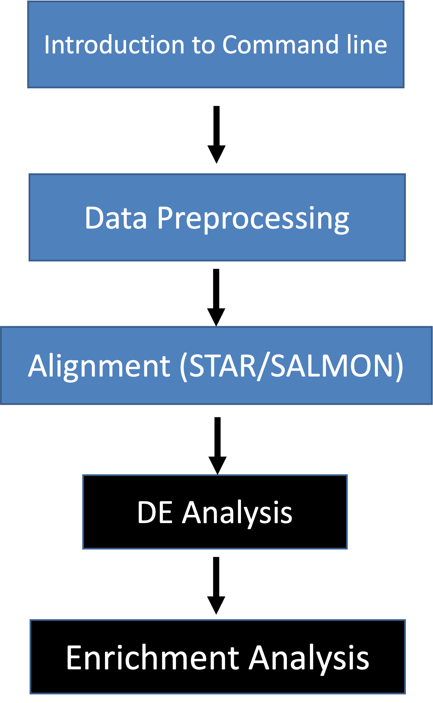

## Schedule

All posted times are **Pacific** time zone. At least one break will be provided each morning and afternoon.

### Monday, June 26 

|:----------- |:------------------- |
|**8:50 am**  | Zoom session starts |
|**1:00 pm**  | Sequencing technologies and library prep talk by Dr. Eric Chow, Director of CAT at UCSF |
|**5:00 pm** | Zoom session ends |

### Tuesday, June 27

|:----------- |:------------------- |
|**8:50 am**  | Zoom session starts |
|**5:00 pm** | Zoom session ends |

### Wednesday, June 28

|:----------- |:------------------- |
|**8:50 am**  | Zoom session starts |
|**5:00 pm** | Zoom session ends |

### Thursday, June 29

|:----------- |:------------------- |
|**8:50 am**  | Zoom session starts |
|**11:30 pm**  | Full length transcript sequencing talk by PacBio |
|**5:00 pm** | Zoom session ends |

### Friday, June 30

|:----------- |:------------------- |
|**8:50 am**  | Zoom session starts |
|**11:30 am**  | Single cell RNASeq technologies talk by 10X |
|**5:00 pm** | Zoom session ends |

## Workshop blocks

