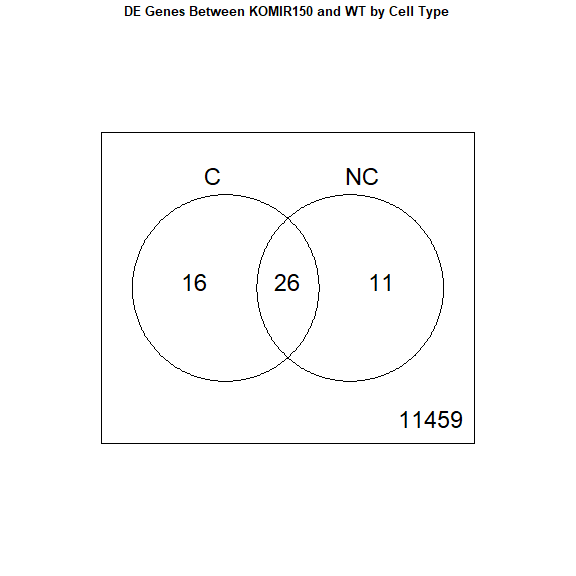

<script>
function buildQuiz(myq, qc){
  // variable to store the HTML output
  const output = [];

  // for each question...
  myq.forEach(
    (currentQuestion, questionNumber) => {

      // variable to store the list of possible answers
      const answers = [];

      // and for each available answer...
      for(letter in currentQuestion.answers){

        // ...add an HTML radio button
        answers.push(
          `<label>
            <input type="radio" name="question${questionNumber}" value="${letter}">
            ${letter} :
            ${currentQuestion.answers[letter]}
          </label><br/>`
        );
      }

      // add this question and its answers to the output
      output.push(
        `<div class="question"> ${currentQuestion.question} </div>
        <div class="answers"> ${answers.join('')} </div><br/>`
      );
    }
  );

  // finally combine our output list into one string of HTML and put it on the page
  qc.innerHTML = output.join('');
}

function showResults(myq, qc, rc){

  // gather answer containers from our quiz
  const answerContainers = qc.querySelectorAll('.answers');

  // keep track of user's answers
  let numCorrect = 0;

  // for each question...
  myq.forEach( (currentQuestion, questionNumber) => {

    // find selected answer
    const answerContainer = answerContainers[questionNumber];
    const selector = `input[name=question${questionNumber}]:checked`;
    const userAnswer = (answerContainer.querySelector(selector) || {}).value;

    // if answer is correct
    if(userAnswer === currentQuestion.correctAnswer){
      // add to the number of correct answers
      numCorrect++;

      // color the answers green
      answerContainers[questionNumber].style.color = 'lightgreen';
    }
    // if answer is wrong or blank
    else{
      // color the answers red
      answerContainers[questionNumber].style.color = 'red';
    }
  });

  // show number of correct answers out of total
  rc.innerHTML = `${numCorrect} out of ${myq.length}`;
}
</script>

# Differential Gene Expression Analysis in R

* Differential Gene Expression (DGE) between conditions is determined from count data
* Generally speaking differential expression analysis is performed in a very similar manner to metabolomics, proteomics, or DNA microarrays, once normalization and transformations have been performed.

A lot of RNA-seq analysis has been done in R and so there are many packages available to analyze and view this data. Two of the most commonly used are:
* DESeq2, developed by Simon Anders (also created htseq) in Wolfgang Huber’s group at EMBL
* edgeR and Voom (extension to Limma [microarrays] for RNA-seq), developed out of Gordon Smyth’s group from the Walter and Eliza Hall Institute of Medical Research in Australia

http://bioconductor.org/packages/release/BiocViews.html#___RNASeq

## Differential Expression Analysis with Limma-Voom

**limma** is an R package that was originally developed for differential expression (DE) analysis of gene expression microarray data.

**voom** is a function in the limma package that transforms RNA-Seq data for use with limma.

Together they allow fast, flexible, and powerful analyses of RNA-Seq data.  Limma-voom is _our_ tool of choice for DE analyses because it:

* Allows for incredibly flexible model specification (you can include multiple categorical and continuous variables, allowing incorporation of almost any kind of metadata).

* Based on simulation studies, maintains the false discovery rate at or below the nominal rate, unlike some other packages.

* Empirical Bayes smoothing of gene-wise standard deviations provides increased power.  

### Basic Steps of Differential Gene Expression
1. Read count data and annotation into R and preprocessing.
2. Calculate normalization factors (sample-specific adjustments)
3. Filter genes (uninteresting genes, e.g. unexpressed)
4. Account for expression-dependent variability by transformation, weighting, or modeling
5. Fitting a linear model
6. Perform statistical comparisons of interest (using contrasts)
7. Adjust for multiple testing, Benjamini-Hochberg (BH) or q-value
8. Check results for confidence
9. Attach annotation if available and write tables


## 1. Read in the counts table and create our DGEList


```r
counts <- read.delim("rnaseq_workshop_counts.txt", row.names = 1)
head(counts)
```

<div class='r_output'>                      mouse_110_WT_C mouse_110_WT_NC mouse_148_WT_C
 ENSMUSG00000102693.2              0               0              0
 ENSMUSG00000064842.3              0               0              0
 ENSMUSG00000051951.6              0               0              0
 ENSMUSG00000102851.2              0               0              0
 ENSMUSG00000103377.2              0               0              0
 ENSMUSG00000104017.2              0               0              0
                      mouse_148_WT_NC mouse_158_WT_C mouse_158_WT_NC
 ENSMUSG00000102693.2               0              0               0
 ENSMUSG00000064842.3               0              0               0
 ENSMUSG00000051951.6               0              0               0
 ENSMUSG00000102851.2               0              0               0
 ENSMUSG00000103377.2               0              0               0
 ENSMUSG00000104017.2               0              0               0
                      mouse_183_KOMIR150_C mouse_183_KOMIR150_NC
 ENSMUSG00000102693.2                    0                     0
 ENSMUSG00000064842.3                    0                     0
 ENSMUSG00000051951.6                    0                     0
 ENSMUSG00000102851.2                    0                     0
 ENSMUSG00000103377.2                    0                     0
 ENSMUSG00000104017.2                    0                     0
                      mouse_198_KOMIR150_C mouse_198_KOMIR150_NC
 ENSMUSG00000102693.2                    0                     0
 ENSMUSG00000064842.3                    0                     0
 ENSMUSG00000051951.6                    0                     0
 ENSMUSG00000102851.2                    0                     0
 ENSMUSG00000103377.2                    0                     0
 ENSMUSG00000104017.2                    0                     0
                      mouse_206_KOMIR150_C mouse_206_KOMIR150_NC
 ENSMUSG00000102693.2                    0                     0
 ENSMUSG00000064842.3                    0                     0
 ENSMUSG00000051951.6                    0                     0
 ENSMUSG00000102851.2                    0                     0
 ENSMUSG00000103377.2                    0                     0
 ENSMUSG00000104017.2                    0                     0
                      mouse_2670_KOTet3_C mouse_2670_KOTet3_NC
 ENSMUSG00000102693.2                   0                    0
 ENSMUSG00000064842.3                   0                    0
 ENSMUSG00000051951.6                   0                    0
 ENSMUSG00000102851.2                   0                    0
 ENSMUSG00000103377.2                   0                    0
 ENSMUSG00000104017.2                   0                    0
                      mouse_7530_KOTet3_C mouse_7530_KOTet3_NC
 ENSMUSG00000102693.2                   0                    0
 ENSMUSG00000064842.3                   0                    0
 ENSMUSG00000051951.6                   0                    0
 ENSMUSG00000102851.2                   0                    0
 ENSMUSG00000103377.2                   0                    0
 ENSMUSG00000104017.2                   0                    0
                      mouse_7531_KOTet3_C mouse_7532_WT_NC mouse_H510_WT_C
 ENSMUSG00000102693.2                   0                0               0
 ENSMUSG00000064842.3                   0                0               0
 ENSMUSG00000051951.6                   0                0               0
 ENSMUSG00000102851.2                   0                0               0
 ENSMUSG00000103377.2                   0                0               0
 ENSMUSG00000104017.2                   0                0               0
                      mouse_H510_WT_NC mouse_H514_WT_C mouse_H514_WT_NC
 ENSMUSG00000102693.2                0               0                0
 ENSMUSG00000064842.3                0               0                0
 ENSMUSG00000051951.6                0               0                0
 ENSMUSG00000102851.2                0               0                0
 ENSMUSG00000103377.2                0               0                0
 ENSMUSG00000104017.2                0               0                0
</div>
Create Differential Gene Expression List Object (DGEList) object 

A DGEList is an object in the package edgeR for storing count data, normalization factors, and other information


```r
d0 <- DGEList(counts)
```
  
**1a\.** Read in Annotation

```r
anno <- read.delim("ensembl_mm_109.txt",as.is=T)
dim(anno)
```

<div class='r_output'> [1] 57010    11
</div>
```r
head(anno)
```

<div class='r_output'>       Gene.stable.ID Gene.stable.ID.version
 1 ENSMUSG00000064336   ENSMUSG00000064336.1
 2 ENSMUSG00000064337   ENSMUSG00000064337.1
 3 ENSMUSG00000064338   ENSMUSG00000064338.1
 4 ENSMUSG00000064339   ENSMUSG00000064339.1
 5 ENSMUSG00000064340   ENSMUSG00000064340.1
 6 ENSMUSG00000064341   ENSMUSG00000064341.1
                                                                  Gene.description
 1   mitochondrially encoded tRNA phenylalanine [Source:MGI Symbol;Acc:MGI:102487]
 2             mitochondrially encoded 12S rRNA [Source:MGI Symbol;Acc:MGI:102493]
 3          mitochondrially encoded tRNA valine [Source:MGI Symbol;Acc:MGI:102472]
 4             mitochondrially encoded 16S rRNA [Source:MGI Symbol;Acc:MGI:102492]
 5       mitochondrially encoded tRNA leucine 1 [Source:MGI Symbol;Acc:MGI:102482]
 6 mitochondrially encoded NADH dehydrogenase 1 [Source:MGI Symbol;Acc:MGI:101787]
   Chromosome.scaffold.name Gene.start..bp. Gene.end..bp. Strand Gene.name
 1                       MT               1            68      1     mt-Tf
 2                       MT              70          1024      1   mt-Rnr1
 3                       MT            1025          1093      1     mt-Tv
 4                       MT            1094          2675      1   mt-Rnr2
 5                       MT            2676          2750      1    mt-Tl1
 6                       MT            2751          3707      1    mt-Nd1
   Transcript.count Gene...GC.content      Gene.type
 1                1             30.88        Mt_tRNA
 2                1             35.81        Mt_rRNA
 3                1             39.13        Mt_tRNA
 4                1             35.40        Mt_rRNA
 5                1             44.00        Mt_tRNA
 6                1             37.62 protein_coding
</div>
```r
tail(anno)
```

<div class='r_output'>           Gene.stable.ID Gene.stable.ID.version
 57005 ENSMUSG00000087337   ENSMUSG00000087337.2
 57006 ENSMUSG00000089575   ENSMUSG00000089575.3
 57007 ENSMUSG00000119806   ENSMUSG00000119806.1
 57008 ENSMUSG00000087609   ENSMUSG00000087609.2
 57009 ENSMUSG00000119525   ENSMUSG00000119525.1
 57010 ENSMUSG00000083391   ENSMUSG00000083391.3
                                                     Gene.description
 57005       predicted gene 14144 [Source:MGI Symbol;Acc:MGI:3702160]
 57006      predicted gene, 23005 [Source:MGI Symbol;Acc:MGI:5452782]
 57007      predicted gene, 24077 [Source:MGI Symbol;Acc:MGI:5453854]
 57008 RIKEN cDNA 4930442J19 gene [Source:MGI Symbol;Acc:MGI:1921910]
 57009      predicted gene, 23261 [Source:MGI Symbol;Acc:MGI:5453038]
 57010       predicted gene 14148 [Source:MGI Symbol;Acc:MGI:3651554]
       Chromosome.scaffold.name Gene.start..bp. Gene.end..bp. Strand
 57005                        2       151106523     151120756     -1
 57006                        2       151124895     151125030     -1
 57007                        2       151142864     151142999      1
 57008                        2       151143894     151158167      1
 57009                        2       151214283     151214418     -1
 57010                        2       151215928     151216967      1
           Gene.name Transcript.count Gene...GC.content            Gene.type
 57005       Gm14144                1             39.95               lncRNA
 57006       Gm23005                1             43.38               snoRNA
 57007       Gm24077                1             44.12               snoRNA
 57008 4930442J19Rik                2             40.05               lncRNA
 57009       Gm23261                1             45.59               snoRNA
 57010       Gm14148                1             53.75 processed_pseudogene
</div>
```r
any(duplicated(anno$Gene.stable.ID))
```

<div class='r_output'> [1] FALSE
</div>
**1b\.** Derive experiment metadata from the sample names

Our experiment has two factors, genotype ("WT", "KOMIR150", or "KOTet3") and cell type ("C" or "NC").

The sample names are "mouse" followed by an animal identifier, followed by the genotype, followed by the cell type.

```r
sample_names <- colnames(counts)
metadata <- as.data.frame(strsplit2(sample_names, c("_"))[,2:4], row.names = sample_names)
colnames(metadata) <- c("mouse", "genotype", "cell_type")
```

Create a new variable "group" that combines genotype and cell type.

```r
metadata$group <- interaction(metadata$genotype, metadata$cell_type)
table(metadata$group)
```

<div class='r_output'> 
  KOMIR150.C    KOTet3.C        WT.C KOMIR150.NC   KOTet3.NC       WT.NC 
           3           3           5           3           2           6
</div>
```r
table(metadata$mouse)
```

<div class='r_output'> 
  110  148  158  183  198  206 2670 7530 7531 7532 H510 H514 
    2    2    2    2    2    2    2    2    1    1    2    2
</div>
Note: you can also enter group information manually, or read it in from an external file.  If you do this, it is $VERY, VERY, VERY$ important that you make sure the metadata is in the same order as the column names of the counts table.

## Quiz 1

<div id="quiz1" class="quiz"></div>
<button id="submit1">Submit Quiz</button>
<div id="results1" class="output"></div>
<script>
quizContainer1 = document.getElementById('quiz1');
resultsContainer1 = document.getElementById('results1');
submitButton1 = document.getElementById('submit1');

myQuestions1 = [
  {
    question: "How many genes are in the counts table",
    answers: {
      a: "22",
      b: "57,010",
      c: "54,847,988",
    },
    correctAnswer: "b"
  },
  {
    question: "How many samples are in the counts table",
    answers: {
      a: "22",
      b: "57,010",
      c: "54,847,988",
    },
    correctAnswer: "a"
  },
  {
    question: "What is the total count across all genes for sample mouse_110_WT_C",
    answers: {
      a: "10,000",
      b: "2,787,240",
      c: "2,304,023"
    },
    correctAnswer: "c"
  },
  {
    question: "'Extra-credit' question: How many genes have a count of 0 in every sample?",
    answers: {
      a: "23,396",
      b: "33,614",
      c: "57,010"
    },
    correctAnswer: "b"
  }
];

buildQuiz(myQuestions1, quizContainer1);
submitButton1.addEventListener('click', function() {showResults(myQuestions1, quizContainer1, resultsContainer1);});
</script>

## 2. Preprocessing and Normalization factors

In differential expression analysis, only sample-specific effects need to be normalized, we are NOT concerned with comparisons and quantification of absolute expression.

* Sequence depth – is a sample specific effect and needs to be adjusted for.
* RNA composition - finding a set of scaling factors for the library sizes that minimize the log-fold changes between the samples for most genes (edgeR uses a trimmed mean of M-values between each pair of sample)
* GC content – is NOT sample-specific (except when it is)
* Gene Length – is NOT sample-specific (except when it is)

In edgeR/limma, you calculate normalization factors to scale the raw library sizes (number of reads) using the function calcNormFactors, which by default uses TMM (weighted trimmed means of M values to the reference). Assumes most genes are not DE.

Proposed by Robinson and Oshlack (2010).


```r
d0 <- calcNormFactors(d0)
d0$samples
```

<div class='r_output'>                       group lib.size norm.factors
 mouse_110_WT_C            1  2304023    1.0245280
 mouse_110_WT_NC           1  2787240    0.9867519
 mouse_148_WT_C            1  2771020    1.0173432
 mouse_148_WT_NC           1  2567752    0.9825135
 mouse_158_WT_C            1  2925991    1.0036005
 mouse_158_WT_NC           1  2606603    0.9659563
 mouse_183_KOMIR150_C      1  2489520    1.0162146
 mouse_183_KOMIR150_NC     1  1827790    0.9951951
 mouse_198_KOMIR150_C      1  2801612    1.0114713
 mouse_198_KOMIR150_NC     1  2876668    0.9869667
 mouse_206_KOMIR150_C      1  1368036    1.0007811
 mouse_206_KOMIR150_NC     1   937916    0.9711335
 mouse_2670_KOTet3_C       1  2864926    1.0034471
 mouse_2670_KOTet3_NC      1  2890691    0.9735639
 mouse_7530_KOTet3_C       1  2571863    1.0327346
 mouse_7530_KOTet3_NC      1  2828322    0.9580725
 mouse_7531_KOTet3_C       1  2611767    1.0368431
 mouse_7532_WT_NC          1  2654919    1.0023156
 mouse_H510_WT_C           1  2539507    1.0350765
 mouse_H510_WT_NC          1  2777733    1.0142696
 mouse_H514_WT_C           1  2255608    0.9949890
 mouse_H514_WT_NC          1  2588481    0.9914444
</div>
**Note:** calcNormFactors doesn't _normalize_ the data, it just calculates normalization factors for use downstream.

## 3. Filtering genes

We filter genes based on non-experimental factors to reduce the number of genes/tests being conducted and therefor do not have to be accounted for in our transformation or multiple testing correction. Commonly we try to remove genes that are either a) unexpressed, or b) unchanging (low-variability).

Common filters include:
1. to remove genes with a max value (X) of less then Y.
2. to remove genes that are less than X normalized read counts (cpm) across a certain number of samples. Ex: rowSums(cpms <=1) < 3 , require at least 1 cpm in at least 3 samples to keep.
3. A less used filter is for genes with minimum variance across all samples, so if a gene isn't changing (constant expression) its inherently not interesting therefor no need to test. 

We will use the built in function filterByExpr() to filter low-expressed genes.  filterByExpr uses the experimental design to determine how many samples a gene needs to be expressed in to stay.  Importantly, once this number of samples has been determined, the group information is not used in filtering.

Using filterByExpr requires specifying the model we will use to analysis our data.  

* The model you use will change for every experiment, and this step should be given the most time and attention.*

We use a model that includes group and (in order to account for the paired design) mouse.


```r
group <- metadata$group
mouse <- metadata$mouse
mm <- model.matrix(~0 + group + mouse)
head(mm)
```

<div class='r_output'>   groupKOMIR150.C groupKOTet3.C groupWT.C groupKOMIR150.NC groupKOTet3.NC
 1               0             0         1                0              0
 2               0             0         0                0              0
 3               0             0         1                0              0
 4               0             0         0                0              0
 5               0             0         1                0              0
 6               0             0         0                0              0
   groupWT.NC mouse148 mouse158 mouse183 mouse198 mouse206 mouse2670 mouse7530
 1          0        0        0        0        0        0         0         0
 2          1        0        0        0        0        0         0         0
 3          0        1        0        0        0        0         0         0
 4          1        1        0        0        0        0         0         0
 5          0        0        1        0        0        0         0         0
 6          1        0        1        0        0        0         0         0
   mouse7531 mouse7532 mouseH510 mouseH514
 1         0         0         0         0
 2         0         0         0         0
 3         0         0         0         0
 4         0         0         0         0
 5         0         0         0         0
 6         0         0         0         0
</div>

```r
keep <- filterByExpr(d0, mm)
sum(keep) # number of genes retained
```

<div class='r_output'> [1] 11512
</div>
```r
d <- d0[keep,]
```
"Low-expressed" depends on the dataset and can be subjective.

Visualizing your data with a Multidimensional scaling (MDS) plot.

```r
plotMDS(d, col = as.numeric(metadata$group), cex=1)
```

<!-- -->

The MDS plot tells you **A LOT** about what to expect from your experiment.

**3a\.** Extracting "normalized" expression table

### RPKM vs. FPKM vs. CPM and Model Based
* RPKM - Reads per kilobase per million mapped reads
* FPKM - Fragments per kilobase per million mapped reads
* logCPM – log Counts per million [ good for producing MDS plots, estimate of normalized values in model based ]
* Model based - original read counts are not themselves transformed, but rather correction factors are used in the DE model itself. 

We use the `cpm` function with log=TRUE to obtain log-transformed normalized expression data.  On the log scale, the data has less mean-dependent variability and is more suitable for plotting.

```r
logcpm <- cpm(d, prior.count=2, log=TRUE)
write.table(logcpm,"rnaseq_workshop_normalized_counts.txt",sep="\t",quote=F)
```

## Quiz 2

<div id="quiz2" class="quiz"></div>
<button id="submit2">Submit Quiz</button>
<div id="results2" class="output"></div>
<script>
quizContainer2 = document.getElementById('quiz2');
resultsContainer2 = document.getElementById('results2');
submitButton2 = document.getElementById('submit2');

myQuestions2 = [
  {
    question: "Which sample has the largest normalization factor?",
    answers: {
      a: "mouse_7530_KOTet3_NC",
      b: "mouse_7531_KOTet3_C",
      c: "mouse_148_WT_C",
    },
    correctAnswer: "b"
  },
  {
    question: "Is the sample with the largest normalization factor the sample with the smallest total counts?",
    answers: {
      a: "TRUE",
      b: "FALSE"
    },
    correctAnswer: "b"
  },
  {
    question: "Based on the MDS plot, what is the biggest source of between-sample differences?",
    answers: {
      a: "Genotype",
      b: "Mouse",
      c: "Cell type"
    },
    correctAnswer: "c"
  },
  {
    question: "Make an MDS plot of the unfiltered data.  How does it differ from the MDS plot of the filtered data?",
    answers: {
      a: "The axis ranges are larger",
      b: "There is less separation",
      c: "The plots are nearly identical"
    },
    correctAnswer: "c"
  }
];

buildQuiz(myQuestions2, quizContainer2);
submitButton2.addEventListener('click', function() {showResults(myQuestions2, quizContainer2, resultsContainer2);});
</script>

## 4. Voom transformation and calculation of variance weights

**4a\.** **Voom**

```r
y <- voom(d, mm, plot = T)
```

<div class='r_output'> Coefficients not estimable: mouse206 mouse7531
</div>
<div class='r_output'> Warning: Partial NA coefficients for 11512 probe(s)
</div>
<!-- -->

What is voom doing?

1. Counts are transformed to log2 counts per million reads (CPM), where "per million reads" is defined based on the normalization factors we calculated earlier.
2. A linear model is fitted to the log2 CPM for each gene, and the residuals are calculated.
3. A smoothed curve is fitted to the sqrt(residual standard deviation) by average expression.
(see red line in plot above)
4. The smoothed curve is used to obtain weights for each gene and sample that are passed into limma along with the log2 CPMs.

More details at "[voom: precision weights unlock linear model analysis tools for RNA-seq read counts](https://genomebiology.biomedcentral.com/articles/10.1186/gb-2014-15-2-r29)"

If your voom plot looks like the below (performed on the raw data), you might want to filter more:

```r
tmp <- voom(d0, mm, plot = T)
```

<div class='r_output'> Coefficients not estimable: mouse206 mouse7531
</div>
<div class='r_output'> Warning: Partial NA coefficients for 57010 probe(s)
</div>
<!-- -->


## 5. Fitting linear models in limma

lmFit fits a linear model using weighted least squares for each gene:

```r
fit <- lmFit(y, mm)
```

<div class='r_output'> Coefficients not estimable: mouse206 mouse7531
</div>
<div class='r_output'> Warning: Partial NA coefficients for 11512 probe(s)
</div>
```r
head(coef(fit))
```

<div class='r_output'>                       groupKOMIR150.C groupKOTet3.C groupWT.C groupKOMIR150.NC
 ENSMUSG00000033845.14        4.772837      4.963655  4.704938         4.971355
 ENSMUSG00000025903.15        4.980285      5.414525  5.396681         5.030629
 ENSMUSG00000033813.16        5.911137      5.666063  5.810657         5.983298
 ENSMUSG00000033793.13        5.230663      5.283875  5.423001         5.069581
 ENSMUSG00000090031.4         2.305425      3.493513  1.916860         2.465590
 ENSMUSG00000025907.15        6.383192      6.466658  6.485529         6.197580
                       groupKOTet3.NC groupWT.NC    mouse148    mouse158
 ENSMUSG00000033845.14       4.609835   4.507908  0.23436789  0.15808834
 ENSMUSG00000025903.15       5.305906   5.156686 -0.07626244 -0.06283904
 ENSMUSG00000033813.16       5.858753   5.828425  0.04411038  0.03083226
 ENSMUSG00000033793.13       4.774806   5.149948 -0.20016385 -0.25080455
 ENSMUSG00000090031.4        3.856040   2.136507 -0.12083090  0.10917459
 ENSMUSG00000025907.15       6.551041   6.214839 -0.15305947 -0.06970361
                          mouse183    mouse198 mouse206   mouse2670    mouse7530
 ENSMUSG00000033845.14 -0.34352972 -0.06398921       NA -0.06090536 -0.005868771
 ENSMUSG00000025903.15  0.37805043  0.34135424       NA  0.03692425 -0.148032773
 ENSMUSG00000033813.16 -0.22263564 -0.01365372       NA  0.16989159  0.194964781
 ENSMUSG00000033793.13 -0.27484845  0.07620846       NA  0.21176027  0.474793360
 ENSMUSG00000090031.4  -0.35385622  0.15261515       NA -1.10525514 -0.205389075
 ENSMUSG00000025907.15 -0.06134122  0.16667360       NA -0.05262854 -0.116519792
                       mouse7531   mouse7532   mouseH510  mouseH514
 ENSMUSG00000033845.14        NA  0.13536933  0.06729753  0.1296202
 ENSMUSG00000025903.15        NA  0.17950152  0.11575108  0.1254478
 ENSMUSG00000033813.16        NA  0.05877819  0.03878651 -0.0376184
 ENSMUSG00000033793.13        NA -0.32354845 -0.09193819 -0.1845264
 ENSMUSG00000090031.4         NA  1.89443112  1.24527471  1.4453435
 ENSMUSG00000025907.15        NA  0.10447457 -0.16556570 -0.2535768
</div>
Comparisons between groups (log fold-changes) are obtained as _contrasts_ of these fitted linear models:

## 6. Specify which groups to compare using contrasts:

Comparison between cell types for genotype WT.

```r
contr <- makeContrasts(groupWT.C - groupWT.NC, levels = colnames(coef(fit)))
contr
```

<div class='r_output'>                   Contrasts
 Levels             groupWT.C - groupWT.NC
   groupKOMIR150.C                       0
   groupKOTet3.C                         0
   groupWT.C                             1
   groupKOMIR150.NC                      0
   groupKOTet3.NC                        0
   groupWT.NC                           -1
   mouse148                              0
   mouse158                              0
   mouse183                              0
   mouse198                              0
   mouse206                              0
   mouse2670                             0
   mouse7530                             0
   mouse7531                             0
   mouse7532                             0
   mouseH510                             0
   mouseH514                             0
</div>
**6a\.** Estimate contrast for each gene

```r
tmp <- contrasts.fit(fit, contr)
```

The variance characteristics of low expressed genes are different from high expressed genes, if treated the same, the effect is to over represent low expressed genes in the DE list. This is corrected for by the log transformation and voom. However, some genes will have increased or decreased variance that is not a result of low expression, but due to other random factors. We are going to run empirical Bayes to adjust the variance of these genes.

Empirical Bayes smoothing of standard errors (shifts standard errors that are much larger or smaller than those from other genes towards the average standard error) (see "[Linear Models and Empirical Bayes Methods for Assessing Differential Expression in Microarray Experiments](https://www.degruyter.com/doi/10.2202/1544-6115.1027)"

**6b\.** Apply EBayes

```r
tmp <- eBayes(tmp)
```

## 7. Multiple Testing Adjustment

The TopTable. Adjust for multiple testing using method of Benjamini & Hochberg (BH), or its 'alias' fdr. "[Controlling the false discovery rate: a practical and powerful approach to multiple testing](http://www.jstor.org/stable/2346101).

here `n=Inf` says to produce the topTable for **all** genes. 

```r
top.table <- topTable(tmp, adjust.method = "BH", sort.by = "P", n = Inf)
```

### Multiple Testing Correction

Simply a must! Best choices are:
  * [FDR](http://www.jstor.org/stable/2346101) (false discovery rate), such as Benjamini-Hochberg (1995).
  * [Qvalue](https://rss.onlinelibrary.wiley.com/doi/abs/10.1111/1467-9868.00346) - Storey (2002)

The FDR (or qvalue) is a statement about the list and is no longer about the gene (pvalue). So a FDR of 0.05, says you expect 5% false positives among the list of genes with an FDR of 0.05 or less.

The statement “Statistically significantly different” means FDR of 0.05 or less.

**7a\.** How many DE genes are there (false discovery rate corrected)?

```r
length(which(top.table$adj.P.Val < 0.05))
```

<div class='r_output'> [1] 5682
</div>
## 8. Check your results for confidence.

You've conducted an experiment, you've seen a phenotype. Now check which genes are most differentially expressed (show the top 50)? Look up these top genes, their description and ensure they relate to your experiment/phenotype. 

```r
head(top.table, 50)
```

<div class='r_output'>                           logFC   AveExpr         t      P.Value    adj.P.Val
 ENSMUSG00000020608.8  -2.493130  7.869004 -44.14352 8.218003e-19 9.460565e-15
 ENSMUSG00000052212.7   4.539354  6.223898  40.65736 3.232959e-18 1.860891e-14
 ENSMUSG00000049103.15  2.152305  9.912143  38.76983 7.127039e-18 2.734882e-14
 ENSMUSG00000030203.18 -4.128233  7.025932 -33.50481 8.029402e-17 2.228834e-13
 ENSMUSG00000027508.16 -1.906648  8.143581 -32.87085 1.101664e-16 2.228834e-13
 ENSMUSG00000021990.17 -2.686905  8.379626 -32.76572 1.161658e-16 2.228834e-13
 ENSMUSG00000037820.16 -4.178760  7.141891 -31.77612 1.929424e-16 3.173076e-13
 ENSMUSG00000026193.16  4.795082 10.171591  31.10868 2.740507e-16 3.709716e-13
 ENSMUSG00000024164.16  1.789078  9.897286  31.00222 2.900230e-16 3.709716e-13
 ENSMUSG00000038807.20 -1.572034  9.037110 -30.77364 3.277408e-16 3.772952e-13
 ENSMUSG00000037185.10 -1.545563  9.505610 -30.38871 4.034762e-16 4.222562e-13
 ENSMUSG00000030342.9  -3.687260  6.068776 -30.15411 4.585503e-16 4.399026e-13
 ENSMUSG00000048498.9  -5.800771  6.532762 -29.90498 5.258462e-16 4.656570e-13
 ENSMUSG00000051177.17  3.180492  5.017386  29.36517 7.101907e-16 5.274520e-13
 ENSMUSG00000021614.17  5.976450  5.456194  29.32405 7.267961e-16 5.274520e-13
 ENSMUSG00000027215.14 -2.583659  6.924810 -29.30874 7.330813e-16 5.274520e-13
 ENSMUSG00000030413.8  -2.616187  6.659403 -29.17831 7.890290e-16 5.343118e-13
 ENSMUSG00000039959.14 -1.492452  8.958932 -28.98900 8.784157e-16 5.617956e-13
 ENSMUSG00000029254.17 -2.403420  6.434301 -28.83935 9.566448e-16 5.728322e-13
 ENSMUSG00000020108.5  -2.056257  6.977319 -28.77031 9.951914e-16 5.728322e-13
 ENSMUSG00000028885.9  -2.362908  7.077824 -28.60037 1.097250e-15 5.805778e-13
 ENSMUSG00000020437.13 -1.209857 10.245636 -28.53978 1.136264e-15 5.805778e-13
 ENSMUSG00000018168.9  -3.909027  5.413591 -28.50407 1.159945e-15 5.805778e-13
 ENSMUSG00000023827.9  -2.154776  6.436057 -28.40706 1.226951e-15 5.885277e-13
 ENSMUSG00000020212.15 -2.174074  6.806148 -28.06641 1.496626e-15 6.891664e-13
 ENSMUSG00000038147.15  1.679286  7.172528  27.57769 1.998385e-15 8.848235e-13
 ENSMUSG00000022584.15  4.714295  6.764996  27.46247 2.140876e-15 9.128062e-13
 ENSMUSG00000023809.11 -3.192343  4.819492 -27.29551 2.366751e-15 9.730728e-13
 ENSMUSG00000020387.16 -4.939993  4.360263 -27.07193 2.709491e-15 1.075574e-12
 ENSMUSG00000021728.9   1.659001  8.388920  26.82524 3.149454e-15 1.208551e-12
 ENSMUSG00000020272.9  -1.307883 10.477646 -26.64294 3.522875e-15 1.308237e-12
 ENSMUSG00000018001.19 -2.621412  7.202409 -26.47379 3.911419e-15 1.402279e-12
 ENSMUSG00000044783.17 -1.739259  7.018167 -26.42979 4.019736e-15 1.402279e-12
 ENSMUSG00000008496.20 -1.492397  9.437025 -26.24820 4.501574e-15 1.468230e-12
 ENSMUSG00000026923.16  1.995423  6.646797  26.21732 4.589425e-15 1.468230e-12
 ENSMUSG00000042700.17 -1.830400  6.106321 -26.19544 4.652768e-15 1.468230e-12
 ENSMUSG00000035493.11  1.911074  9.780777  26.17291 4.718947e-15 1.468230e-12
 ENSMUSG00000039109.18  4.732427  8.315758  25.43302 7.553645e-15 2.288357e-12
 ENSMUSG00000043263.14  1.777767  7.862452  25.17310 8.938720e-15 2.638527e-12
 ENSMUSG00000051457.8  -2.270967  9.825287 -25.09759 9.389699e-15 2.666143e-12
 ENSMUSG00000029287.15 -3.786723  5.433231 -25.08044 9.495473e-15 2.666143e-12
 ENSMUSG00000033705.18  1.683257  7.147600  24.87296 1.087952e-14 2.982025e-12
 ENSMUSG00000022818.14 -1.757183  6.811563 -24.68368 1.232900e-14 3.300731e-12
 ENSMUSG00000027435.9   3.024522  6.749402  24.49769 1.395372e-14 3.650800e-12
 ENSMUSG00000016496.8  -3.570321  6.433647 -24.41867 1.471115e-14 3.755765e-12
 ENSMUSG00000050335.18  1.101406  8.992598  24.38893 1.500740e-14 3.755765e-12
 ENSMUSG00000005800.4   5.724669  4.153671  24.17782 1.730061e-14 4.237545e-12
 ENSMUSG00000032035.17 -4.401372  5.196779 -24.04687 1.890703e-14 4.534536e-12
 ENSMUSG00000034731.12 -1.756879  6.627812 -23.93690 2.037809e-14 4.777498e-12
 ENSMUSG00000025701.13 -2.752185  5.304627 -23.91042 2.075008e-14 4.777498e-12
                              B
 ENSMUSG00000020608.8  33.38996
 ENSMUSG00000052212.7  31.53894
 ENSMUSG00000049103.15 31.31019
 ENSMUSG00000030203.18 28.83527
 ENSMUSG00000027508.16 28.58448
 ENSMUSG00000021990.17 28.52970
 ENSMUSG00000037820.16 27.95664
 ENSMUSG00000026193.16 27.57318
 ENSMUSG00000024164.16 27.53988
 ENSMUSG00000038807.20 27.45455
 ENSMUSG00000037185.10 27.21836
 ENSMUSG00000030342.9  26.99398
 ENSMUSG00000048498.9  26.66478
 ENSMUSG00000051177.17 26.28212
 ENSMUSG00000021614.17 25.47280
 ENSMUSG00000027215.14 26.68986
 ENSMUSG00000030413.8  26.61881
 ENSMUSG00000039959.14 26.44418
 ENSMUSG00000029254.17 26.41588
 ENSMUSG00000020108.5  26.37860
 ENSMUSG00000028885.9  26.29350
 ENSMUSG00000020437.13 26.10015
 ENSMUSG00000018168.9  26.02538
 ENSMUSG00000023827.9  26.17056
 ENSMUSG00000020212.15 25.98397
 ENSMUSG00000038147.15 25.68536
 ENSMUSG00000022584.15 25.60670
 ENSMUSG00000023809.11 25.12667
 ENSMUSG00000020387.16 23.92006
 ENSMUSG00000021728.9  25.17485
 ENSMUSG00000020272.9  24.91139
 ENSMUSG00000018001.19 25.01060
 ENSMUSG00000044783.17 24.98954
 ENSMUSG00000008496.20 24.73595
 ENSMUSG00000026923.16 24.85870
 ENSMUSG00000042700.17 24.84489
 ENSMUSG00000035493.11 24.67448
 ENSMUSG00000039109.18 24.30019
 ENSMUSG00000043263.14 24.12598
 ENSMUSG00000051457.8  23.94796
 ENSMUSG00000029287.15 24.05666
 ENSMUSG00000033705.18 23.96609
 ENSMUSG00000022818.14 23.86237
 ENSMUSG00000027435.9  23.75649
 ENSMUSG00000016496.8  23.69362
 ENSMUSG00000050335.18 23.52743
 ENSMUSG00000005800.4  21.62630
 ENSMUSG00000032035.17 23.24502
 ENSMUSG00000034731.12 23.36313
 ENSMUSG00000025701.13 23.29131
</div>Columns are
* logFC: log2 fold change of WT.C/WT.NC
* AveExpr: Average expression across all samples, in log2 CPM
* t: logFC divided by its standard error
* P.Value: Raw p-value (based on t) from test that logFC differs from 0
* adj.P.Val: Benjamini-Hochberg false discovery rate adjusted p-value
* B: log-odds that gene is DE (arguably less useful than the other columns)

ENSMUSG00000030203.18 has higher expression at WT NC than at WT C (logFC is negative).  ENSMUSG00000026193.16 has higher expression at WT C than at WT NC (logFC is positive).

## 9. Write top.table to a file, adding in cpms and annotation

```r
top.table$Gene <- rownames(top.table)
top.table <- top.table[,c("Gene", names(top.table)[1:6])]
top.table <- data.frame(top.table,anno[match(top.table$Gene,anno$Gene.stable.ID.version),],logcpm[match(top.table$Gene,rownames(logcpm)),])

head(top.table)
```

<div class='r_output'>                                        Gene     logFC  AveExpr         t
 ENSMUSG00000020608.8   ENSMUSG00000020608.8 -2.493130 7.869004 -44.14352
 ENSMUSG00000052212.7   ENSMUSG00000052212.7  4.539354 6.223898  40.65736
 ENSMUSG00000049103.15 ENSMUSG00000049103.15  2.152305 9.912143  38.76983
 ENSMUSG00000030203.18 ENSMUSG00000030203.18 -4.128233 7.025932 -33.50481
 ENSMUSG00000027508.16 ENSMUSG00000027508.16 -1.906648 8.143581 -32.87085
 ENSMUSG00000021990.17 ENSMUSG00000021990.17 -2.686905 8.379626 -32.76572
                            P.Value    adj.P.Val        B     Gene.stable.ID
 ENSMUSG00000020608.8  8.218003e-19 9.460565e-15 33.38996 ENSMUSG00000020608
 ENSMUSG00000052212.7  3.232959e-18 1.860891e-14 31.53894 ENSMUSG00000052212
 ENSMUSG00000049103.15 7.127039e-18 2.734882e-14 31.31019 ENSMUSG00000049103
 ENSMUSG00000030203.18 8.029402e-17 2.228834e-13 28.83527 ENSMUSG00000030203
 ENSMUSG00000027508.16 1.101664e-16 2.228834e-13 28.58448 ENSMUSG00000027508
 ENSMUSG00000021990.17 1.161658e-16 2.228834e-13 28.52970 ENSMUSG00000021990
                       Gene.stable.ID.version
 ENSMUSG00000020608.8    ENSMUSG00000020608.8
 ENSMUSG00000052212.7    ENSMUSG00000052212.7
 ENSMUSG00000049103.15  ENSMUSG00000049103.15
 ENSMUSG00000030203.18  ENSMUSG00000030203.18
 ENSMUSG00000027508.16  ENSMUSG00000027508.16
 ENSMUSG00000021990.17  ENSMUSG00000021990.17
                                                                                                          Gene.description
 ENSMUSG00000020608.8                          structural maintenance of chromosomes 6 [Source:MGI Symbol;Acc:MGI:1914491]
 ENSMUSG00000052212.7                                                    CD177 antigen [Source:MGI Symbol;Acc:MGI:1916141]
 ENSMUSG00000049103.15                                 chemokine (C-C motif) receptor 2 [Source:MGI Symbol;Acc:MGI:106185]
 ENSMUSG00000030203.18                                 dual specificity phosphatase 16 [Source:MGI Symbol;Acc:MGI:1917936]
 ENSMUSG00000027508.16 phosphoprotein associated with glycosphingolipid microdomains 1 [Source:MGI Symbol;Acc:MGI:2443160]
 ENSMUSG00000021990.17                                    spermatogenesis associated 13 [Source:MGI Symbol;Acc:MGI:104838]
                       Chromosome.scaffold.name Gene.start..bp. Gene.end..bp.
 ENSMUSG00000020608.8                        12        11315887      11369786
 ENSMUSG00000052212.7                         7        24443408      24459736
 ENSMUSG00000049103.15                        9       123901987     123913594
 ENSMUSG00000030203.18                        6       134692431     134769588
 ENSMUSG00000027508.16                        3         9752539       9898739
 ENSMUSG00000021990.17                       14        60871450      61002005
                       Strand Gene.name Transcript.count Gene...GC.content
 ENSMUSG00000020608.8       1      Smc6               12             38.40
 ENSMUSG00000052212.7      -1     Cd177                2             52.26
 ENSMUSG00000049103.15      1      Ccr2                4             38.86
 ENSMUSG00000030203.18     -1    Dusp16                7             41.74
 ENSMUSG00000027508.16     -1      Pag1                5             44.66
 ENSMUSG00000021990.17      1   Spata13                9             47.38
                            Gene.type mouse_110_WT_C mouse_110_WT_NC
 ENSMUSG00000020608.8  protein_coding       6.655047        9.080727
 ENSMUSG00000052212.7  protein_coding       8.661587        4.190151
 ENSMUSG00000049103.15 protein_coding      10.944175        8.855782
 ENSMUSG00000030203.18 protein_coding       5.044291        9.007196
 ENSMUSG00000027508.16 protein_coding       7.223967        9.055317
 ENSMUSG00000021990.17 protein_coding       7.003544        9.576715
                       mouse_148_WT_C mouse_148_WT_NC mouse_158_WT_C
 ENSMUSG00000020608.8        7.056520        9.421518       6.778389
 ENSMUSG00000052212.7        8.393913        3.665950       8.148673
 ENSMUSG00000049103.15      11.280438        8.991397      11.102168
 ENSMUSG00000030203.18       5.222585        9.112049       5.494145
 ENSMUSG00000027508.16       7.086953        9.147773       7.424180
 ENSMUSG00000021990.17       7.366667        9.808340       7.054526
                       mouse_158_WT_NC mouse_183_KOMIR150_C
 ENSMUSG00000020608.8         9.187451             6.825973
 ENSMUSG00000052212.7         3.423665             8.766870
 ENSMUSG00000049103.15        8.757934            11.080629
 ENSMUSG00000030203.18        9.234820             5.261254
 ENSMUSG00000027508.16        9.292609             7.234678
 ENSMUSG00000021990.17        9.754609             7.461915
                       mouse_183_KOMIR150_NC mouse_198_KOMIR150_C
 ENSMUSG00000020608.8               9.312343             6.526691
 ENSMUSG00000052212.7               3.560299             8.678775
 ENSMUSG00000049103.15              8.759736            10.746479
 ENSMUSG00000030203.18              8.936869             4.824102
 ENSMUSG00000027508.16              8.858728             7.071960
 ENSMUSG00000021990.17              9.604918             6.575551
                       mouse_198_KOMIR150_NC mouse_206_KOMIR150_C
 ENSMUSG00000020608.8               8.986655             6.418331
 ENSMUSG00000052212.7               3.790099             8.766170
 ENSMUSG00000049103.15              8.537930            10.803031
 ENSMUSG00000030203.18              9.216715             5.249907
 ENSMUSG00000027508.16              8.819017             6.948477
 ENSMUSG00000021990.17              9.334734             6.592224
                       mouse_206_KOMIR150_NC mouse_2670_KOTet3_C
 ENSMUSG00000020608.8               8.947641            6.549630
 ENSMUSG00000052212.7               3.686874            7.836953
 ENSMUSG00000049103.15              8.564049           11.467048
 ENSMUSG00000030203.18              9.532892            4.957196
 ENSMUSG00000027508.16              8.892049            7.741692
 ENSMUSG00000021990.17              9.205464            7.794636
                       mouse_2670_KOTet3_NC mouse_7530_KOTet3_C
 ENSMUSG00000020608.8              9.517943            6.405323
 ENSMUSG00000052212.7              4.129462            8.247370
 ENSMUSG00000049103.15             7.552329           11.195297
 ENSMUSG00000030203.18             9.913045            4.054373
 ENSMUSG00000027508.16             9.509528            7.436609
 ENSMUSG00000021990.17            10.645589            7.335982
                       mouse_7530_KOTet3_NC mouse_7531_KOTet3_C mouse_7532_WT_NC
 ENSMUSG00000020608.8              9.353148            6.264398         8.854935
 ENSMUSG00000052212.7              3.325902            9.028515         4.568319
 ENSMUSG00000049103.15             7.252444           11.333679         9.613225
 ENSMUSG00000030203.18             9.488268            4.091681         9.038311
 ENSMUSG00000027508.16             9.452999            7.341412         8.969680
 ENSMUSG00000021990.17            10.470302            6.903384         9.537187
                       mouse_H510_WT_C mouse_H510_WT_NC mouse_H514_WT_C
 ENSMUSG00000020608.8         6.426574         9.002760        6.483338
 ENSMUSG00000052212.7         8.952344         4.619567        8.767123
 ENSMUSG00000049103.15       11.439414         9.551585       11.222499
 ENSMUSG00000030203.18        4.163585         9.045058        4.851630
 ENSMUSG00000027508.16        6.820551         8.700724        7.172684
 ENSMUSG00000021990.17        6.507225         9.468731        6.826945
                       mouse_H514_WT_NC
 ENSMUSG00000020608.8          9.178533
 ENSMUSG00000052212.7          4.369765
 ENSMUSG00000049103.15         9.045490
 ENSMUSG00000030203.18         9.204492
 ENSMUSG00000027508.16         9.038024
 ENSMUSG00000021990.17         9.607556
</div>
```r
write.table(top.table, file = "WT.C_v_WT.NC.txt", row.names = F, sep = "\t", quote = F)
```

## Quiz 3

<div id="quiz3" class="quiz"></div>
<button id="submit3">Submit Quiz</button>
<div id="results3" class="output"></div>
<script>
quizContainer3 = document.getElementById('quiz3');
resultsContainer3 = document.getElementById('results3');
submitButton3 = document.getElementById('submit3');

myQuestions3 = [
  {
      question: "Based on the above model, how many genes are significantly differentially expressed between WT C and WT NC? (Significant = adjusted P < 0.05)",
    answers: {
      a: "6,312",
      b: "0",
      c: "5,682",
    },
    correctAnswer: "c"
  },
  {
    question: "Based on the above model, and without taking significance into account, how many genes have higher expression in WT C than in WT NC",
    answers: {
      a: "5,513",
      b: "2,723",
      c: "5,999",
    },
    correctAnswer: "a"
  },
  {
    question: "How many genes have an unadjusted p-value less than 0.05 for the comparison of WT C to WT NC in the above model",
    answers: {
      a: "6,312",
      b: "0",
      c: "5,682",
    },
    correctAnswer: "a"
  },
  {
    question: "What is the adjusted p-value for the last gene with unadjusted P < 0.05?  (This is the proportion of the genes with unadjusted P < 0.05 that, on average, would be expected to be false discoveries.)",
    answers: {
      a: "0.050",
      b: "0.511",
      c: "0.091"
    },
    correctAnswer: "c"
  },
  {
    question: "Which of these conditions is LEAST likely to indicate a problem with your analysis code?",
    answers: {
      a: "Every gene is differentially expressed",
      b: "No gene is differentially expressed",
      c: "The top of your gene list is dominated by antisense transcripts"
    },
    correctAnswer: "b"
  }
];

buildQuiz(myQuestions3, quizContainer3);
submitButton3.addEventListener('click', function() {showResults(myQuestions3, quizContainer3, resultsContainer3);});
</script>


# Linear models and contrasts

Let's say we want to compare genotypes for cell type C.  The only thing we have to change is the call to makeContrasts:

```r
contr <- makeContrasts(groupWT.C - groupKOMIR150.C, levels = colnames(coef(fit)))
tmp <- contrasts.fit(fit, contr)
tmp <- eBayes(tmp)
top.table <- topTable(tmp, sort.by = "P", n = Inf)
head(top.table, 20)
```

<div class='r_output'>                            logFC   AveExpr          t      P.Value    adj.P.Val
 ENSMUSG00000030703.9  -2.9863951 4.5693068 -14.467831 6.534002e-11 7.521943e-07
 ENSMUSG00000044229.10 -3.2426537 6.8631393 -11.472401 2.286309e-09 1.315999e-05
 ENSMUSG00000066687.6  -2.0775450 4.9576762  -9.073208 6.982185e-08 2.100463e-04
 ENSMUSG00000030748.10  1.7283647 7.0828176   9.044739 7.298344e-08 2.100463e-04
 ENSMUSG00000040152.9  -2.2243531 6.4731392  -8.656596 1.347746e-07 2.696580e-04
 ENSMUSG00000032012.10 -5.2405848 5.0378142  -8.630481 1.405445e-07 2.696580e-04
 ENSMUSG00000008348.10 -1.2046182 6.2811339  -8.003757 3.942229e-07 6.483277e-04
 ENSMUSG00000067017.6   4.9613474 3.0375239   7.888379 4.792511e-07 6.896423e-04
 ENSMUSG00000028028.12  0.8880151 7.2348693   7.592839 7.966473e-07 1.019000e-03
 ENSMUSG00000020893.18 -1.2149550 7.5689129  -7.032931 2.153875e-06 2.479541e-03
 ENSMUSG00000055435.7  -1.3731238 5.0008350  -6.774942 3.455008e-06 3.489714e-03
 ENSMUSG00000028037.14  5.6346078 2.2895098   6.747116 3.637645e-06 3.489714e-03
 ENSMUSG00000039146.6   7.4559054 0.1545606   6.623162 4.581752e-06 4.057318e-03
 ENSMUSG00000030365.12  0.9842650 6.6047572   6.531959 5.436848e-06 4.470643e-03
 ENSMUSG00000024772.10 -1.2946239 6.3599701  -6.492778 5.853621e-06 4.492459e-03
 ENSMUSG00000028619.16  3.2022937 4.6322127   6.318097 8.157201e-06 5.869106e-03
 ENSMUSG00000051495.9  -0.8566744 7.1729417  -6.033609 1.412842e-05 9.277204e-03
 ENSMUSG00000042105.19 -0.6969525 7.4718295  -6.020099 1.450570e-05 9.277204e-03
 ENSMUSG00000096768.9  -1.9760465 3.4604559  -5.970071 1.599618e-05 9.692000e-03
 ENSMUSG00000055994.16 -1.2354899 5.8697259  -5.801980 2.227347e-05 1.282061e-02
                               B
 ENSMUSG00000030703.9  14.826414
 ENSMUSG00000044229.10 11.820827
 ENSMUSG00000066687.6   8.379807
 ENSMUSG00000030748.10  8.437268
 ENSMUSG00000040152.9   7.687868
 ENSMUSG00000032012.10  6.893839
 ENSMUSG00000008348.10  6.686509
 ENSMUSG00000067017.6   4.785950
 ENSMUSG00000028028.12  5.893227
 ENSMUSG00000020893.18  4.821952
 ENSMUSG00000055435.7   4.615692
 ENSMUSG00000028037.14  3.081116
 ENSMUSG00000039146.6   1.011161
 ENSMUSG00000030365.12  4.115225
 ENSMUSG00000024772.10  3.972582
 ENSMUSG00000028619.16  3.414552
 ENSMUSG00000051495.9   2.957872
 ENSMUSG00000042105.19  2.892158
 ENSMUSG00000096768.9   3.203111
 ENSMUSG00000055994.16  2.722106
</div>
```r
length(which(top.table$adj.P.Val < 0.05)) # number of DE genes
```

<div class='r_output'> [1] 42
</div>
```r
top.table$Gene <- rownames(top.table)
top.table <- top.table[,c("Gene", names(top.table)[1:6])]
top.table <- data.frame(top.table,anno[match(top.table$Gene,anno$Gene.stable.ID),],logcpm[match(top.table$Gene,rownames(logcpm)),])

write.table(top.table, file = "WT.C_v_KOMIR150.C.txt", row.names = F, sep = "\t", quote = F)
```

## What if we refit our model as a two-factor model (rather than using the group variable)?

Create new model matrix:

```r
genotype <- factor(metadata$genotype, levels = c("WT", "KOMIR150", "KOTet3"))
cell_type <- factor(metadata$cell_type, levels = c("C", "NC"))
mouse <- factor(metadata$mouse, levels = c("110", "148", "158", "183", "198", "206", "2670", "7530", "7531", "7532", "H510", "H514"))
mm <- model.matrix(~genotype*cell_type + mouse)
```

We are specifying that model includes effects for genotype, cell type, and the genotype-cell type interaction (which allows the differences between genotypes to differ across cell types).


```r
colnames(mm)
```

<div class='r_output'>  [1] "(Intercept)"                  "genotypeKOMIR150"            
  [3] "genotypeKOTet3"               "cell_typeNC"                 
  [5] "mouse148"                     "mouse158"                    
  [7] "mouse183"                     "mouse198"                    
  [9] "mouse206"                     "mouse2670"                   
 [11] "mouse7530"                    "mouse7531"                   
 [13] "mouse7532"                    "mouseH510"                   
 [15] "mouseH514"                    "genotypeKOMIR150:cell_typeNC"
 [17] "genotypeKOTet3:cell_typeNC"
</div>

```r
y <- voom(d, mm, plot = F)
```

<div class='r_output'> Coefficients not estimable: mouse206 mouse7531
</div>
<div class='r_output'> Warning: Partial NA coefficients for 11512 probe(s)
</div>
```r
fit <- lmFit(y, mm)
```

<div class='r_output'> Coefficients not estimable: mouse206 mouse7531
</div>
<div class='r_output'> Warning: Partial NA coefficients for 11512 probe(s)
</div>
```r
head(coef(fit))
```

<div class='r_output'>                       (Intercept) genotypeKOMIR150 genotypeKOTet3 cell_typeNC
 ENSMUSG00000033845.14    4.704938       0.06789836     0.25871696 -0.19703026
 ENSMUSG00000025903.15    5.396681      -0.41639687     0.01784334 -0.23999526
 ENSMUSG00000033813.16    5.810657       0.10048044    -0.14459322  0.01776791
 ENSMUSG00000033793.13    5.423001      -0.19233822    -0.13912628 -0.27305317
 ENSMUSG00000090031.4     1.916860       0.38856501     1.57665255  0.21964670
 ENSMUSG00000025907.15    6.485529      -0.10233668    -0.01887111 -0.27068938
                          mouse148    mouse158    mouse183    mouse198 mouse206
 ENSMUSG00000033845.14  0.23436789  0.15808834 -0.34352972 -0.06398921       NA
 ENSMUSG00000025903.15 -0.07626244 -0.06283904  0.37805043  0.34135424       NA
 ENSMUSG00000033813.16  0.04411038  0.03083226 -0.22263564 -0.01365372       NA
 ENSMUSG00000033793.13 -0.20016385 -0.25080455 -0.27484845  0.07620846       NA
 ENSMUSG00000090031.4  -0.12083090  0.10917459 -0.35385622  0.15261515       NA
 ENSMUSG00000025907.15 -0.15305947 -0.06970361 -0.06134122  0.16667360       NA
                         mouse2670    mouse7530 mouse7531   mouse7532
 ENSMUSG00000033845.14 -0.06090536 -0.005868771        NA  0.13536933
 ENSMUSG00000025903.15  0.03692425 -0.148032773        NA  0.17950152
 ENSMUSG00000033813.16  0.16989159  0.194964781        NA  0.05877819
 ENSMUSG00000033793.13  0.21176027  0.474793360        NA -0.32354845
 ENSMUSG00000090031.4  -1.10525514 -0.205389075        NA  1.89443112
 ENSMUSG00000025907.15 -0.05262854 -0.116519792        NA  0.10447457
                         mouseH510  mouseH514 genotypeKOMIR150:cell_typeNC
 ENSMUSG00000033845.14  0.06729753  0.1296202                   0.39554887
 ENSMUSG00000025903.15  0.11575108  0.1254478                   0.29033994
 ENSMUSG00000033813.16  0.03878651 -0.0376184                   0.05439329
 ENSMUSG00000033793.13 -0.09193819 -0.1845264                   0.11197163
 ENSMUSG00000090031.4   1.24527471  1.4453435                  -0.05948241
 ENSMUSG00000025907.15 -0.16556570 -0.2535768                   0.08507706
                       genotypeKOTet3:cell_typeNC
 ENSMUSG00000033845.14                 -0.1567903
 ENSMUSG00000025903.15                  0.1313766
 ENSMUSG00000033813.16                  0.1749214
 ENSMUSG00000033793.13                 -0.2360156
 ENSMUSG00000090031.4                   0.1428805
 ENSMUSG00000025907.15                  0.3550733
</div>
```r
colnames(coef(fit))
```

<div class='r_output'>  [1] "(Intercept)"                  "genotypeKOMIR150"            
  [3] "genotypeKOTet3"               "cell_typeNC"                 
  [5] "mouse148"                     "mouse158"                    
  [7] "mouse183"                     "mouse198"                    
  [9] "mouse206"                     "mouse2670"                   
 [11] "mouse7530"                    "mouse7531"                   
 [13] "mouse7532"                    "mouseH510"                   
 [15] "mouseH514"                    "genotypeKOMIR150:cell_typeNC"
 [17] "genotypeKOTet3:cell_typeNC"
</div>* The coefficient genotypeKOMIR150 represents the difference in mean expression between KOMIR150 and the reference genotype (WT), _for cell type C_ (the reference level for cell type)
* The coefficient cell_typeNC represents the difference in mean expression between cell type NC and cell type C, _for genotype WT_
* The coefficient genotypeKOMIR150:cell_typeNC is the difference between cell types NC and C of the differences between genotypes KOMIR150 and WT (the interaction effect).

Let's estimate the difference between genotypes WT and KOMIR150 in cell type C.

```r
tmp <- contrasts.fit(fit, coef = 2) # Directly test second coefficient
tmp <- eBayes(tmp)
top.table <- topTable(tmp, sort.by = "P", n = Inf)
head(top.table, 20)
```

<div class='r_output'>                            logFC   AveExpr         t      P.Value    adj.P.Val
 ENSMUSG00000030703.9   2.9863951 4.5693068 14.467831 6.534002e-11 7.521943e-07
 ENSMUSG00000044229.10  3.2426537 6.8631393 11.472401 2.286309e-09 1.315999e-05
 ENSMUSG00000066687.6   2.0775450 4.9576762  9.073208 6.982185e-08 2.100463e-04
 ENSMUSG00000030748.10 -1.7283647 7.0828176 -9.044739 7.298344e-08 2.100463e-04
 ENSMUSG00000040152.9   2.2243531 6.4731392  8.656596 1.347746e-07 2.696580e-04
 ENSMUSG00000032012.10  5.2405848 5.0378142  8.630481 1.405445e-07 2.696580e-04
 ENSMUSG00000008348.10  1.2046182 6.2811339  8.003757 3.942229e-07 6.483277e-04
 ENSMUSG00000067017.6  -4.9613474 3.0375239 -7.888379 4.792511e-07 6.896423e-04
 ENSMUSG00000028028.12 -0.8880151 7.2348693 -7.592839 7.966473e-07 1.019000e-03
 ENSMUSG00000020893.18  1.2149550 7.5689129  7.032931 2.153875e-06 2.479541e-03
 ENSMUSG00000055435.7   1.3731238 5.0008350  6.774942 3.455008e-06 3.489714e-03
 ENSMUSG00000028037.14 -5.6346078 2.2895098 -6.747116 3.637645e-06 3.489714e-03
 ENSMUSG00000039146.6  -7.4559054 0.1545606 -6.623162 4.581752e-06 4.057318e-03
 ENSMUSG00000030365.12 -0.9842650 6.6047572 -6.531959 5.436848e-06 4.470643e-03
 ENSMUSG00000024772.10  1.2946239 6.3599701  6.492778 5.853621e-06 4.492459e-03
 ENSMUSG00000028619.16 -3.2022937 4.6322127 -6.318097 8.157201e-06 5.869106e-03
 ENSMUSG00000051495.9   0.8566744 7.1729417  6.033609 1.412842e-05 9.277204e-03
 ENSMUSG00000042105.19  0.6969525 7.4718295  6.020099 1.450570e-05 9.277204e-03
 ENSMUSG00000096768.9   1.9760465 3.4604559  5.970071 1.599618e-05 9.692000e-03
 ENSMUSG00000055994.16  1.2354899 5.8697259  5.801980 2.227347e-05 1.282061e-02
                               B
 ENSMUSG00000030703.9  14.826414
 ENSMUSG00000044229.10 11.820827
 ENSMUSG00000066687.6   8.379807
 ENSMUSG00000030748.10  8.437268
 ENSMUSG00000040152.9   7.687868
 ENSMUSG00000032012.10  6.893839
 ENSMUSG00000008348.10  6.686509
 ENSMUSG00000067017.6   4.785950
 ENSMUSG00000028028.12  5.893227
 ENSMUSG00000020893.18  4.821952
 ENSMUSG00000055435.7   4.615692
 ENSMUSG00000028037.14  3.081116
 ENSMUSG00000039146.6   1.011161
 ENSMUSG00000030365.12  4.115225
 ENSMUSG00000024772.10  3.972582
 ENSMUSG00000028619.16  3.414552
 ENSMUSG00000051495.9   2.957872
 ENSMUSG00000042105.19  2.892158
 ENSMUSG00000096768.9   3.203111
 ENSMUSG00000055994.16  2.722106
</div>
```r
length(which(top.table$adj.P.Val < 0.05)) # number of DE genes
```

<div class='r_output'> [1] 42
</div>We get the same results as with the model where each coefficient corresponded to a group mean.  In essence, these are the _same_ model, so use whichever is most convenient for what you are estimating.

The interaction effects genotypeKOMIR150:cell_typeNC are easier to estimate and test in this setup.

```r
head(coef(fit))
```

<div class='r_output'>                       (Intercept) genotypeKOMIR150 genotypeKOTet3 cell_typeNC
 ENSMUSG00000033845.14    4.704938       0.06789836     0.25871696 -0.19703026
 ENSMUSG00000025903.15    5.396681      -0.41639687     0.01784334 -0.23999526
 ENSMUSG00000033813.16    5.810657       0.10048044    -0.14459322  0.01776791
 ENSMUSG00000033793.13    5.423001      -0.19233822    -0.13912628 -0.27305317
 ENSMUSG00000090031.4     1.916860       0.38856501     1.57665255  0.21964670
 ENSMUSG00000025907.15    6.485529      -0.10233668    -0.01887111 -0.27068938
                          mouse148    mouse158    mouse183    mouse198 mouse206
 ENSMUSG00000033845.14  0.23436789  0.15808834 -0.34352972 -0.06398921       NA
 ENSMUSG00000025903.15 -0.07626244 -0.06283904  0.37805043  0.34135424       NA
 ENSMUSG00000033813.16  0.04411038  0.03083226 -0.22263564 -0.01365372       NA
 ENSMUSG00000033793.13 -0.20016385 -0.25080455 -0.27484845  0.07620846       NA
 ENSMUSG00000090031.4  -0.12083090  0.10917459 -0.35385622  0.15261515       NA
 ENSMUSG00000025907.15 -0.15305947 -0.06970361 -0.06134122  0.16667360       NA
                         mouse2670    mouse7530 mouse7531   mouse7532
 ENSMUSG00000033845.14 -0.06090536 -0.005868771        NA  0.13536933
 ENSMUSG00000025903.15  0.03692425 -0.148032773        NA  0.17950152
 ENSMUSG00000033813.16  0.16989159  0.194964781        NA  0.05877819
 ENSMUSG00000033793.13  0.21176027  0.474793360        NA -0.32354845
 ENSMUSG00000090031.4  -1.10525514 -0.205389075        NA  1.89443112
 ENSMUSG00000025907.15 -0.05262854 -0.116519792        NA  0.10447457
                         mouseH510  mouseH514 genotypeKOMIR150:cell_typeNC
 ENSMUSG00000033845.14  0.06729753  0.1296202                   0.39554887
 ENSMUSG00000025903.15  0.11575108  0.1254478                   0.29033994
 ENSMUSG00000033813.16  0.03878651 -0.0376184                   0.05439329
 ENSMUSG00000033793.13 -0.09193819 -0.1845264                   0.11197163
 ENSMUSG00000090031.4   1.24527471  1.4453435                  -0.05948241
 ENSMUSG00000025907.15 -0.16556570 -0.2535768                   0.08507706
                       genotypeKOTet3:cell_typeNC
 ENSMUSG00000033845.14                 -0.1567903
 ENSMUSG00000025903.15                  0.1313766
 ENSMUSG00000033813.16                  0.1749214
 ENSMUSG00000033793.13                 -0.2360156
 ENSMUSG00000090031.4                   0.1428805
 ENSMUSG00000025907.15                  0.3550733
</div>
```r
colnames(coef(fit))
```

<div class='r_output'>  [1] "(Intercept)"                  "genotypeKOMIR150"            
  [3] "genotypeKOTet3"               "cell_typeNC"                 
  [5] "mouse148"                     "mouse158"                    
  [7] "mouse183"                     "mouse198"                    
  [9] "mouse206"                     "mouse2670"                   
 [11] "mouse7530"                    "mouse7531"                   
 [13] "mouse7532"                    "mouseH510"                   
 [15] "mouseH514"                    "genotypeKOMIR150:cell_typeNC"
 [17] "genotypeKOTet3:cell_typeNC"
</div>

```r
tmp <- contrasts.fit(fit, coef = 16) # Test genotypeKOMIR150:cell_typeNC
tmp <- eBayes(tmp)
top.table <- topTable(tmp, sort.by = "P", n = Inf)
head(top.table, 20)
```

<div class='r_output'>                            logFC   AveExpr         t      P.Value adj.P.Val
 ENSMUSG00000030748.10  0.7301436 7.0828176  4.682442 0.0002206452 0.8038914
 ENSMUSG00000076609.3  -4.5277268 3.5005625 -4.633852 0.0002444803 0.8038914
 ENSMUSG00000033004.17 -0.3755811 8.8053852 -4.467756 0.0003476870 0.8038914
 ENSMUSG00000029004.16 -0.3293392 8.5041398 -4.347231 0.0004495260 0.8038914
 ENSMUSG00000015501.11 -0.8445027 5.5229673 -4.252777 0.0005501603 0.8038914
 ENSMUSG00000054387.14 -0.3401317 7.9800385 -4.067489 0.0008189156 0.8038914
 ENSMUSG00000030724.8  -2.8783133 1.0281699 -4.053839 0.0008433224 0.8038914
 ENSMUSG00000026357.4   0.9387766 4.4219437  4.029620 0.0008884491 0.8038914
 ENSMUSG00000049313.9   0.3199510 9.8053597  4.013301 0.0009202219 0.8038914
 ENSMUSG00000004110.18 -3.5089377 0.6816706 -3.989155 0.0009693475 0.8038914
 ENSMUSG00000037020.17 -0.9416391 4.0168441 -3.901340 0.0011713639 0.8038914
 ENSMUSG00000029647.16 -0.3376717 7.4963076 -3.893756 0.0011906855 0.8038914
 ENSMUSG00000004952.14 -0.4311087 7.8232334 -3.884801 0.0012139099 0.8038914
 ENSMUSG00000110218.2  -1.8769072 2.5684107 -3.883693 0.0012168142 0.8038914
 ENSMUSG00000024772.10 -0.6738778 6.3599701 -3.819290 0.0013982485 0.8038914
 ENSMUSG00000043091.10  1.0636471 4.2514740  3.815865 0.0014086228 0.8038914
 ENSMUSG00000021810.4  -0.6836902 5.1701974 -3.778127 0.0015281931 0.8038914
 ENSMUSG00000005533.11 -0.8653772 5.6333329 -3.766463 0.0015671706 0.8038914
 ENSMUSG00000037857.17 -0.3596708 7.5475602 -3.701972 0.0018013514 0.8038914
 ENSMUSG00000020644.10  0.6915393 6.7904695  3.673955 0.0019137072 0.8038914
                                B
 ENSMUSG00000030748.10  0.5197268
 ENSMUSG00000076609.3  -1.3871691
 ENSMUSG00000033004.17  0.3610022
 ENSMUSG00000029004.16  0.1268441
 ENSMUSG00000015501.11 -0.4011410
 ENSMUSG00000054387.14 -0.4135199
 ENSMUSG00000030724.8  -3.1346037
 ENSMUSG00000026357.4  -1.2149007
 ENSMUSG00000049313.9  -0.5719958
 ENSMUSG00000004110.18 -3.4420133
 ENSMUSG00000037020.17 -1.7102740
 ENSMUSG00000029647.16 -0.7457326
 ENSMUSG00000004952.14 -0.7643231
 ENSMUSG00000110218.2  -2.8032590
 ENSMUSG00000024772.10 -0.9043908
 ENSMUSG00000043091.10 -1.7232597
 ENSMUSG00000021810.4  -1.2639070
 ENSMUSG00000005533.11 -1.0968028
 ENSMUSG00000037857.17 -1.1164292
 ENSMUSG00000020644.10 -1.1723433
</div>
```r
length(which(top.table$adj.P.Val < 0.05))
```

<div class='r_output'> [1] 0
</div>
The log fold change here is the difference between genotypes KOMIR150 and WT in the log fold changes between cell types NC and C.

A gene for which this interaction effect is significant is one for which the effect of cell type differs between genotypes, and for which the effect of genotypes differs between cell types.

### More complicated models
Specifying a different model is simply a matter of changing the calls to model.matrix (and possibly to contrasts.fit).

What if we want to adjust for a continuous variable like some health score?
(We are making this data up here, but it would typically be a variable in your metadata.)

```r
# Generate example health data
set.seed(99)
HScore <- rnorm(n = 22, mean = 7.5, sd = 1)
HScore
```

<div class='r_output'>  [1] 7.713963 7.979658 7.587829 7.943859 7.137162 7.622674 6.636155 7.989624
  [9] 7.135883 6.205758 6.754231 8.421550 8.250054 4.991446 4.459066 7.500266
 [17] 7.105981 5.754972 7.998631 7.770954 8.598922 8.252513
</div>
Model adjusting for HScore score:

```r
mm <- model.matrix(~0 + group + mouse + HScore)
y <- voom(d, mm, plot = F)
```

<div class='r_output'> Coefficients not estimable: mouse206 mouse7531
</div>
<div class='r_output'> Warning: Partial NA coefficients for 11512 probe(s)
</div>
```r
fit <- lmFit(y, mm)
```

<div class='r_output'> Coefficients not estimable: mouse206 mouse7531
</div>
<div class='r_output'> Warning: Partial NA coefficients for 11512 probe(s)
</div>
```r
contr <- makeContrasts(groupKOMIR150.NC - groupWT.NC,
                       levels = colnames(coef(fit)))
tmp <- contrasts.fit(fit, contr)
tmp <- eBayes(tmp)
top.table <- topTable(tmp, sort.by = "P", n = Inf)
head(top.table, 20)
```

<div class='r_output'>                            logFC  AveExpr         t      P.Value    adj.P.Val
 ENSMUSG00000044229.10  3.1944863 6.863139 21.591142 1.272070e-13 1.464406e-09
 ENSMUSG00000030703.9   3.3086381 4.569307 14.439855 7.488554e-11 3.372909e-07
 ENSMUSG00000032012.10  5.4910665 5.037814 14.291312 8.789720e-11 3.372909e-07
 ENSMUSG00000040152.9   3.0228530 6.473139  9.960733 1.970367e-08 5.670717e-05
 ENSMUSG00000008348.10  1.3156962 6.281134  9.591148 3.386858e-08 7.797903e-05
 ENSMUSG00000121395.1   5.2544557 1.615833  8.794012 1.147633e-07 1.892895e-04
 ENSMUSG00000028619.16 -2.9500126 4.632213 -8.693252 1.346154e-07 1.892895e-04
 ENSMUSG00000028173.11 -1.8207756 6.704770 -8.665635 1.406630e-07 1.892895e-04
 ENSMUSG00000070372.12  0.9143234 7.442347  8.613590 1.528462e-07 1.892895e-04
 ENSMUSG00000100801.2  -2.5665119 5.616718 -8.567996 1.644280e-07 1.892895e-04
 ENSMUSG00000020893.18  1.0984785 7.568913  8.450798 1.986196e-07 2.078645e-04
 ENSMUSG00000042396.11 -1.0114196 6.566913 -8.195440 3.015455e-07 2.892826e-04
 ENSMUSG00000030365.12 -1.0442557 6.604757 -8.122206 3.404193e-07 3.014544e-04
 ENSMUSG00000030748.10 -0.9903796 7.082818 -7.860214 5.282551e-07 4.343767e-04
 ENSMUSG00000035212.15  0.8124150 7.148243  7.538768 9.167908e-07 6.832996e-04
 ENSMUSG00000066687.6   1.8477997 4.957676  7.518480 9.496867e-07 6.832996e-04
 ENSMUSG00000028028.12 -0.8437642 7.234869 -7.354995 1.264206e-06 8.560904e-04
 ENSMUSG00000067017.6  -3.9210527 3.037524 -7.246079 1.532670e-06 9.802273e-04
 ENSMUSG00000042105.19  0.6811150 7.471830  6.764093 3.663597e-06 2.166408e-03
 ENSMUSG00000063065.14 -0.6317182 7.955539 -6.749452 3.763738e-06 2.166408e-03
                               B
 ENSMUSG00000044229.10 21.211756
 ENSMUSG00000030703.9  14.378799
 ENSMUSG00000032012.10 13.827619
 ENSMUSG00000040152.9   9.719245
 ENSMUSG00000008348.10  9.140963
 ENSMUSG00000121395.1   4.780628
 ENSMUSG00000028619.16  7.366601
 ENSMUSG00000028173.11  7.742650
 ENSMUSG00000070372.12  7.507809
 ENSMUSG00000100801.2   7.631232
 ENSMUSG00000020893.18  7.243964
 ENSMUSG00000042396.11  6.952179
 ENSMUSG00000030365.12  6.887191
 ENSMUSG00000030748.10  6.334850
 ENSMUSG00000035212.15  5.753762
 ENSMUSG00000066687.6   5.901683
 ENSMUSG00000028028.12  5.445645
 ENSMUSG00000067017.6   3.922454
 ENSMUSG00000042105.19  4.314574
 ENSMUSG00000063065.14  4.209432
</div>
```r
length(which(top.table$adj.P.Val < 0.05))
```

<div class='r_output'> [1] 99
</div>
What if we want to look at the correlation of gene expression with a continuous variable like pH?

```r
# Generate example pH data
set.seed(99)
pH <- rnorm(n = 22, mean = 8, sd = 1.5)
pH
```

<div class='r_output'>  [1] 8.320944 8.719487 8.131743 8.665788 7.455743 8.184011 6.704232 8.734436
  [9] 7.453825 6.058637 6.881346 9.382326 9.125082 4.237169 3.438599 8.000399
 [17] 7.408972 5.382459 8.747947 8.406431 9.648382 9.128770
</div>
Specify model matrix:

```r
mm <- model.matrix(~pH)
head(mm)
```

<div class='r_output'>   (Intercept)       pH
 1           1 8.320944
 2           1 8.719487
 3           1 8.131743
 4           1 8.665788
 5           1 7.455743
 6           1 8.184011
</div>

```r
y <- voom(d, mm, plot = F)
fit <- lmFit(y, mm)
tmp <- contrasts.fit(fit, coef = 2) # test "pH" coefficient
tmp <- eBayes(tmp)
top.table <- topTable(tmp, sort.by = "P", n = Inf)
head(top.table, 20)
```

<div class='r_output'>                             logFC    AveExpr         t      P.Value adj.P.Val
 ENSMUSG00000056054.10 -1.18673002  1.0853625 -5.144010 3.304043e-05 0.3803614
 ENSMUSG00000094497.2  -0.96027864 -0.5959555 -4.732841 9.146270e-05 0.4005065
 ENSMUSG00000026822.15 -1.15511915  1.2851017 -4.679731 1.043711e-04 0.4005065
 ENSMUSG00000027111.17 -0.51302121  2.0111279 -4.275558 2.854228e-04 0.8214467
 ENSMUSG00000069049.12 -1.17303192  1.5672305 -4.103353 4.379811e-04 0.9998139
 ENSMUSG00000056071.13 -1.00327715  0.9312647 -3.850138 8.201811e-04 0.9998139
 ENSMUSG00000069045.12 -1.21938666  2.1004598 -3.798915 9.306922e-04 0.9998139
 ENSMUSG00000016356.19  0.26508860  1.7245190  3.595488 1.533942e-03 0.9998139
 ENSMUSG00000056673.15 -1.09930435  1.1039847 -3.565025 1.652504e-03 0.9998139
 ENSMUSG00000031843.3  -0.17486398  3.6322229 -3.517683 1.854783e-03 0.9998139
 ENSMUSG00000046032.17 -0.07738062  5.1955088 -3.503447 1.920216e-03 0.9998139
 ENSMUSG00000040521.12 -0.17299122  2.8932663 -3.501371 1.929944e-03 0.9998139
 ENSMUSG00000036764.13 -0.34856828  0.1763688 -3.501140 1.931032e-03 0.9998139
 ENSMUSG00000091537.3  -0.09077905  5.4715241 -3.463409 2.116577e-03 0.9998139
 ENSMUSG00000035877.18 -0.16450928  2.7738286 -3.460712 2.130491e-03 0.9998139
 ENSMUSG00000030835.7  -0.07749780  5.7012899 -3.432541 2.281232e-03 0.9998139
 ENSMUSG00000090946.4  -0.10021289  5.8392972 -3.401863 2.457223e-03 0.9998139
 ENSMUSG00000041747.4  -0.10886439  4.4939952 -3.361340 2.710093e-03 0.9998139
 ENSMUSG00000068457.15 -0.86660700  0.1173072 -3.335085 2.887262e-03 0.9998139
 ENSMUSG00000023110.13 -0.11877059  4.2915718 -3.295808 3.173503e-03 0.9998139
                                B
 ENSMUSG00000056054.10  0.1866221
 ENSMUSG00000094497.2  -1.8289642
 ENSMUSG00000026822.15 -0.3253501
 ENSMUSG00000027111.17 -0.5787521
 ENSMUSG00000069049.12 -0.7728835
 ENSMUSG00000056071.13 -1.7392699
 ENSMUSG00000069045.12 -1.0750943
 ENSMUSG00000016356.19 -2.6631566
 ENSMUSG00000056673.15 -1.9083213
 ENSMUSG00000031843.3  -1.3555949
 ENSMUSG00000046032.17 -1.2352969
 ENSMUSG00000040521.12 -1.6064368
 ENSMUSG00000036764.13 -2.9643896
 ENSMUSG00000091537.3  -1.3144829
 ENSMUSG00000035877.18 -1.7109789
 ENSMUSG00000030835.7  -1.3791489
 ENSMUSG00000090946.4  -1.4444446
 ENSMUSG00000041747.4  -1.5478931
 ENSMUSG00000068457.15 -2.7617617
 ENSMUSG00000023110.13 -1.6843304
</div>
```r
length(which(top.table$adj.P.Val < 0.05))
```

<div class='r_output'> [1] 0
</div>
In this case, limma is fitting a linear regression model, which here is a straight line fit, with the slope and intercept defined by the model coefficients:

```r
ENSMUSG00000056054 <- y$E["ENSMUSG00000056054.10",]
plot(ENSMUSG00000056054 ~ pH, ylim = c(0, 3.5))
intercept <- coef(fit)["ENSMUSG00000056054.10", "(Intercept)"]
slope <- coef(fit)["ENSMUSG00000056054.10", "pH"]
abline(a = intercept, b = slope)
```

<!-- -->

```r
slope
```

<div class='r_output'> [1] -1.18673
</div>
In this example, the log fold change logFC is the slope of the line, or the change in gene expression (on the log2 CPM scale) for each unit increase in pH.

Here, a logFC of 0.20 means a 0.20 log2 CPM increase in gene expression for each unit increase in pH, or a 15% increase on the CPM scale (2^0.20 = 1.15).

### A bit more on linear models

Limma fits a linear model to each gene.

Linear models include analysis of variance (ANOVA) models, linear regression, and any model of the form

Y = &beta;<sub>0</sub> + &beta;<sub>1</sub>X<sub>1</sub> + &beta;<sub>2</sub>X<sub>2</sub> + ... + &beta;<sub>p</sub>X<sub>p</sub> + &epsilon;

The covariates X can be:

* a continuous variable (pH, HScore score, age, weight, temperature, etc.)
* Dummy variables coding a categorical covariate (like cell type, genotype, and group)

The &beta;'s are unknown parameters to be estimated.

In limma, the &beta;'s are the log fold changes.  

The error (residual) term &epsilon; is assumed to be normally distributed with a variance that is constant across the range of the data.

Normally distributed means the residuals come from a distribution that looks like this:
<!-- -->

The log2 transformation that voom applies to the counts makes the data "normal enough", but doesn't completely stabilize the variance:

```r
mm <- model.matrix(~0 + group + mouse)
tmp <- voom(d, mm, plot = T)
```

<div class='r_output'> Coefficients not estimable: mouse206 mouse7531
</div>
<div class='r_output'> Warning: Partial NA coefficients for 11512 probe(s)
</div>
<!-- -->

The log2 counts per million are more variable at lower expression levels.  The variance weights calculated by voom address this situation.

### Both edgeR and limma have VERY comprehensive user manuals

The limma users' guide has great details on model specification.

* [Limma voom](https://bioconductor.org/packages/release/bioc/vignettes/limma/inst/doc/usersguide.pdf)

* [edgeR](http://bioconductor.org/packages/release/bioc/vignettes/edgeR/inst/doc/edgeRUsersGuide.pdf)


# Simple plotting


```r
mm <- model.matrix(~genotype*cell_type + mouse)
colnames(mm) <- make.names(colnames(mm))
y <- voom(d, mm, plot = F)
```

<div class='r_output'> Coefficients not estimable: mouse206 mouse7531
</div>
<div class='r_output'> Warning: Partial NA coefficients for 11512 probe(s)
</div>
```r
fit <- lmFit(y, mm)
```

<div class='r_output'> Coefficients not estimable: mouse206 mouse7531
</div>
<div class='r_output'> Warning: Partial NA coefficients for 11512 probe(s)
</div>
```r
contrast.matrix <- makeContrasts(genotypeKOMIR150, levels=colnames(coef(fit)))
fit2 <- contrasts.fit(fit, contrast.matrix)
fit2 <- eBayes(fit2)
top.table <- topTable(fit2, coef = 1, sort.by = "P", n = 40)
```

## Volcano plot


```r
volcanoplot(fit2, coef=1, highlight=8, names=rownames(fit2), main="Genotype KOMIR150 vs. WT for cell type C", cex.main = 0.8)
```

<!-- -->

```r
head(anno[match(rownames(fit2), anno$Gene.stable.ID.version),
     c("Gene.stable.ID.version", "Gene.name") ])
```

<div class='r_output'>       Gene.stable.ID.version     Gene.name
 45894  ENSMUSG00000033845.14        Mrpl15
 46299  ENSMUSG00000025903.15        Lypla1
 46443  ENSMUSG00000033813.16         Tcea1
 47013  ENSMUSG00000033793.13       Atp6v1h
 51402   ENSMUSG00000090031.4 4732440D04Rik
 47337  ENSMUSG00000025907.15        Rb1cc1
</div>
```r
identical(anno[match(rownames(fit2), anno$Gene.stable.ID.version),
     c("Gene.stable.ID.version")], rownames(fit2))
```

<div class='r_output'> [1] TRUE
</div>
```r
volcanoplot(fit2, coef=1, highlight=8, names=anno[match(rownames(fit2), anno$Gene.stable.ID.version), "Gene.name"], main="Genotype KOMIR150 vs. WT for cell type C", cex.main = 0.8)
```

<!-- -->

## Heatmap

```r
#using a red and blue color scheme without traces and scaling each row
heatmap.2(logcpm[rownames(top.table),],col=brewer.pal(11,"RdBu"),scale="row", trace="none")
```

<!-- -->

```r
anno[match(rownames(top.table), anno$Gene.stable.ID.version),
     c("Gene.stable.ID.version", "Gene.name")]
```

<div class='r_output'>       Gene.stable.ID.version     Gene.name
 12278   ENSMUSG00000030703.9         Gdpd3
 38040  ENSMUSG00000044229.10         Nxpe4
 3257    ENSMUSG00000066687.6        Zbtb16
 52251  ENSMUSG00000030748.10         Il4ra
 55471   ENSMUSG00000040152.9         Thbs1
 21185  ENSMUSG00000032012.10       Nectin1
 34718  ENSMUSG00000008348.10           Ubc
 45375   ENSMUSG00000067017.6    Capza1-ps1
 18142  ENSMUSG00000028028.12         Alpk1
 38350  ENSMUSG00000020893.18          Per1
 17138   ENSMUSG00000055435.7           Maf
 2685   ENSMUSG00000028037.14         Ifi44
 2699    ENSMUSG00000039146.6        Ifi44l
 47426  ENSMUSG00000030365.12        Clec2i
 10390  ENSMUSG00000024772.10          Ehd1
 6760   ENSMUSG00000028619.16       Tceanc2
 29669   ENSMUSG00000051495.9       Irf2bp2
 36873  ENSMUSG00000042105.19        Inpp5f
 721     ENSMUSG00000096768.9       Gm47283
 20958  ENSMUSG00000055994.16          Nod2
 1919   ENSMUSG00000054008.10         Ndst1
 1849    ENSMUSG00000033863.3          Klf9
 34325  ENSMUSG00000070372.12        Capza1
 15250   ENSMUSG00000076937.4         Iglc2
 19991  ENSMUSG00000031431.14       Tsc22d3
 16917  ENSMUSG00000028173.11           Wls
 9365    ENSMUSG00000100801.2       Gm15459
 38389  ENSMUSG00000035212.15        Leprot
 43138   ENSMUSG00000121395.1              
 55825   ENSMUSG00000035385.6          Ccl2
 7393    ENSMUSG00000051439.8          Cd14
 48302   ENSMUSG00000020108.5         Ddit4
 23582  ENSMUSG00000034342.10           Cbl
 31502  ENSMUSG00000015501.11        Hivep2
 50030  ENSMUSG00000040139.15 9430038I01Rik
 24482   ENSMUSG00000045382.7         Cxcr4
 31507   ENSMUSG00000048534.8          Jaml
 48290  ENSMUSG00000030577.15          Cd22
 24531   ENSMUSG00000003545.4          Fosb
 6058    ENSMUSG00000076609.3          Igkc
</div>
```r
identical(anno[match(rownames(top.table), anno$Gene.stable.ID.version), "Gene.stable.ID.version"], rownames(top.table))
```

<div class='r_output'> [1] TRUE
</div>
```r
heatmap.2(logcpm[rownames(top.table),],col=brewer.pal(11,"RdBu"),scale="row", trace="none", labRow = anno[match(rownames(top.table), anno$Gene.stable.ID.version), "Gene.name"])
```

<!-- -->

## 2 factor venn diagram


```r
mm <- model.matrix(~genotype*cell_type + mouse)
colnames(mm) <- make.names(colnames(mm))
y <- voom(d, mm, plot = F)
```

<div class='r_output'> Coefficients not estimable: mouse206 mouse7531
</div>
<div class='r_output'> Warning: Partial NA coefficients for 11512 probe(s)
</div>
```r
fit <- lmFit(y, mm)
```

<div class='r_output'> Coefficients not estimable: mouse206 mouse7531
</div>
<div class='r_output'> Warning: Partial NA coefficients for 11512 probe(s)
</div>
```r
contrast.matrix <- makeContrasts(genotypeKOMIR150, genotypeKOMIR150 + genotypeKOMIR150.cell_typeNC, levels=colnames(coef(fit)))
fit2 <- contrasts.fit(fit, contrast.matrix)
fit2 <- eBayes(fit2)
top.table <- topTable(fit2, coef = 1, sort.by = "P", n = 40)

results <- decideTests(fit2)
vennDiagram(results, names = c("C", "NC"), main = "DE Genes Between KOMIR150 and WT by Cell Type", cex.main = 0.8)
```

<!-- -->

## Download the Enrichment Analysis R Markdown document

```r
download.file("https://raw.githubusercontent.com/ucdavis-bioinformatics-training/2023-June-RNA-Seq-Analysis/master/data_analysis/enrichment_mm.Rmd", "enrichment_mm.Rmd")
```


```r
sessionInfo()
```

<div class='r_output'> R version 4.3.1 (2023-06-16 ucrt)
 Platform: x86_64-w64-mingw32/x64 (64-bit)
 Running under: Windows 10 x64 (build 19045)
 
 Matrix products: default
 
 
 locale:
 [1] LC_COLLATE=English_United States.utf8 
 [2] LC_CTYPE=English_United States.utf8   
 [3] LC_MONETARY=English_United States.utf8
 [4] LC_NUMERIC=C                          
 [5] LC_TIME=English_United States.utf8    
 
 time zone: America/Los_Angeles
 tzcode source: internal
 
 attached base packages:
 [1] stats     graphics  grDevices utils     datasets  methods   base     
 
 other attached packages:
 [1] gplots_3.1.3       RColorBrewer_1.1-3 edgeR_3.42.4       limma_3.56.2      
 
 loaded via a namespace (and not attached):
  [1] cli_3.6.1          knitr_1.43         rlang_1.1.1        xfun_0.39         
  [5] highr_0.10         KernSmooth_2.23-21 jsonlite_1.8.5     gtools_3.9.4      
  [9] htmltools_0.5.5    sass_0.4.6         locfit_1.5-9.8     rmarkdown_2.22    
 [13] grid_4.3.1         evaluate_0.21      jquerylib_0.1.4    caTools_1.18.2    
 [17] bitops_1.0-7       fastmap_1.1.1      yaml_2.3.7         compiler_4.3.1    
 [21] Rcpp_1.0.10        rstudioapi_0.14    lattice_0.21-8     digest_0.6.31     
 [25] R6_2.5.1           bslib_0.5.0        tools_4.3.1        cachem_1.0.8
</div>
