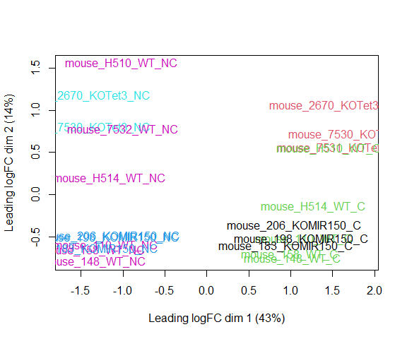

<script>
function buildQuiz(myq, qc){
  // variable to store the HTML output
  const output = [];

  // for each question...
  myq.forEach(
    (currentQuestion, questionNumber) => {

      // variable to store the list of possible answers
      const answers = [];

      // and for each available answer...
      for(letter in currentQuestion.answers){

        // ...add an HTML radio button
        answers.push(
          `<label>
            <input type="radio" name="question${questionNumber}" value="${letter}">
            ${letter} :
            ${currentQuestion.answers[letter]}
          </label><br/>`
        );
      }

      // add this question and its answers to the output
      output.push(
        `<div class="question"> ${currentQuestion.question} </div>
        <div class="answers"> ${answers.join('')} </div><br/>`
      );
    }
  );

  // finally combine our output list into one string of HTML and put it on the page
  qc.innerHTML = output.join('');
}

function showResults(myq, qc, rc){

  // gather answer containers from our quiz
  const answerContainers = qc.querySelectorAll('.answers');

  // keep track of user's answers
  let numCorrect = 0;

  // for each question...
  myq.forEach( (currentQuestion, questionNumber) => {

    // find selected answer
    const answerContainer = answerContainers[questionNumber];
    const selector = `input[name=question${questionNumber}]:checked`;
    const userAnswer = (answerContainer.querySelector(selector) || {}).value;

    // if answer is correct
    if(userAnswer === currentQuestion.correctAnswer){
      // add to the number of correct answers
      numCorrect++;

      // color the answers green
      answerContainers[questionNumber].style.color = 'lightgreen';
    }
    // if answer is wrong or blank
    else{
      // color the answers red
      answerContainers[questionNumber].style.color = 'red';
    }
  });

  // show number of correct answers out of total
  rc.innerHTML = `${numCorrect} out of ${myq.length}`;
}
</script>

# Differential Gene Expression Analysis in R

* Differential Gene Expression (DGE) between conditions is determined from count data
* Generally speaking differential expression analysis is performed in a very similar manner to DNA microarrays, once normalization and transformations have been performed.

A lot of RNA-seq analysis has been done in R and so there are many packages available to analyze and view this data. Two of the most commonly used are:
* DESeq2, developed by Simon Anders (also created htseq) in Wolfgang Huber’s group at EMBL
* edgeR and Voom (extension to Limma [microarrays] for RNA-seq), developed out of Gordon Smyth’s group from the Walter and Eliza Hall Institute of Medical Research in Australia

http://bioconductor.org/packages/release/BiocViews.html#___RNASeq

## Differential Expression Analysis with Limma-Voom

**limma** is an R package that was originally developed for differential expression (DE) analysis of gene expression microarray data.

**voom** is a function in the limma package that transforms RNA-Seq data for use with limma.

Together they allow fast, flexible, and powerful analyses of RNA-Seq data.  Limma-voom is _our_ tool of choice for DE analyses because it:

* Allows for incredibly flexible model specification (you can include multiple categorical and continuous variables, allowing incorporation of almost any kind of metadata).

* Based on simulation studies, maintains the false discovery rate at or below the nominal rate, unlike some other packages.

* Empirical Bayes smoothing of gene-wise standard deviations provides increased power.  

### Basic Steps of Differential Gene Expression
1. Read count data and annotation into R and preprocessing.
2. Calculate normalization factors (sample-specific adjustments)
3. Filter genes (uninteresting genes, e.g. unexpressed)
4. Account for expression-dependent variability by transformation, weighting, or modeling
5. Fitting a linear model
6. Perform statistical comparisons of interest (using contrasts)
7. Adjust for multiple testing, Benjamini-Hochberg (BH) or q-value
8. Check results for confidence
9. Attach annotation if available and write tables


## 1. Read in the counts table and create our DGEList


```r
counts <- read.delim("rnaseq_workshop_counts.txt", row.names = 1)
head(counts)
```

<div class='r_output'>                      mouse_110_WT_C mouse_110_WT_NC mouse_148_WT_C
 ENSMUSG00000102693.2              0               0              0
 ENSMUSG00000064842.3              0               0              0
 ENSMUSG00000051951.6              0               0              0
 ENSMUSG00000102851.2              0               0              0
 ENSMUSG00000103377.2              0               0              0
 ENSMUSG00000104017.2              0               0              0
                      mouse_148_WT_NC mouse_158_WT_C mouse_158_WT_NC
 ENSMUSG00000102693.2               0              0               0
 ENSMUSG00000064842.3               0              0               0
 ENSMUSG00000051951.6               0              0               0
 ENSMUSG00000102851.2               0              0               0
 ENSMUSG00000103377.2               0              0               0
 ENSMUSG00000104017.2               0              0               0
                      mouse_183_KOMIR150_C mouse_183_KOMIR150_NC
 ENSMUSG00000102693.2                    0                     0
 ENSMUSG00000064842.3                    0                     0
 ENSMUSG00000051951.6                    0                     0
 ENSMUSG00000102851.2                    0                     0
 ENSMUSG00000103377.2                    0                     0
 ENSMUSG00000104017.2                    0                     0
                      mouse_198_KOMIR150_C mouse_198_KOMIR150_NC
 ENSMUSG00000102693.2                    0                     0
 ENSMUSG00000064842.3                    0                     0
 ENSMUSG00000051951.6                    0                     0
 ENSMUSG00000102851.2                    0                     0
 ENSMUSG00000103377.2                    0                     0
 ENSMUSG00000104017.2                    0                     0
                      mouse_206_KOMIR150_C mouse_206_KOMIR150_NC
 ENSMUSG00000102693.2                    0                     0
 ENSMUSG00000064842.3                    0                     0
 ENSMUSG00000051951.6                    0                     0
 ENSMUSG00000102851.2                    0                     0
 ENSMUSG00000103377.2                    0                     0
 ENSMUSG00000104017.2                    0                     0
                      mouse_2670_KOTet3_C mouse_2670_KOTet3_NC
 ENSMUSG00000102693.2                   0                    0
 ENSMUSG00000064842.3                   0                    0
 ENSMUSG00000051951.6                   0                    0
 ENSMUSG00000102851.2                   0                    0
 ENSMUSG00000103377.2                   0                    0
 ENSMUSG00000104017.2                   0                    0
                      mouse_7530_KOTet3_C mouse_7530_KOTet3_NC
 ENSMUSG00000102693.2                   0                    0
 ENSMUSG00000064842.3                   0                    0
 ENSMUSG00000051951.6                   0                    0
 ENSMUSG00000102851.2                   0                    0
 ENSMUSG00000103377.2                   0                    0
 ENSMUSG00000104017.2                   0                    0
                      mouse_7531_KOTet3_C mouse_7532_WT_NC mouse_H510_WT_C
 ENSMUSG00000102693.2                   0                0               0
 ENSMUSG00000064842.3                   0                0               0
 ENSMUSG00000051951.6                   0                0               0
 ENSMUSG00000102851.2                   0                0               0
 ENSMUSG00000103377.2                   0                0               0
 ENSMUSG00000104017.2                   0                0               0
                      mouse_H510_WT_NC mouse_H514_WT_C mouse_H514_WT_NC
 ENSMUSG00000102693.2                0               0                0
 ENSMUSG00000064842.3                0               0                0
 ENSMUSG00000051951.6                0               0                0
 ENSMUSG00000102851.2                0               0                0
 ENSMUSG00000103377.2                0               0                0
 ENSMUSG00000104017.2                0               0                0
</div>
Create Differential Gene Expression List Object (DGEList) object 

A DGEList is an object in the package edgeR for storing count data, normalization factors, and other information


```r
d0 <- DGEList(counts)
```
  
**1a\.** Read in Annotation

```r
anno <- read.delim("ensembl_mm_106.tsv",as.is=T)
dim(anno)
```

<div class='r_output'> [1] 55414    11
</div>
```r
head(anno)
```

<div class='r_output'>       Gene.stable.ID Gene.stable.ID.version Gene.name      Gene.type
 1 ENSMUSG00000064336   ENSMUSG00000064336.1     mt-Tf        Mt_tRNA
 2 ENSMUSG00000064337   ENSMUSG00000064337.1   mt-Rnr1        Mt_rRNA
 3 ENSMUSG00000064338   ENSMUSG00000064338.1     mt-Tv        Mt_tRNA
 4 ENSMUSG00000064339   ENSMUSG00000064339.1   mt-Rnr2        Mt_rRNA
 5 ENSMUSG00000064340   ENSMUSG00000064340.1    mt-Tl1        Mt_tRNA
 6 ENSMUSG00000064341   ENSMUSG00000064341.1    mt-Nd1 protein_coding
   Transcript.count Gene.start..bp. Gene.end..bp. Strand
 1                1               1            68      1
 2                1              70          1024      1
 3                1            1025          1093      1
 4                1            1094          2675      1
 5                1            2676          2750      1
 6                1            2751          3707      1
                                                                  Gene.description
 1   mitochondrially encoded tRNA phenylalanine [Source:MGI Symbol;Acc:MGI:102487]
 2             mitochondrially encoded 12S rRNA [Source:MGI Symbol;Acc:MGI:102493]
 3          mitochondrially encoded tRNA valine [Source:MGI Symbol;Acc:MGI:102472]
 4             mitochondrially encoded 16S rRNA [Source:MGI Symbol;Acc:MGI:102492]
 5       mitochondrially encoded tRNA leucine 1 [Source:MGI Symbol;Acc:MGI:102482]
 6 mitochondrially encoded NADH dehydrogenase 1 [Source:MGI Symbol;Acc:MGI:101787]
   Gene...GC.content Chromosome.scaffold.name
 1             30.88                       MT
 2             35.81                       MT
 3             39.13                       MT
 4             35.40                       MT
 5             44.00                       MT
 6             37.62                       MT
</div>
```r
tail(anno)
```

<div class='r_output'>           Gene.stable.ID Gene.stable.ID.version Gene.name
 55409 ENSMUSG00000044103   ENSMUSG00000044103.5     Il36g
 55410 ENSMUSG00000026984   ENSMUSG00000026984.5     Il36a
 55411 ENSMUSG00000104173   ENSMUSG00000104173.2   Gm37703
 55412 ENSMUSG00000083172   ENSMUSG00000083172.2   Gm13409
 55413 ENSMUSG00000026983  ENSMUSG00000026983.11    Il36rn
 55414 ENSMUSG00000046845   ENSMUSG00000046845.2    Il1f10
                    Gene.type Transcript.count Gene.start..bp. Gene.end..bp.
 55409         protein_coding                1        24076488      24083580
 55410         protein_coding                2        24105430      24115714
 55411                    TEC                1        24121880      24123663
 55412 unprocessed_pseudogene                1        24151842      24156350
 55413         protein_coding                7        24166966      24173438
 55414         protein_coding                1        24181208      24183832
       Strand
 55409      1
 55410      1
 55411      1
 55412     -1
 55413      1
 55414      1
                                                             Gene.description
 55409                    interleukin 36G [Source:MGI Symbol;Acc:MGI:2449929]
 55410                    interleukin 36A [Source:MGI Symbol;Acc:MGI:1859324]
 55411              predicted gene, 37703 [Source:MGI Symbol;Acc:MGI:5610931]
 55412               predicted gene 13409 [Source:MGI Symbol;Acc:MGI:3651609]
 55413 interleukin 36 receptor antagonist [Source:MGI Symbol;Acc:MGI:1859325]
 55414    interleukin 1 family, member 10 [Source:MGI Symbol;Acc:MGI:2652548]
       Gene...GC.content Chromosome.scaffold.name
 55409             42.00                        2
 55410             39.61                        2
 55411             40.08                        2
 55412             38.30                        2
 55413             45.43                        2
 55414             46.36                        2
</div>
```r
any(duplicated(anno$Gene.stable.ID))
```

<div class='r_output'> [1] FALSE
</div>
**1b\.** Derive experiment metadata from the sample names

Our experiment has two factors, genotype ("WT", "KOMIR150", or "KOTet3") and cell type ("C" or "NC").

The sample names are "mouse" followed by an animal identifier, followed by the genotype, followed by the cell type.

```r
sample_names <- colnames(counts)
metadata <- as.data.frame(strsplit2(sample_names, c("_"))[,2:4], row.names = sample_names)
colnames(metadata) <- c("mouse", "genotype", "cell_type")
```

Create a new variable "group" that combines genotype and cell type.

```r
metadata$group <- interaction(metadata$genotype, metadata$cell_type)
table(metadata$group)
```

<div class='r_output'> 
  KOMIR150.C    KOTet3.C        WT.C KOMIR150.NC   KOTet3.NC       WT.NC 
           3           3           5           3           2           6
</div>
```r
table(metadata$mouse)
```

<div class='r_output'> 
  110  148  158  183  198  206 2670 7530 7531 7532 H510 H514 
    2    2    2    2    2    2    2    2    1    1    2    2
</div>
Note: you can also enter group information manually, or read it in from an external file.  If you do this, it is $VERY, VERY, VERY$ important that you make sure the metadata is in the same order as the column names of the counts table.

## Quiz 1

<div id="quiz1" class="quiz"></div>
<button id="submit1">Submit Quiz</button>
<div id="results1" class="output"></div>
<script>
quizContainer1 = document.getElementById('quiz1');
resultsContainer1 = document.getElementById('results1');
submitButton1 = document.getElementById('submit1');

myQuestions1 = [
  {
    question: "How many genes are in the counts table",
    answers: {
      a: "22",
      b: "55,414",
      c: "56,186,884",
    },
    correctAnswer: "b"
  },
  {
    question: "How many samples are in the counts table",
    answers: {
      a: "22",
      b: "55,414",
      c: "56,186,884",
    },
    correctAnswer: "a"
  },
  {
    question: "What is the total count across all genes for sample mouse_110_WT_C",
    answers: {
      a: "10,000",
      b: "2,855,542",
      c: "2,354,047"
    },
    correctAnswer: "c"
  },
  {
    question: "'Extra-credit' question: How many genes have a count of 0 in every sample?",
    answers: {
      a: "22,502",
      b: "32,912",
      c: "55,414"
    },
    correctAnswer: "b"
  }
];

buildQuiz(myQuestions1, quizContainer1);
submitButton1.addEventListener('click', function() {showResults(myQuestions1, quizContainer1, resultsContainer1);});
</script>

## 2. Preprocessing and Normalization factors

In differential expression analysis, only sample-specific effects need to be normalized, we are NOT concerned with comparisons and quantification of absolute expression.

* Sequence depth – is a sample specific effect and needs to be adjusted for.
* RNA composition - finding a set of scaling factors for the library sizes that minimize the log-fold changes between the samples for most genes (edgeR uses a trimmed mean of M-values between each pair of sample)
* GC content – is NOT sample-specific (except when it is)
* Gene Length – is NOT sample-specific (except when it is)

In edgeR/limma, you calculate normalization factors to scale the raw library sizes (number of reads) using the function calcNormFactors, which by default uses TMM (weighted trimmed means of M values to the reference). Assumes most genes are not DE.

Proposed by Robinson and Oshlack (2010).


```r
d0 <- calcNormFactors(d0)
d0$samples
```

<div class='r_output'>                       group lib.size norm.factors
 mouse_110_WT_C            1  2354047    1.0377120
 mouse_110_WT_NC           1  2855542    0.9883050
 mouse_148_WT_C            1  2832974    1.0117329
 mouse_148_WT_NC           1  2629970    0.9817121
 mouse_158_WT_C            1  2993210    1.0017491
 mouse_158_WT_NC           1  2673435    0.9629221
 mouse_183_KOMIR150_C      1  2552200    1.0277658
 mouse_183_KOMIR150_NC     1  1873049    1.0135566
 mouse_198_KOMIR150_C      1  2859228    1.0102789
 mouse_198_KOMIR150_NC     1  2938965    0.9864590
 mouse_206_KOMIR150_C      1  1399381    0.9850821
 mouse_206_KOMIR150_NC     1   959879    0.9915571
 mouse_2670_KOTet3_C       1  2923622    0.9944173
 mouse_2670_KOTet3_NC      1  2956486    0.9780692
 mouse_7530_KOTet3_C       1  2631467    1.0172313
 mouse_7530_KOTet3_NC      1  2903155    0.9615916
 mouse_7531_KOTet3_C       1  2682282    1.0227600
 mouse_7532_WT_NC          1  2730871    1.0052820
 mouse_H510_WT_C           1  2601596    1.0201380
 mouse_H510_WT_NC          1  2852724    1.0256272
 mouse_H514_WT_C           1  2316653    0.9901225
 mouse_H514_WT_NC          1  2666148    0.9904483
</div>
**Note:** calcNormFactors doesn't _normalize_ the data, it just calculates normalization factors for use downstream.

## 3. Filtering genes

We filter genes based on non-experimental factors to reduce the number of genes/tests being conducted and therefor do not have to be accounted for in our transformation or multiple testing correction. Commonly we try to remove genes that are either a) unexpressed, or b) unchanging (low-variability).

Common filters include:
1. to remove genes with a max value (X) of less then Y.
2. to remove genes that are less than X normalized read counts (cpm) across a certain number of samples. Ex: rowSums(cpms <=1) < 3 , require at least 1 cpm in at least 3 samples to keep.
3. A less used filter is for genes with minimum variance across all samples, so if a gene isn't changing (constant expression) its inherently not interesting therefor no need to test. 

We will use the built in function filterByExpr() to filter low-expressed genes.  filterByExpr uses the experimental design to determine how many samples a gene needs to be expressed in to stay.  Importantly, once this number of samples has been determined, the group information is not used in filtering.

Using filterByExpr requires specifying the model we will use to analysis our data.  

* The model you use will change for every experiment, and this step should be given the most time and attention.*

We use a model that includes group and (in order to account for the paired design) mouse.


```r
group <- metadata$group
mouse <- metadata$mouse
mm <- model.matrix(~0 + group + mouse)
head(mm)
```

<div class='r_output'>   groupKOMIR150.C groupKOTet3.C groupWT.C groupKOMIR150.NC groupKOTet3.NC
 1               0             0         1                0              0
 2               0             0         0                0              0
 3               0             0         1                0              0
 4               0             0         0                0              0
 5               0             0         1                0              0
 6               0             0         0                0              0
   groupWT.NC mouse148 mouse158 mouse183 mouse198 mouse206 mouse2670 mouse7530
 1          0        0        0        0        0        0         0         0
 2          1        0        0        0        0        0         0         0
 3          0        1        0        0        0        0         0         0
 4          1        1        0        0        0        0         0         0
 5          0        0        1        0        0        0         0         0
 6          1        0        1        0        0        0         0         0
   mouse7531 mouse7532 mouseH510 mouseH514
 1         0         0         0         0
 2         0         0         0         0
 3         0         0         0         0
 4         0         0         0         0
 5         0         0         0         0
 6         0         0         0         0
</div>

```r
keep <- filterByExpr(d0, mm)
sum(keep) # number of genes retained
```

<div class='r_output'> [1] 11430
</div>
```r
d <- d0[keep,]
```
"Low-expressed" depends on the dataset and can be subjective.

Visualizing your data with a Multidimensional scaling (MDS) plot.

```r
plotMDS(d, col = as.numeric(metadata$group), cex=1)
```

<!-- -->

The MDS plot tells you **A LOT** about what to expect from your experiment.

**3a\.** Extracting "normalized" expression table

### RPKM vs. FPKM vs. CPM and Model Based
* RPKM - Reads per kilobase per million mapped reads
* FPKM - Fragments per kilobase per million mapped reads
* logCPM – log Counts per million [ good for producing MDS plots, estimate of normalized values in model based ]
* Model based - original read counts are not themselves transformed, but rather correction factors are used in the DE model itself. 

We use the `cpm` function with log=TRUE to obtain log-transformed normalized expression data.  On the log scale, the data has less mean-dependent variability and is more suitable for plotting.

```r
logcpm <- cpm(d, prior.count=2, log=TRUE)
write.table(logcpm,"rnaseq_workshop_normalized_counts.txt",sep="\t",quote=F)
```

## Quiz 2

<div id="quiz2" class="quiz"></div>
<button id="submit2">Submit Quiz</button>
<div id="results2" class="output"></div>
<script>
quizContainer2 = document.getElementById('quiz2');
resultsContainer2 = document.getElementById('results2');
submitButton2 = document.getElementById('submit2');

myQuestions2 = [
  {
    question: "Which sample has the largest normalization factor?",
    answers: {
      a: "mouse_7530_KOTet3_NC",
      b: "mouse_110_WT_C",
      c: "mouse_148_WT_C",
    },
    correctAnswer: "b"
  },
  {
    question: "Is the sample with the largest normalization factor the sample with the smallest total counts?",
    answers: {
      a: "TRUE",
      b: "FALSE"
    },
    correctAnswer: "b"
  },
  {
    question: "Based on the MDS plot, what is the biggest source of between-sample differences?",
    answers: {
      a: "Genotype",
      b: "Mouse",
      c: "Cell type"
    },
    correctAnswer: "c"
  },
  {
    question: "Make an MDS plot of the unfiltered data.  How does it differ from the MDS plot of the filtered data?",
    answers: {
      a: "The axis ranges are larger",
      b: "There is less separation",
      c: "The plots are nearly identical"
    },
    correctAnswer: "c"
  }
];

buildQuiz(myQuestions2, quizContainer2);
submitButton2.addEventListener('click', function() {showResults(myQuestions2, quizContainer2, resultsContainer2);});
</script>

## 4. Voom transformation and calculation of variance weights

**4a\.** **Voom**

```r
y <- voom(d, mm, plot = T)
```

<div class='r_output'> Coefficients not estimable: mouse206 mouse7531
</div>
<div class='r_output'> Warning: Partial NA coefficients for 11430 probe(s)
</div>
<!-- -->

What is voom doing?

1. Counts are transformed to log2 counts per million reads (CPM), where "per million reads" is defined based on the normalization factors we calculated earlier.
2. A linear model is fitted to the log2 CPM for each gene, and the residuals are calculated.
3. A smoothed curve is fitted to the sqrt(residual standard deviation) by average expression.
(see red line in plot above)
4. The smoothed curve is used to obtain weights for each gene and sample that are passed into limma along with the log2 CPMs.

More details at "[voom: precision weights unlock linear model analysis tools for RNA-seq read counts](https://genomebiology.biomedcentral.com/articles/10.1186/gb-2014-15-2-r29)"

If your voom plot looks like the below (performed on the raw data), you might want to filter more:

```r
tmp <- voom(d0, mm, plot = T)
```

<div class='r_output'> Coefficients not estimable: mouse206 mouse7531
</div>
<div class='r_output'> Warning: Partial NA coefficients for 55414 probe(s)
</div>
<!-- -->


## 5. Fitting linear models in limma

lmFit fits a linear model using weighted least squares for each gene:

```r
fit <- lmFit(y, mm)
```

<div class='r_output'> Coefficients not estimable: mouse206 mouse7531
</div>
<div class='r_output'> Warning: Partial NA coefficients for 11430 probe(s)
</div>
```r
head(coef(fit))
```

<div class='r_output'>                       groupKOMIR150.C groupKOTet3.C groupWT.C groupKOMIR150.NC
 ENSMUSG00000033845.14        4.863263      5.011676  4.759326         5.109324
 ENSMUSG00000025903.15        5.135887      5.636828  5.519602         5.260182
 ENSMUSG00000033813.16        5.887608      5.647359  5.773644         5.939362
 ENSMUSG00000033793.13        5.259696      5.383275  5.420424         5.079821
 ENSMUSG00000025907.15        6.523165      6.660415  6.541454         6.341045
 ENSMUSG00000090031.3         2.281048      3.474808  1.883502         2.426840
                       groupKOTet3.NC groupWT.NC    mouse148    mouse158
 ENSMUSG00000033845.14       4.739022   4.624170  0.23192176  0.16747528
 ENSMUSG00000025903.15       5.601852   5.356630 -0.03872025  0.04806943
 ENSMUSG00000033813.16       5.812784   5.781199  0.05756464  0.04179097
 ENSMUSG00000033793.13       4.859325   5.150285 -0.16351899 -0.22593717
 ENSMUSG00000025907.15       6.752318   6.289800 -0.10198768 -0.02426407
 ENSMUSG00000090031.3        3.808701   2.087661 -0.10839188  0.11945290
                         mouse183    mouse198 mouse206   mouse2670    mouse7530
 ENSMUSG00000033845.14 -0.4528993 -0.10127318       NA -0.04037166 -0.009073243
 ENSMUSG00000025903.15  0.3685759  0.41175400       NA  0.06371351 -0.116244875
 ENSMUSG00000033813.16 -0.2529610 -0.00841256       NA  0.17471195  0.200158401
 ENSMUSG00000033793.13 -0.3302039  0.06166284       NA  0.13088790  0.391433836
 ENSMUSG00000025907.15 -0.1209212  0.12443747       NA -0.09360513 -0.137224529
 ENSMUSG00000090031.3  -0.3786011  0.15564447       NA -1.09960890 -0.199717680
                       mouse7531   mouse7532   mouseH510   mouseH514
 ENSMUSG00000033845.14        NA  0.19499278  0.16951088  0.15722271
 ENSMUSG00000025903.15        NA  0.25787054  0.10923179  0.22799700
 ENSMUSG00000033813.16        NA  0.06104751  0.04599131 -0.03185153
 ENSMUSG00000033793.13        NA -0.29436437 -0.03879120 -0.15132577
 ENSMUSG00000025907.15        NA  0.18101608  0.01135225 -0.12996434
 ENSMUSG00000090031.3         NA  1.89832058  1.25166060  1.45045597
</div>
Comparisons between groups (log fold-changes) are obtained as _contrasts_ of these fitted linear models:

## 6. Specify which groups to compare using contrasts:

Comparison between cell types for genotype WT.

```r
contr <- makeContrasts(groupWT.C - groupWT.NC, levels = colnames(coef(fit)))
contr
```

<div class='r_output'>                   Contrasts
 Levels             groupWT.C - groupWT.NC
   groupKOMIR150.C                       0
   groupKOTet3.C                         0
   groupWT.C                             1
   groupKOMIR150.NC                      0
   groupKOTet3.NC                        0
   groupWT.NC                           -1
   mouse148                              0
   mouse158                              0
   mouse183                              0
   mouse198                              0
   mouse206                              0
   mouse2670                             0
   mouse7530                             0
   mouse7531                             0
   mouse7532                             0
   mouseH510                             0
   mouseH514                             0
</div>
**6a\.** Estimate contrast for each gene

```r
tmp <- contrasts.fit(fit, contr)
```

The variance characteristics of low expressed genes are different from high expressed genes, if treated the same, the effect is to over represent low expressed genes in the DE list. This is corrected for by the log transformation and voom. However, some genes will have increased or decreased variance that is not a result of low expression, but due to other random factors. We are going to run empirical Bayes to adjust the variance of these genes.

Empirical Bayes smoothing of standard errors (shifts standard errors that are much larger or smaller than those from other genes towards the average standard error) (see "[Linear Models and Empirical Bayes Methods for Assessing Differential Expression in Microarray Experiments](https://www.degruyter.com/doi/10.2202/1544-6115.1027)"

**6b\.** Apply EBayes

```r
tmp <- eBayes(tmp)
```

## 7. Multiple Testing Adjustment

The TopTable. Adjust for multiple testing using method of Benjamini & Hochberg (BH), or its 'alias' fdr. "[Controlling the false discovery rate: a practical and powerful approach to multiple testing](http://www.jstor.org/stable/2346101).

here `n=Inf` says to produce the topTable for **all** genes. 

```r
top.table <- topTable(tmp, adjust.method = "BH", sort.by = "P", n = Inf)
```

### Multiple Testing Correction

Simply a must! Best choices are:
  * [FDR](http://www.jstor.org/stable/2346101) (false discovery rate), such as Benjamini-Hochberg (1995).
  * [Qvalue](https://rss.onlinelibrary.wiley.com/doi/abs/10.1111/1467-9868.00346) - Storey (2002)

The FDR (or qvalue) is a statement about the list and is no longer about the gene (pvalue). So a FDR of 0.05, says you expect 5% false positives among the list of genes with an FDR of 0.05 or less.

The statement “Statistically significantly different” means FDR of 0.05 or less.

**7a\.** How many DE genes are there (false discovery rate corrected)?

```r
length(which(top.table$adj.P.Val < 0.05))
```

<div class='r_output'> [1] 5629
</div>
## 8. Check your results for confidence.

You've conducted an experiment, you've seen a phenotype. Now check which genes are most differentially expressed (show the top 50)? Look up these top genes, their description and ensure they relate to your experiment/phenotype. 

```r
head(top.table, 50)
```

<div class='r_output'>                           logFC   AveExpr         t      P.Value    adj.P.Val
 ENSMUSG00000020608.8  -2.487719  7.859085 -45.36099 4.383027e-19 5.009800e-15
 ENSMUSG00000052212.7   4.552564  6.190761  40.11910 3.423886e-18 1.503259e-14
 ENSMUSG00000049103.15  2.164336  9.879972  39.78025 3.945562e-18 1.503259e-14
 ENSMUSG00000030203.18 -4.121437  6.993895 -34.01395 5.384455e-17 1.538608e-13
 ENSMUSG00000027508.16 -1.899178  8.112819 -33.27597 7.758438e-17 1.617246e-13
 ENSMUSG00000021990.17 -2.676304  8.356926 -33.09644 8.489480e-17 1.617246e-13
 ENSMUSG00000024164.16  1.800345  9.861523  32.30710 1.268544e-16 1.877277e-13
 ENSMUSG00000037820.16 -4.167030  7.117017 -32.23889 1.313930e-16 1.877277e-13
 ENSMUSG00000026193.16  4.807150 10.143888  31.56222 1.869556e-16 2.374336e-13
 ENSMUSG00000038807.20 -1.562385  9.003435 -30.13553 4.030599e-16 4.335589e-13
 ENSMUSG00000048498.8  -5.792618  6.490525 -29.99180 4.363377e-16 4.335589e-13
 ENSMUSG00000030342.9  -3.676052  6.037901 -29.72488 5.060942e-16 4.335589e-13
 ENSMUSG00000030413.8  -2.607215  6.640096 -29.59990 5.427287e-16 4.335589e-13
 ENSMUSG00000028885.9  -2.352285  7.043042 -29.59920 5.429402e-16 4.335589e-13
 ENSMUSG00000021614.17  6.000776  5.427433  29.51572 5.689750e-16 4.335589e-13
 ENSMUSG00000051177.17  3.186136  4.985785  29.30344 6.413131e-16 4.581381e-13
 ENSMUSG00000027215.14 -2.570287  6.889976 -29.00858 7.583544e-16 4.938916e-13
 ENSMUSG00000018168.9  -3.877965  5.456099 -28.93985 7.887579e-16 4.938916e-13
 ENSMUSG00000029254.17 -2.453517  6.686492 -28.86998 8.209922e-16 4.938916e-13
 ENSMUSG00000020437.13 -1.227240 10.305628 -28.68992 9.106557e-16 5.060930e-13
 ENSMUSG00000039959.14 -1.483730  8.932030 -28.65386 9.298296e-16 5.060930e-13
 ENSMUSG00000037185.10 -1.536915  9.479745 -28.19371 1.215712e-15 6.296814e-13
 ENSMUSG00000038147.15  1.689781  7.138335  28.12332 1.267076e-15 6.296814e-13
 ENSMUSG00000020108.5  -2.051154  6.943149 -27.97858 1.380041e-15 6.572448e-13
 ENSMUSG00000020212.15 -2.163284  6.773920 -27.89693 1.448423e-15 6.622189e-13
 ENSMUSG00000023827.9  -2.143751  6.405974 -27.80537 1.529400e-15 6.723477e-13
 ENSMUSG00000022584.15  4.737856  6.735796  27.66914 1.658850e-15 7.022466e-13
 ENSMUSG00000023809.11 -3.192699  4.823849 -27.49195 1.844820e-15 7.530818e-13
 ENSMUSG00000020272.9  -1.299449 10.443529 -27.16976 2.241822e-15 8.633658e-13
 ENSMUSG00000020387.16 -4.934650  4.326562 -27.11322 2.320355e-15 8.633658e-13
 ENSMUSG00000018001.19 -2.613949  7.171269 -27.09828 2.341587e-15 8.633658e-13
 ENSMUSG00000021728.9   1.661441  8.386923  26.95813 2.551093e-15 9.112186e-13
 ENSMUSG00000008496.20 -1.485361  9.416862 -26.49805 3.390083e-15 1.174201e-12
 ENSMUSG00000035493.11  1.922719  9.747251  26.23559 3.995526e-15 1.343202e-12
 ENSMUSG00000026923.16  2.014555  6.623886  25.95612 4.767785e-15 1.526455e-12
 ENSMUSG00000039109.18  4.740467  8.315280  25.94299 4.807732e-15 1.526455e-12
 ENSMUSG00000042700.17 -1.813816  6.083974 -25.80378 5.253884e-15 1.623024e-12
 ENSMUSG00000051457.8  -2.264000  9.813220 -25.60064 5.985169e-15 1.800276e-12
 ENSMUSG00000043263.14  1.784129  7.845866  25.40127 6.808339e-15 1.947848e-12
 ENSMUSG00000029287.15 -3.782709  5.404369 -25.39940 6.816615e-15 1.947848e-12
 ENSMUSG00000044783.17 -1.728670  7.013074 -25.36125 6.987571e-15 1.947998e-12
 ENSMUSG00000025701.13 -2.754362  5.339213 -25.24728 7.525826e-15 2.048100e-12
 ENSMUSG00000050335.18  1.111875  8.961147  25.03993 8.620692e-15 2.291500e-12
 ENSMUSG00000033705.18  1.697567  7.148728  24.98003 8.967477e-15 2.329506e-12
 ENSMUSG00000022818.14 -1.748293  6.777005 -24.74549 1.047401e-14 2.645144e-12
 ENSMUSG00000027435.9   3.036123  6.718151  24.72110 1.064537e-14 2.645144e-12
 ENSMUSG00000016496.8  -3.559684  6.399550 -24.51906 1.218433e-14 2.963125e-12
 ENSMUSG00000005800.4   5.749952  4.124806  24.24865 1.462200e-14 3.481863e-12
 ENSMUSG00000020340.17 -2.254179  8.644957 -24.19352 1.517948e-14 3.540845e-12
 ENSMUSG00000034731.12 -1.747589  6.597146 -24.08389 1.635596e-14 3.738972e-12
                              B
 ENSMUSG00000020608.8  33.99666
 ENSMUSG00000052212.7  31.51334
 ENSMUSG00000049103.15 31.90164
 ENSMUSG00000030203.18 29.22222
 ENSMUSG00000027508.16 28.93065
 ENSMUSG00000021990.17 28.83896
 ENSMUSG00000024164.16 28.38196
 ENSMUSG00000037820.16 28.32938
 ENSMUSG00000026193.16 27.96362
 ENSMUSG00000038807.20 27.23661
 ENSMUSG00000048498.8  26.84866
 ENSMUSG00000030342.9  26.91147
 ENSMUSG00000030413.8  26.98685
 ENSMUSG00000028885.9  26.98913
 ENSMUSG00000021614.17 25.71991
 ENSMUSG00000051177.17 26.40008
 ENSMUSG00000027215.14 26.65346
 ENSMUSG00000018168.9  26.43153
 ENSMUSG00000029254.17 26.57415
 ENSMUSG00000020437.13 26.32075
 ENSMUSG00000039959.14 26.37857
 ENSMUSG00000037185.10 26.07971
 ENSMUSG00000038147.15 26.13767
 ENSMUSG00000020108.5  26.04068
 ENSMUSG00000020212.15 26.01172
 ENSMUSG00000023827.9  25.95162
 ENSMUSG00000022584.15 25.85530
 ENSMUSG00000023809.11 25.39377
 ENSMUSG00000020272.9  25.37937
 ENSMUSG00000020387.16 24.09795
 ENSMUSG00000018001.19 25.52150
 ENSMUSG00000021728.9  25.38037
 ENSMUSG00000008496.20 25.02213
 ENSMUSG00000035493.11 24.84152
 ENSMUSG00000026923.16 24.81325
 ENSMUSG00000039109.18 24.75216
 ENSMUSG00000042700.17 24.72275
 ENSMUSG00000051457.8  24.40923
 ENSMUSG00000043263.14 24.39431
 ENSMUSG00000029287.15 24.37852
 ENSMUSG00000044783.17 24.42201
 ENSMUSG00000025701.13 24.28156
 ENSMUSG00000050335.18 24.09199
 ENSMUSG00000033705.18 24.15264
 ENSMUSG00000022818.14 24.01949
 ENSMUSG00000027435.9  24.02174
 ENSMUSG00000016496.8  23.87710
 ENSMUSG00000005800.4  21.81886
 ENSMUSG00000020340.17 23.53586
 ENSMUSG00000034731.12 23.57744
</div>Columns are
* logFC: log2 fold change of WT.C/WT.NC
* AveExpr: Average expression across all samples, in log2 CPM
* t: logFC divided by its standard error
* P.Value: Raw p-value (based on t) from test that logFC differs from 0
* adj.P.Val: Benjamini-Hochberg false discovery rate adjusted p-value
* B: log-odds that gene is DE (arguably less useful than the other columns)

ENSMUSG00000030203.18 has higher expression at WT NC than at WT C (logFC is negative).  ENSMUSG00000026193.16 has higher expression at WT C than at WT NC (logFC is positive).

In the paper, the authors specify that NC cells were identified by low expression of Ly6C (which is now called Ly6c1 or ENSMUSG00000079018.11).  Is this gene differentially expressed?

```r
top.table["ENSMUSG00000079018.11",]
```

<div class='r_output'>    logFC AveExpr  t P.Value adj.P.Val  B
 NA    NA      NA NA      NA        NA NA
</div>
```r
d0$counts["ENSMUSG00000079018.11",]
```

<div class='r_output'>        mouse_110_WT_C       mouse_110_WT_NC        mouse_148_WT_C 
                     2                     0                     2 
       mouse_148_WT_NC        mouse_158_WT_C       mouse_158_WT_NC 
                     0                     2                     0 
  mouse_183_KOMIR150_C mouse_183_KOMIR150_NC  mouse_198_KOMIR150_C 
                     1                     0                     1 
 mouse_198_KOMIR150_NC  mouse_206_KOMIR150_C mouse_206_KOMIR150_NC 
                     0                     1                     0 
   mouse_2670_KOTet3_C  mouse_2670_KOTet3_NC   mouse_7530_KOTet3_C 
                     2                     0                     2 
  mouse_7530_KOTet3_NC   mouse_7531_KOTet3_C      mouse_7532_WT_NC 
                     0                     1                     0 
       mouse_H510_WT_C      mouse_H510_WT_NC       mouse_H514_WT_C 
                     1                     0                     2 
      mouse_H514_WT_NC 
                     0
</div>
Ly6c1 was removed from our data by the filtering step, because the maximum counts for the gene did not exceed 2.

## 9. Write top.table to a file, adding in cpms and annotation

```r
top.table$Gene <- rownames(top.table)
top.table <- top.table[,c("Gene", names(top.table)[1:6])]
top.table <- data.frame(top.table,anno[match(top.table$Gene,anno$Gene.stable.ID.version),],logcpm[match(top.table$Gene,rownames(logcpm)),])

head(top.table)
```

<div class='r_output'>                                        Gene     logFC  AveExpr         t
 ENSMUSG00000020608.8   ENSMUSG00000020608.8 -2.487719 7.859085 -45.36099
 ENSMUSG00000052212.7   ENSMUSG00000052212.7  4.552564 6.190761  40.11910
 ENSMUSG00000049103.15 ENSMUSG00000049103.15  2.164336 9.879972  39.78025
 ENSMUSG00000030203.18 ENSMUSG00000030203.18 -4.121437 6.993895 -34.01395
 ENSMUSG00000027508.16 ENSMUSG00000027508.16 -1.899178 8.112819 -33.27597
 ENSMUSG00000021990.17 ENSMUSG00000021990.17 -2.676304 8.356926 -33.09644
                            P.Value    adj.P.Val        B     Gene.stable.ID
 ENSMUSG00000020608.8  4.383027e-19 5.009800e-15 33.99666 ENSMUSG00000020608
 ENSMUSG00000052212.7  3.423886e-18 1.503259e-14 31.51334 ENSMUSG00000052212
 ENSMUSG00000049103.15 3.945562e-18 1.503259e-14 31.90164 ENSMUSG00000049103
 ENSMUSG00000030203.18 5.384455e-17 1.538608e-13 29.22222 ENSMUSG00000030203
 ENSMUSG00000027508.16 7.758438e-17 1.617246e-13 28.93065 ENSMUSG00000027508
 ENSMUSG00000021990.17 8.489480e-17 1.617246e-13 28.83896 ENSMUSG00000021990
                       Gene.stable.ID.version Gene.name      Gene.type
 ENSMUSG00000020608.8    ENSMUSG00000020608.8      Smc6 protein_coding
 ENSMUSG00000052212.7    ENSMUSG00000052212.7     Cd177 protein_coding
 ENSMUSG00000049103.15  ENSMUSG00000049103.15      Ccr2 protein_coding
 ENSMUSG00000030203.18  ENSMUSG00000030203.18    Dusp16 protein_coding
 ENSMUSG00000027508.16  ENSMUSG00000027508.16      Pag1 protein_coding
 ENSMUSG00000021990.17  ENSMUSG00000021990.17   Spata13 protein_coding
                       Transcript.count Gene.start..bp. Gene.end..bp. Strand
 ENSMUSG00000020608.8                12        11315887      11369786      1
 ENSMUSG00000052212.7                 2        24443408      24459736     -1
 ENSMUSG00000049103.15                4       123901987     123913594      1
 ENSMUSG00000030203.18                7       134692431     134769588     -1
 ENSMUSG00000027508.16                5         9752539       9898739     -1
 ENSMUSG00000021990.17                9        60871450      61002005      1
                                                                                                          Gene.description
 ENSMUSG00000020608.8                          structural maintenance of chromosomes 6 [Source:MGI Symbol;Acc:MGI:1914491]
 ENSMUSG00000052212.7                                                    CD177 antigen [Source:MGI Symbol;Acc:MGI:1916141]
 ENSMUSG00000049103.15                                 chemokine (C-C motif) receptor 2 [Source:MGI Symbol;Acc:MGI:106185]
 ENSMUSG00000030203.18                                 dual specificity phosphatase 16 [Source:MGI Symbol;Acc:MGI:1917936]
 ENSMUSG00000027508.16 phosphoprotein associated with glycosphingolipid microdomains 1 [Source:MGI Symbol;Acc:MGI:2443160]
 ENSMUSG00000021990.17                                    spermatogenesis associated 13 [Source:MGI Symbol;Acc:MGI:104838]
                       Gene...GC.content Chromosome.scaffold.name mouse_110_WT_C
 ENSMUSG00000020608.8              38.40                       12       6.623815
 ENSMUSG00000052212.7              52.26                        7       8.612183
 ENSMUSG00000049103.15             38.86                        9      10.897845
 ENSMUSG00000030203.18             41.74                        6       4.995235
 ENSMUSG00000027508.16             44.66                        3       7.178698
 ENSMUSG00000021990.17             47.38                       14       6.968425
                       mouse_110_WT_NC mouse_148_WT_C mouse_148_WT_NC
 ENSMUSG00000020608.8         9.066601       7.044026        9.419500
 ENSMUSG00000052212.7         4.153098       8.373006        3.632551
 ENSMUSG00000049103.15        8.820855      11.258774        8.960279
 ENSMUSG00000030203.18        8.975093       5.198449        9.079718
 ENSMUSG00000027508.16        9.020096       7.062972        9.119441
 ENSMUSG00000021990.17        9.548425       7.355047        9.779434
                       mouse_158_WT_C mouse_158_WT_NC mouse_183_KOMIR150_C
 ENSMUSG00000020608.8        6.774864        9.189456             6.793887
 ENSMUSG00000052212.7        8.118558        3.391535             8.717340
 ENSMUSG00000049103.15      11.074742        8.725945            11.030298
 ENSMUSG00000030203.18       5.463973        9.204733             5.224246
 ENSMUSG00000027508.16       7.396916        9.263360             7.186377
 ENSMUSG00000021990.17       7.039108        9.734513             7.409819
                       mouse_183_KOMIR150_NC mouse_198_KOMIR150_C
 ENSMUSG00000020608.8               9.272997             6.504482
 ENSMUSG00000052212.7               3.500537             8.651096
 ENSMUSG00000049103.15              8.699953            10.721178
 ENSMUSG00000030203.18              8.878484             4.814123
 ENSMUSG00000027508.16              8.798820             7.044256
 ENSMUSG00000021990.17              9.546336             6.547832
                       mouse_198_KOMIR150_NC mouse_206_KOMIR150_C
 ENSMUSG00000020608.8               8.970438             6.444737
 ENSMUSG00000052212.7               3.759714             8.756254
 ENSMUSG00000049103.15              8.509122            10.797859
 ENSMUSG00000030203.18              9.188250             5.239532
 ENSMUSG00000027508.16              8.789968             6.946957
 ENSMUSG00000021990.17              9.308492             6.593036
                       mouse_206_KOMIR150_NC mouse_2670_KOTet3_C
 ENSMUSG00000020608.8               8.900220            6.591024
 ENSMUSG00000052212.7               3.625307            7.820674
 ENSMUSG00000049103.15              8.504871           11.453482
 ENSMUSG00000030203.18              9.469505            4.940524
 ENSMUSG00000027508.16              8.835332            7.730090
 ENSMUSG00000021990.17              9.147440            7.796325
                       mouse_2670_KOTet3_NC mouse_7530_KOTet3_C
 ENSMUSG00000020608.8              9.506520            6.425574
 ENSMUSG00000052212.7              4.119562            8.236079
 ENSMUSG00000049103.15             7.521391           11.185447
 ENSMUSG00000030203.18             9.878697            4.042055
 ENSMUSG00000027508.16             9.473214            7.437762
 ENSMUSG00000021990.17            10.621108            7.347984
                       mouse_7530_KOTet3_NC mouse_7531_KOTet3_C mouse_7532_WT_NC
 ENSMUSG00000020608.8              9.338409            6.259331         8.832075
 ENSMUSG00000052212.7              3.283661            9.008766         4.523736
 ENSMUSG00000049103.15             7.209527           11.317033         9.572427
 ENSMUSG00000030203.18             9.446796            4.072264         8.995432
 ENSMUSG00000027508.16             9.413081            7.322632         8.935514
 ENSMUSG00000021990.17            10.445986            6.906662         9.512530
                       mouse_H510_WT_C mouse_H510_WT_NC mouse_H514_WT_C
 ENSMUSG00000020608.8         6.444073         8.973037        6.480320
 ENSMUSG00000052212.7         8.938437         4.565744        8.737141
 ENSMUSG00000049103.15       11.428494         9.500517       11.193734
 ENSMUSG00000030203.18        4.148818         8.994464        4.820109
 ENSMUSG00000027508.16        6.811383         8.649953        7.141218
 ENSMUSG00000021990.17        6.517112         9.429355        6.795476
                       mouse_H514_WT_NC
 ENSMUSG00000020608.8          9.157573
 ENSMUSG00000052212.7          4.328847
 ENSMUSG00000049103.15         9.005364
 ENSMUSG00000030203.18         9.165206
 ENSMUSG00000027508.16         9.004301
 ENSMUSG00000021990.17         9.585689
</div>
```r
write.table(top.table, file = "WT.C_v_WT.NC.txt", row.names = F, sep = "\t", quote = F)
```

## Quiz 3

<div id="quiz3" class="quiz"></div>
<button id="submit3">Submit Quiz</button>
<div id="results3" class="output"></div>
<script>
quizContainer3 = document.getElementById('quiz3');
resultsContainer3 = document.getElementById('results3');
submitButton3 = document.getElementById('submit3');

myQuestions3 = [
  {
      question: "Based on the above model, how many genes are significantly differentially expressed between WT C and WT NC? (Significant = adjusted P < 0.05)",
    answers: {
      a: "6,291",
      b: "0",
      c: "5,629",
    },
    correctAnswer: "c"
  },
  {
    question: "Based on the above model, and without taking significance into account, how many genes have higher expression in WT C than in WT NC",
    answers: {
      a: "5,545",
      b: "2,736",
      c: "5,885",
    },
    correctAnswer: "a"
  },
  {
    question: "How many genes have an unadjusted p-value less than 0.05 for the comparison of WT C to WT NC in the above model",
    answers: {
      a: "6,291",
      b: "0",
      c: "5,629",
    },
    correctAnswer: "a"
  },
  {
    question: "What is the adjusted p-value for the last gene with unadjusted P < 0.05?  (This is the proportion of the genes with unadjusted P < 0.05 that, on average, would be expected to be false discoveries.)",
    answers: {
      a: "0.050",
      b: "0.511",
      c: "0.091"
    },
    correctAnswer: "c"
  },
  {
    question: "Which of these conditions is LEAST likely to indicate a problem with your analysis code?",
    answers: {
      a: "Every gene is differentially expressed",
      b: "No gene is differentially expressed",
      c: "The top of your gene list is dominated by antisense transcripts"
    },
    correctAnswer: "b"
  }
];

buildQuiz(myQuestions3, quizContainer3);
submitButton3.addEventListener('click', function() {showResults(myQuestions3, quizContainer3, resultsContainer3);});
</script>

# Linear models and contrasts

Let's say we want to compare genotypes for cell type C.  The only thing we have to change is the call to makeContrasts:

```r
contr <- makeContrasts(groupWT.C - groupKOMIR150.C, levels = colnames(coef(fit)))
tmp <- contrasts.fit(fit, contr)
tmp <- eBayes(tmp)
top.table <- topTable(tmp, sort.by = "P", n = Inf)
head(top.table, 20)
```

<div class='r_output'>                            logFC   AveExpr          t      P.Value    adj.P.Val
 ENSMUSG00000030703.9  -2.9794841 4.8093053 -15.526938 1.984025e-11 2.267740e-07
 ENSMUSG00000044229.10 -3.2492483 6.8291795 -11.427311 2.283435e-09 1.304983e-05
 ENSMUSG00000066687.6  -2.0785859 4.9242350  -9.047548 6.949803e-08 2.004156e-04
 ENSMUSG00000030748.10  1.7327619 7.0657178   9.041700 7.013669e-08 2.004156e-04
 ENSMUSG00000040152.9  -2.2538218 6.4431525  -8.746312 1.119185e-07 2.159461e-04
 ENSMUSG00000032012.10 -5.2390560 5.0042592  -8.738328 1.133575e-07 2.159461e-04
 ENSMUSG00000008348.10 -1.1948544 6.3048017  -7.961361 4.081414e-07 6.664367e-04
 ENSMUSG00000067017.6   5.0046008 3.1239296   7.875918 4.720879e-07 6.744956e-04
 ENSMUSG00000028028.12  0.8590031 7.2918397   7.238286 1.441887e-06 1.819292e-03
 ENSMUSG00000020893.18 -1.2306749 7.5341308  -7.183294 1.591682e-06 1.819292e-03
 ENSMUSG00000030365.12  1.0089083 6.6854527   7.038173 2.070079e-06 2.126368e-03
 ENSMUSG00000096780.8  -5.6654297 2.3853315  -6.996774 2.232407e-06 2.126368e-03
 ENSMUSG00000055435.7  -1.3884855 4.9736669  -6.793182 3.246993e-06 2.854856e-03
 ENSMUSG00000028037.14  5.6397694 2.3452940   6.665050 4.122324e-06 3.365583e-03
 ENSMUSG00000039146.6   7.4363964 0.1197785   6.577750 4.856537e-06 3.700681e-03
 ENSMUSG00000028619.16  3.0830501 4.6808527   6.445119 6.242206e-06 4.254655e-03
 ENSMUSG00000024772.10 -1.2964673 6.3304194  -6.437941 6.328008e-06 4.254655e-03
 ENSMUSG00000051495.9  -0.8713110 7.1409081  -6.396919 6.842452e-06 4.344957e-03
 ENSMUSG00000042105.19 -0.7267966 7.4673400  -6.359198 7.353816e-06 4.423901e-03
 ENSMUSG00000096768.9  -1.9846810 3.4256738  -6.041035 1.360967e-05 7.777924e-03
                                B
 ENSMUSG00000030703.9  16.0048436
 ENSMUSG00000044229.10 11.8174038
 ENSMUSG00000066687.6   8.3780060
 ENSMUSG00000030748.10  8.4730364
 ENSMUSG00000040152.9   7.8784993
 ENSMUSG00000032012.10  7.0489500
 ENSMUSG00000008348.10  6.6435962
 ENSMUSG00000067017.6   4.8009371
 ENSMUSG00000028028.12  5.2813342
 ENSMUSG00000020893.18  5.1329930
 ENSMUSG00000030365.12  5.0723354
 ENSMUSG00000096780.8   2.2566477
 ENSMUSG00000055435.7   4.6743751
 ENSMUSG00000028037.14  3.0240161
 ENSMUSG00000039146.6   0.9916291
 ENSMUSG00000028619.16  3.6793908
 ENSMUSG00000024772.10  3.8941452
 ENSMUSG00000051495.9   3.6972150
 ENSMUSG00000042105.19  3.5825789
 ENSMUSG00000096768.9   3.3465594
</div>
```r
length(which(top.table$adj.P.Val < 0.05)) # number of DE genes
```

<div class='r_output'> [1] 44
</div>
```r
top.table$Gene <- rownames(top.table)
top.table <- top.table[,c("Gene", names(top.table)[1:6])]
top.table <- data.frame(top.table,anno[match(top.table$Gene,anno$Gene.stable.ID),],logcpm[match(top.table$Gene,rownames(logcpm)),])

write.table(top.table, file = "WT.C_v_KOMIR150.C.txt", row.names = F, sep = "\t", quote = F)
```

## What if we refit our model as a two-factor model (rather than using the group variable)?

Create new model matrix:

```r
genotype <- factor(metadata$genotype, levels = c("WT", "KOMIR150", "KOTet3"))
cell_type <- factor(metadata$cell_type, levels = c("C", "NC"))
mouse <- factor(metadata$mouse, levels = c("110", "148", "158", "183", "198", "206", "2670", "7530", "7531", "7532", "H510", "H514"))
mm <- model.matrix(~genotype*cell_type + mouse)
```

We are specifying that model includes effects for genotype, cell type, and the genotype-cell type interaction (which allows the differences between genotypes to differ across cell types).


```r
colnames(mm)
```

<div class='r_output'>  [1] "(Intercept)"                  "genotypeKOMIR150"            
  [3] "genotypeKOTet3"               "cell_typeNC"                 
  [5] "mouse148"                     "mouse158"                    
  [7] "mouse183"                     "mouse198"                    
  [9] "mouse206"                     "mouse2670"                   
 [11] "mouse7530"                    "mouse7531"                   
 [13] "mouse7532"                    "mouseH510"                   
 [15] "mouseH514"                    "genotypeKOMIR150:cell_typeNC"
 [17] "genotypeKOTet3:cell_typeNC"
</div>

```r
y <- voom(d, mm, plot = F)
```

<div class='r_output'> Coefficients not estimable: mouse206 mouse7531
</div>
<div class='r_output'> Warning: Partial NA coefficients for 11430 probe(s)
</div>
```r
fit <- lmFit(y, mm)
```

<div class='r_output'> Coefficients not estimable: mouse206 mouse7531
</div>
<div class='r_output'> Warning: Partial NA coefficients for 11430 probe(s)
</div>
```r
head(coef(fit))
```

<div class='r_output'>                       (Intercept) genotypeKOMIR150 genotypeKOTet3  cell_typeNC
 ENSMUSG00000033845.14    4.759326       0.10393680     0.25235008 -0.135156622
 ENSMUSG00000025903.15    5.519602      -0.38371523     0.11722570 -0.162972407
 ENSMUSG00000033813.16    5.773644       0.11396426    -0.12628542  0.007554495
 ENSMUSG00000033793.13    5.420424      -0.16072757    -0.03714907 -0.270138316
 ENSMUSG00000025907.15    6.541454      -0.01828919     0.11896053 -0.251654329
 ENSMUSG00000090031.3     1.883502       0.39754622     1.59130601  0.204158805
                          mouse148    mouse158   mouse183    mouse198 mouse206
 ENSMUSG00000033845.14  0.23192176  0.16747528 -0.4528993 -0.10127318       NA
 ENSMUSG00000025903.15 -0.03872025  0.04806943  0.3685759  0.41175400       NA
 ENSMUSG00000033813.16  0.05756464  0.04179097 -0.2529610 -0.00841256       NA
 ENSMUSG00000033793.13 -0.16351899 -0.22593717 -0.3302039  0.06166284       NA
 ENSMUSG00000025907.15 -0.10198768 -0.02426407 -0.1209212  0.12443747       NA
 ENSMUSG00000090031.3  -0.10839188  0.11945290 -0.3786011  0.15564447       NA
                         mouse2670    mouse7530 mouse7531   mouse7532
 ENSMUSG00000033845.14 -0.04037166 -0.009073243        NA  0.19499278
 ENSMUSG00000025903.15  0.06371351 -0.116244875        NA  0.25787054
 ENSMUSG00000033813.16  0.17471195  0.200158401        NA  0.06104751
 ENSMUSG00000033793.13  0.13088790  0.391433836        NA -0.29436437
 ENSMUSG00000025907.15 -0.09360513 -0.137224529        NA  0.18101608
 ENSMUSG00000090031.3  -1.09960890 -0.199717680        NA  1.89832058
                         mouseH510   mouseH514 genotypeKOMIR150:cell_typeNC
 ENSMUSG00000033845.14  0.16951088  0.15722271                   0.38121760
 ENSMUSG00000025903.15  0.10923179  0.22799700                   0.28726735
 ENSMUSG00000033813.16  0.04599131 -0.03185153                   0.04419891
 ENSMUSG00000033793.13 -0.03879120 -0.15132577                   0.09026355
 ENSMUSG00000025907.15  0.01135225 -0.12996434                   0.06953420
 ENSMUSG00000090031.3   1.25166060  1.45045597                  -0.05836709
                       genotypeKOTet3:cell_typeNC
 ENSMUSG00000033845.14                 -0.1374981
 ENSMUSG00000025903.15                  0.1279962
 ENSMUSG00000033813.16                  0.1578704
 ENSMUSG00000033793.13                 -0.2538109
 ENSMUSG00000025907.15                  0.3435573
 ENSMUSG00000090031.3                   0.1297337
</div>
```r
colnames(coef(fit))
```

<div class='r_output'>  [1] "(Intercept)"                  "genotypeKOMIR150"            
  [3] "genotypeKOTet3"               "cell_typeNC"                 
  [5] "mouse148"                     "mouse158"                    
  [7] "mouse183"                     "mouse198"                    
  [9] "mouse206"                     "mouse2670"                   
 [11] "mouse7530"                    "mouse7531"                   
 [13] "mouse7532"                    "mouseH510"                   
 [15] "mouseH514"                    "genotypeKOMIR150:cell_typeNC"
 [17] "genotypeKOTet3:cell_typeNC"
</div>* The coefficient genotypeKOMIR150 represents the difference in mean expression between KOMIR150 and the reference genotype (WT), _for cell type C_ (the reference level for cell type)
* The coefficient cell_typeNC represents the difference in mean expression between cell type NC and cell type C, _for genotype WT_
* The coefficient genotypeKOMIR150:cell_typeNC is the difference between cell types NC and C of the differences between genotypes KOMIR150 and WT (the interaction effect).

Let's estimate the difference between genotypes WT and KOMIR150 in cell type C.

```r
tmp <- contrasts.fit(fit, coef = 2) # Directly test second coefficient
tmp <- eBayes(tmp)
top.table <- topTable(tmp, sort.by = "P", n = Inf)
head(top.table, 20)
```

<div class='r_output'>                            logFC   AveExpr         t      P.Value    adj.P.Val
 ENSMUSG00000030703.9   2.9794841 4.8093053 15.526938 1.984025e-11 2.267740e-07
 ENSMUSG00000044229.10  3.2492483 6.8291795 11.427311 2.283435e-09 1.304983e-05
 ENSMUSG00000066687.6   2.0785859 4.9242350  9.047548 6.949803e-08 2.004156e-04
 ENSMUSG00000030748.10 -1.7327619 7.0657178 -9.041700 7.013669e-08 2.004156e-04
 ENSMUSG00000040152.9   2.2538218 6.4431525  8.746312 1.119185e-07 2.159461e-04
 ENSMUSG00000032012.10  5.2390560 5.0042592  8.738328 1.133575e-07 2.159461e-04
 ENSMUSG00000008348.10  1.1948544 6.3048017  7.961361 4.081414e-07 6.664367e-04
 ENSMUSG00000067017.6  -5.0046008 3.1239296 -7.875918 4.720879e-07 6.744956e-04
 ENSMUSG00000028028.12 -0.8590031 7.2918397 -7.238286 1.441887e-06 1.819292e-03
 ENSMUSG00000020893.18  1.2306749 7.5341308  7.183294 1.591682e-06 1.819292e-03
 ENSMUSG00000030365.12 -1.0089083 6.6854527 -7.038173 2.070079e-06 2.126368e-03
 ENSMUSG00000096780.8   5.6654297 2.3853315  6.996774 2.232407e-06 2.126368e-03
 ENSMUSG00000055435.7   1.3884855 4.9736669  6.793182 3.246993e-06 2.854856e-03
 ENSMUSG00000028037.14 -5.6397694 2.3452940 -6.665050 4.122324e-06 3.365583e-03
 ENSMUSG00000039146.6  -7.4363964 0.1197785 -6.577750 4.856537e-06 3.700681e-03
 ENSMUSG00000028619.16 -3.0830501 4.6808527 -6.445119 6.242206e-06 4.254655e-03
 ENSMUSG00000024772.10  1.2964673 6.3304194  6.437941 6.328008e-06 4.254655e-03
 ENSMUSG00000051495.9   0.8713110 7.1409081  6.396919 6.842452e-06 4.344957e-03
 ENSMUSG00000042105.19  0.7267966 7.4673400  6.359198 7.353816e-06 4.423901e-03
 ENSMUSG00000096768.9   1.9846810 3.4256738  6.041035 1.360967e-05 7.777924e-03
                                B
 ENSMUSG00000030703.9  16.0048436
 ENSMUSG00000044229.10 11.8174038
 ENSMUSG00000066687.6   8.3780060
 ENSMUSG00000030748.10  8.4730364
 ENSMUSG00000040152.9   7.8784993
 ENSMUSG00000032012.10  7.0489500
 ENSMUSG00000008348.10  6.6435962
 ENSMUSG00000067017.6   4.8009371
 ENSMUSG00000028028.12  5.2813342
 ENSMUSG00000020893.18  5.1329930
 ENSMUSG00000030365.12  5.0723354
 ENSMUSG00000096780.8   2.2566477
 ENSMUSG00000055435.7   4.6743751
 ENSMUSG00000028037.14  3.0240161
 ENSMUSG00000039146.6   0.9916291
 ENSMUSG00000028619.16  3.6793908
 ENSMUSG00000024772.10  3.8941452
 ENSMUSG00000051495.9   3.6972150
 ENSMUSG00000042105.19  3.5825789
 ENSMUSG00000096768.9   3.3465594
</div>
```r
length(which(top.table$adj.P.Val < 0.05)) # number of DE genes
```

<div class='r_output'> [1] 44
</div>We get the same results as with the model where each coefficient corresponded to a group mean.  In essence, these are the _same_ model, so use whichever is most convenient for what you are estimating.

The interaction effects genotypeKOMIR150:cell_typeNC are easier to estimate and test in this setup.

```r
head(coef(fit))
```

<div class='r_output'>                       (Intercept) genotypeKOMIR150 genotypeKOTet3  cell_typeNC
 ENSMUSG00000033845.14    4.759326       0.10393680     0.25235008 -0.135156622
 ENSMUSG00000025903.15    5.519602      -0.38371523     0.11722570 -0.162972407
 ENSMUSG00000033813.16    5.773644       0.11396426    -0.12628542  0.007554495
 ENSMUSG00000033793.13    5.420424      -0.16072757    -0.03714907 -0.270138316
 ENSMUSG00000025907.15    6.541454      -0.01828919     0.11896053 -0.251654329
 ENSMUSG00000090031.3     1.883502       0.39754622     1.59130601  0.204158805
                          mouse148    mouse158   mouse183    mouse198 mouse206
 ENSMUSG00000033845.14  0.23192176  0.16747528 -0.4528993 -0.10127318       NA
 ENSMUSG00000025903.15 -0.03872025  0.04806943  0.3685759  0.41175400       NA
 ENSMUSG00000033813.16  0.05756464  0.04179097 -0.2529610 -0.00841256       NA
 ENSMUSG00000033793.13 -0.16351899 -0.22593717 -0.3302039  0.06166284       NA
 ENSMUSG00000025907.15 -0.10198768 -0.02426407 -0.1209212  0.12443747       NA
 ENSMUSG00000090031.3  -0.10839188  0.11945290 -0.3786011  0.15564447       NA
                         mouse2670    mouse7530 mouse7531   mouse7532
 ENSMUSG00000033845.14 -0.04037166 -0.009073243        NA  0.19499278
 ENSMUSG00000025903.15  0.06371351 -0.116244875        NA  0.25787054
 ENSMUSG00000033813.16  0.17471195  0.200158401        NA  0.06104751
 ENSMUSG00000033793.13  0.13088790  0.391433836        NA -0.29436437
 ENSMUSG00000025907.15 -0.09360513 -0.137224529        NA  0.18101608
 ENSMUSG00000090031.3  -1.09960890 -0.199717680        NA  1.89832058
                         mouseH510   mouseH514 genotypeKOMIR150:cell_typeNC
 ENSMUSG00000033845.14  0.16951088  0.15722271                   0.38121760
 ENSMUSG00000025903.15  0.10923179  0.22799700                   0.28726735
 ENSMUSG00000033813.16  0.04599131 -0.03185153                   0.04419891
 ENSMUSG00000033793.13 -0.03879120 -0.15132577                   0.09026355
 ENSMUSG00000025907.15  0.01135225 -0.12996434                   0.06953420
 ENSMUSG00000090031.3   1.25166060  1.45045597                  -0.05836709
                       genotypeKOTet3:cell_typeNC
 ENSMUSG00000033845.14                 -0.1374981
 ENSMUSG00000025903.15                  0.1279962
 ENSMUSG00000033813.16                  0.1578704
 ENSMUSG00000033793.13                 -0.2538109
 ENSMUSG00000025907.15                  0.3435573
 ENSMUSG00000090031.3                   0.1297337
</div>
```r
colnames(coef(fit))
```

<div class='r_output'>  [1] "(Intercept)"                  "genotypeKOMIR150"            
  [3] "genotypeKOTet3"               "cell_typeNC"                 
  [5] "mouse148"                     "mouse158"                    
  [7] "mouse183"                     "mouse198"                    
  [9] "mouse206"                     "mouse2670"                   
 [11] "mouse7530"                    "mouse7531"                   
 [13] "mouse7532"                    "mouseH510"                   
 [15] "mouseH514"                    "genotypeKOMIR150:cell_typeNC"
 [17] "genotypeKOTet3:cell_typeNC"
</div>

```r
tmp <- contrasts.fit(fit, coef = 16) # Test genotypeKOMIR150:cell_typeNC
tmp <- eBayes(tmp)
top.table <- topTable(tmp, sort.by = "P", n = Inf)
head(top.table, 20)
```

<div class='r_output'>                            logFC   AveExpr         t      P.Value adj.P.Val
 ENSMUSG00000076609.3  -4.5128827 3.4659311 -4.633480 0.0002414512 0.7596173
 ENSMUSG00000030748.10  0.7183028 7.0657178  4.604149 0.0002569486 0.7596173
 ENSMUSG00000033004.17 -0.3892516 8.7779980 -4.516015 0.0003098966 0.7596173
 ENSMUSG00000029004.16 -0.3441454 8.5115425 -4.317942 0.0004731874 0.7596173
 ENSMUSG00000054387.14 -0.3560405 7.9946594 -4.161984 0.0006615271 0.7596173
 ENSMUSG00000015501.11 -0.8394246 5.4932385 -4.125877 0.0007150204 0.7596173
 ENSMUSG00000004952.14 -0.4531030 7.8924221 -4.124182 0.0007176359 0.7596173
 ENSMUSG00000004110.18 -3.5672998 0.6672797 -4.064644 0.0008159243 0.7596173
 ENSMUSG00000030724.8  -2.8628699 1.0344703 -4.038959 0.0008624179 0.7596173
 ENSMUSG00000049313.9   0.3111176 9.7727059  4.023953 0.0008908099 0.7596173
 ENSMUSG00000026357.4   0.9360904 4.3871616  3.987096 0.0009646068 0.7596173
 ENSMUSG00000070305.11  1.6482356 3.4354823  3.983690 0.0009717289 0.7596173
 ENSMUSG00000032026.8  -0.6465648 5.6058186 -3.962272 0.0010177514 0.7596173
 ENSMUSG00000029647.16 -0.3420436 7.5824112 -3.916955 0.0011224903 0.7596173
 ENSMUSG00000037020.17 -0.9135733 3.9978898 -3.831876 0.0013492919 0.7596173
 ENSMUSG00000110218.2  -1.8853554 2.5480596 -3.831485 0.0013504314 0.7596173
 ENSMUSG00000024772.10 -0.6784186 6.3304194 -3.810327 0.0014137014 0.7596173
 ENSMUSG00000005533.11 -0.8335725 5.6296782 -3.779567 0.0015110233 0.7596173
 ENSMUSG00000037857.17 -0.3611968 7.5179818 -3.758815 0.0015804456 0.7596173
 ENSMUSG00000071757.11 -0.7414184 4.6233742 -3.752057 0.0016037349 0.7596173
                                  B
 ENSMUSG00000076609.3  -0.588024711
 ENSMUSG00000030748.10  0.600834785
 ENSMUSG00000033004.17  0.399962669
 ENSMUSG00000029004.16  0.002697595
 ENSMUSG00000054387.14 -0.287399318
 ENSMUSG00000015501.11 -0.356637749
 ENSMUSG00000004952.14 -0.350694576
 ENSMUSG00000004110.18 -2.817938460
 ENSMUSG00000030724.8  -2.497016729
 ENSMUSG00000049313.9  -0.676513504
 ENSMUSG00000026357.4  -0.848600918
 ENSMUSG00000070305.11 -1.666705769
 ENSMUSG00000032026.8  -0.633243118
 ENSMUSG00000029647.16 -0.762087269
 ENSMUSG00000037020.17 -1.293822376
 ENSMUSG00000110218.2  -2.213357837
 ENSMUSG00000024772.10 -0.913573355
 ENSMUSG00000005533.11 -0.960473010
 ENSMUSG00000037857.17 -1.082554261
 ENSMUSG00000071757.11 -1.189111084
</div>
```r
length(which(top.table$adj.P.Val < 0.05))
```

<div class='r_output'> [1] 0
</div>
The log fold change here is the difference between genotypes KOMIR150 and WT in the log fold changes between cell types NC and C.

A gene for which this interaction effect is significant is one for which the effect of cell type differs between genotypes, and for which the effect of genotypes differs between cell types.

### More complicated models
Specifying a different model is simply a matter of changing the calls to model.matrix (and possibly to contrasts.fit).

What if we want to adjust for a continuous variable like some health score?
(We are making this data up here, but it would typically be a variable in your metadata.)

```r
# Generate example health data
set.seed(99)
HScore <- rnorm(n = 22, mean = 7.5, sd = 1)
HScore
```

<div class='r_output'>  [1] 7.713963 7.979658 7.587829 7.943859 7.137162 7.622674 6.636155 7.989624
  [9] 7.135883 6.205758 6.754231 8.421550 8.250054 4.991446 4.459066 7.500266
 [17] 7.105981 5.754972 7.998631 7.770954 8.598922 8.252513
</div>
Model adjusting for HScore score:

```r
mm <- model.matrix(~0 + group + mouse + HScore)
y <- voom(d, mm, plot = F)
```

<div class='r_output'> Coefficients not estimable: mouse206 mouse7531
</div>
<div class='r_output'> Warning: Partial NA coefficients for 11430 probe(s)
</div>
```r
fit <- lmFit(y, mm)
```

<div class='r_output'> Coefficients not estimable: mouse206 mouse7531
</div>
<div class='r_output'> Warning: Partial NA coefficients for 11430 probe(s)
</div>
```r
contr <- makeContrasts(groupKOMIR150.NC - groupWT.NC,
                       levels = colnames(coef(fit)))
tmp <- contrasts.fit(fit, contr)
tmp <- eBayes(tmp)
top.table <- topTable(tmp, sort.by = "P", n = Inf)
head(top.table, 20)
```

<div class='r_output'>                            logFC  AveExpr         t      P.Value    adj.P.Val
 ENSMUSG00000044229.10  3.1986356 6.829179 20.798209 1.962669e-13 2.243331e-09
 ENSMUSG00000030703.9   3.2473693 4.809305 14.828550 4.370936e-11 2.185013e-07
 ENSMUSG00000032012.10  5.5005605 5.004259 14.573680 5.734941e-11 2.185013e-07
 ENSMUSG00000096780.8   5.6322648 2.385331 10.479904 8.659567e-09 2.474471e-05
 ENSMUSG00000040152.9   3.0346995 6.443152 10.021618 1.664686e-08 3.805472e-05
 ENSMUSG00000008348.10  1.3194480 6.304802  9.481425 3.700926e-08 7.050264e-05
 ENSMUSG00000028619.16 -2.8305758 4.680853 -9.068882 6.963269e-08 1.137002e-04
 ENSMUSG00000070372.12  0.9128162 7.401010  8.566272 1.545088e-07 1.943775e-04
 ENSMUSG00000100801.2  -2.5198136 5.600966 -8.480951 1.774318e-07 1.943775e-04
 ENSMUSG00000042396.11 -1.0158466 6.739812 -8.457085 1.844617e-07 1.943775e-04
 ENSMUSG00000028173.11 -1.7945862 6.802367 -8.432737 1.919347e-07 1.943775e-04
 ENSMUSG00000020893.18  1.1014376 7.534131  8.395236 2.040708e-07 1.943775e-04
 ENSMUSG00000030365.12 -1.0464662 6.685453 -8.147177 3.074957e-07 2.703597e-04
 ENSMUSG00000030748.10 -1.0076392 7.065718 -7.823229 5.314964e-07 4.339288e-04
 ENSMUSG00000066687.6   1.8451380 4.924235  7.486638 9.522044e-07 7.255798e-04
 ENSMUSG00000067017.6  -3.9015255 3.123930 -7.383692 1.141519e-06 8.097675e-04
 ENSMUSG00000035212.15  0.8127757 7.115543  7.353414 1.204379e-06 8.097675e-04
 ENSMUSG00000028028.12 -0.8008633 7.291840 -6.909792 2.679195e-06 1.701289e-03
 ENSMUSG00000042105.19  0.6818400 7.467340  6.680298 4.094477e-06 2.463151e-03
 ENSMUSG00000063065.14 -0.6195530 7.926770 -6.629172 4.504617e-06 2.574388e-03
                               B
 ENSMUSG00000044229.10 20.631543
 ENSMUSG00000030703.9  14.663658
 ENSMUSG00000032012.10 13.740069
 ENSMUSG00000096780.8   6.451388
 ENSMUSG00000040152.9   9.846582
 ENSMUSG00000008348.10  9.079941
 ENSMUSG00000028619.16  7.794944
 ENSMUSG00000070372.12  7.564819
 ENSMUSG00000100801.2   7.520317
 ENSMUSG00000042396.11  7.471668
 ENSMUSG00000028173.11  7.455922
 ENSMUSG00000020893.18  7.285023
 ENSMUSG00000030365.12  7.010470
 ENSMUSG00000030748.10  6.388897
 ENSMUSG00000066687.6   5.830311
 ENSMUSG00000067017.6   3.895938
 ENSMUSG00000035212.15  5.544300
 ENSMUSG00000028028.12  4.741840
 ENSMUSG00000042105.19  4.276939
 ENSMUSG00000063065.14  4.115024
</div>
```r
length(which(top.table$adj.P.Val < 0.05))
```

<div class='r_output'> [1] 103
</div>
What if we want to look at the correlation of gene expression with a continuous variable like pH?

```r
# Generate example pH data
set.seed(99)
pH <- rnorm(n = 22, mean = 8, sd = 1.5)
pH
```

<div class='r_output'>  [1] 8.320944 8.719487 8.131743 8.665788 7.455743 8.184011 6.704232 8.734436
  [9] 7.453825 6.058637 6.881346 9.382326 9.125082 4.237169 3.438599 8.000399
 [17] 7.408972 5.382459 8.747947 8.406431 9.648382 9.128770
</div>
Specify model matrix:

```r
mm <- model.matrix(~pH)
head(mm)
```

<div class='r_output'>   (Intercept)       pH
 1           1 8.320944
 2           1 8.719487
 3           1 8.131743
 4           1 8.665788
 5           1 7.455743
 6           1 8.184011
</div>

```r
y <- voom(d, mm, plot = F)
fit <- lmFit(y, mm)
tmp <- contrasts.fit(fit, coef = 2) # test "pH" coefficient
tmp <- eBayes(tmp)
top.table <- topTable(tmp, sort.by = "P", n = Inf)
head(top.table, 20)
```

<div class='r_output'>                             logFC    AveExpr         t      P.Value adj.P.Val
 ENSMUSG00000056054.10 -1.19254531  1.0565449 -5.157240 3.209341e-05 0.3446698
 ENSMUSG00000094497.2  -0.96444255 -0.6307376 -4.743286 8.937725e-05 0.3446698
 ENSMUSG00000026822.15 -1.16854887  1.2606660 -4.738417 9.046451e-05 0.3446698
 ENSMUSG00000027111.17 -0.51910960  2.3918569 -4.192738 3.514725e-04 0.8962289
 ENSMUSG00000069049.12 -1.20135365  1.5709261 -4.148768 3.920511e-04 0.8962289
 ENSMUSG00000056071.13 -1.00722461  0.8964826 -3.869205 7.837864e-04 0.9995090
 ENSMUSG00000069045.12 -1.22876298  2.0766487 -3.817404 8.906755e-04 0.9995090
 ENSMUSG00000036764.13 -0.32538482  0.2918326 -3.639265 1.380051e-03 0.9995090
 ENSMUSG00000016356.19  0.26379202  1.6897369  3.583084 1.583377e-03 0.9995090
 ENSMUSG00000046032.17 -0.07888075  5.1634625 -3.570693 1.632028e-03 0.9995090
 ENSMUSG00000056673.15 -1.11017031  1.1242042 -3.558301 1.682153e-03 0.9995090
 ENSMUSG00000091537.3  -0.09566601  5.4139203 -3.549457 1.718843e-03 0.9995090
 ENSMUSG00000068457.15 -0.88173101  0.1963880 -3.494321 1.965895e-03 0.9995090
 ENSMUSG00000040521.12 -0.17464621  2.8725902 -3.479532 2.037862e-03 0.9995090
 ENSMUSG00000027132.4  -0.15648374  3.3593172 -3.464016 2.116141e-03 0.9995090
 ENSMUSG00000035877.18 -0.16427058  2.7431464 -3.463779 2.117359e-03 0.9995090
 ENSMUSG00000015312.10 -0.13194795  3.2827835 -3.457202 2.151436e-03 0.9995090
 ENSMUSG00000090946.4  -0.10217641  5.8052578 -3.426513 2.317658e-03 0.9995090
 ENSMUSG00000037316.10 -0.10364133  4.1993268 -3.425346 2.324218e-03 0.9995090
 ENSMUSG00000062981.6  -0.11263761  4.7741304 -3.362498 2.705680e-03 0.9995090
                                B
 ENSMUSG00000056054.10  0.1923229
 ENSMUSG00000094497.2  -1.8395832
 ENSMUSG00000026822.15 -0.2473300
 ENSMUSG00000027111.17 -0.4559397
 ENSMUSG00000069049.12 -0.6876277
 ENSMUSG00000056071.13 -1.7276316
 ENSMUSG00000069045.12 -1.0462003
 ENSMUSG00000036764.13 -2.7849384
 ENSMUSG00000016356.19 -2.6851059
 ENSMUSG00000046032.17 -1.0977551
 ENSMUSG00000056673.15 -1.8998096
 ENSMUSG00000091537.3  -1.1363154
 ENSMUSG00000068457.15 -2.5177382
 ENSMUSG00000040521.12 -1.6427259
 ENSMUSG00000027132.4  -1.5204128
 ENSMUSG00000035877.18 -1.7121170
 ENSMUSG00000015312.10 -1.5534278
 ENSMUSG00000090946.4  -1.3938223
 ENSMUSG00000037316.10 -1.4481510
 ENSMUSG00000062981.6  -1.5303786
</div>
```r
length(which(top.table$adj.P.Val < 0.05))
```

<div class='r_output'> [1] 0
</div>
In this case, limma is fitting a linear regression model, which here is a straight line fit, with the slope and intercept defined by the model coefficients:

```r
ENSMUSG00000056054 <- y$E["ENSMUSG00000056054.10",]
plot(ENSMUSG00000056054 ~ pH, ylim = c(0, 3.5))
intercept <- coef(fit)["ENSMUSG00000056054.10", "(Intercept)"]
slope <- coef(fit)["ENSMUSG00000056054.10", "pH"]
abline(a = intercept, b = slope)
```

<!-- -->

```r
slope
```

<div class='r_output'> [1] -1.192545
</div>
In this example, the log fold change logFC is the slope of the line, or the change in gene expression (on the log2 CPM scale) for each unit increase in pH.

Here, a logFC of 0.20 means a 0.20 log2 CPM increase in gene expression for each unit increase in pH, or a 15% increase on the CPM scale (2^0.20 = 1.15).

### A bit more on linear models

Limma fits a linear model to each gene.

Linear models include analysis of variance (ANOVA) models, linear regression, and any model of the form

Y = &beta;<sub>0</sub> + &beta;<sub>1</sub>X<sub>1</sub> + &beta;<sub>2</sub>X<sub>2</sub> + ... + &beta;<sub>p</sub>X<sub>p</sub> + &epsilon;

The covariates X can be:

* a continuous variable (pH, HScore score, age, weight, temperature, etc.)
* Dummy variables coding a categorical covariate (like cell type, genotype, and group)

The &beta;'s are unknown parameters to be estimated.

In limma, the &beta;'s are the log fold changes.  

The error (residual) term &epsilon; is assumed to be normally distributed with a variance that is constant across the range of the data.

Normally distributed means the residuals come from a distribution that looks like this:
<!-- -->

The log2 transformation that voom applies to the counts makes the data "normal enough", but doesn't completely stabilize the variance:

```r
mm <- model.matrix(~0 + group + mouse)
tmp <- voom(d, mm, plot = T)
```

<div class='r_output'> Coefficients not estimable: mouse206 mouse7531
</div>
<div class='r_output'> Warning: Partial NA coefficients for 11430 probe(s)
</div>
<!-- -->

The log2 counts per million are more variable at lower expression levels.  The variance weights calculated by voom address this situation.

### Both edgeR and limma have VERY comprehensive user manuals

The limma users' guide has great details on model specification.

* [Limma voom](https://bioconductor.org/packages/release/bioc/vignettes/limma/inst/doc/usersguide.pdf)

* [edgeR](http://bioconductor.org/packages/release/bioc/vignettes/edgeR/inst/doc/edgeRUsersGuide.pdf)

## Quiz 4

<div id="quiz4" class="quiz"></div>
<button id="submit4">Submit Quiz</button>
<div id="results4" class="output"></div>
<script>
quizContainer4 = document.getElementById('quiz4');
resultsContainer4 = document.getElementById('results4');
submitButton4 = document.getElementById('submit4');

myQuestions4 = [
  {
      question: "For the model ~0 + group + mouse, what coefficients would you use in makeContrasts if you wanted to compare genotypes for the NC cell type",
    answers: {
      a: "groupWT.C - groupKOMIR150.C",
      b: "groupWT.NC + groupKOMIR150.C",
      c: "groupWT.NC - groupKOMIR150.NC",
    },
    correctAnswer: "c"
  },
  {
    question: "For the model ~0 + group + mouse, how many genes are differentially expressed between WT NC and KOMIR150 NC?",
    answers: {
      a: "34",
      b: "44",
      c: "5,629",
    },
    correctAnswer: "a"
  },
  {
    question: "Suppose you have a variable in your metadata called batch that shows the RNA extraction batch.  How would you change the model ~0 + group + mouse to adjust for batch?",
    answers: {
      a: "Change the formula in model.matrix() to ~0 + group + mouse + batch",
      b: "Change the formula in model.matrix() to ~0 + group*batch + mouse",
      c: "Change the coefficients in makeContrasts() to groupWT.C - groupKOMIR150.C - batch"
    },
    correctAnswer: "a"
  }
];

buildQuiz(myQuestions4, quizContainer4);
submitButton4.addEventListener('click', function() {showResults(myQuestions4, quizContainer4, resultsContainer4);});
</script>

# Simple plotting


```r
mm <- model.matrix(~genotype*cell_type + mouse)
colnames(mm) <- make.names(colnames(mm))
y <- voom(d, mm, plot = F)
```

<div class='r_output'> Coefficients not estimable: mouse206 mouse7531
</div>
<div class='r_output'> Warning: Partial NA coefficients for 11430 probe(s)
</div>
```r
fit <- lmFit(y, mm)
```

<div class='r_output'> Coefficients not estimable: mouse206 mouse7531
</div>
<div class='r_output'> Warning: Partial NA coefficients for 11430 probe(s)
</div>
```r
contrast.matrix <- makeContrasts(genotypeKOMIR150, levels=colnames(coef(fit)))
fit2 <- contrasts.fit(fit, contrast.matrix)
fit2 <- eBayes(fit2)
top.table <- topTable(fit2, coef = 1, sort.by = "P", n = 40)
```

## Volcano plot


```r
volcanoplot(fit2, coef=1, highlight=8, names=rownames(fit2), main="Genotype KOMIR150 vs. WT for cell type C", cex.main = 0.8)
```

<!-- -->

```r
head(anno[match(rownames(fit2), anno$Gene.stable.ID.version),
     c("Gene.stable.ID.version", "Gene.name") ])
```

<div class='r_output'>       Gene.stable.ID.version     Gene.name
 48204  ENSMUSG00000033845.14        Mrpl15
 48494  ENSMUSG00000025903.15        Lypla1
 48624  ENSMUSG00000033813.16         Tcea1
 49101  ENSMUSG00000033793.13       Atp6v1h
 49316  ENSMUSG00000025907.15        Rb1cc1
 49363   ENSMUSG00000090031.3 4732440D04Rik
</div>
```r
identical(anno[match(rownames(fit2), anno$Gene.stable.ID.version),
     c("Gene.stable.ID.version")], rownames(fit2))
```

<div class='r_output'> [1] TRUE
</div>
```r
volcanoplot(fit2, coef=1, highlight=8, names=anno[match(rownames(fit2), anno$Gene.stable.ID.version), "Gene.name"], main="Genotype KOMIR150 vs. WT for cell type C", cex.main = 0.8)
```

<!-- -->

## Heatmap

```r
#using a red and blue color scheme without traces and scaling each row
heatmap.2(logcpm[rownames(top.table),],col=brewer.pal(11,"RdBu"),scale="row", trace="none")
```

<!-- -->

```r
anno[match(rownames(top.table), anno$Gene.stable.ID.version),
     c("Gene.stable.ID.version", "Gene.name")]
```

<div class='r_output'>       Gene.stable.ID.version     Gene.name
 14757   ENSMUSG00000030703.9         Gdpd3
 42161  ENSMUSG00000044229.10         Nxpe4
 4197    ENSMUSG00000066687.6        Zbtb16
 53114  ENSMUSG00000030748.10         Il4ra
 54774   ENSMUSG00000040152.9         Thbs1
 25330  ENSMUSG00000032012.10       Nectin1
 38111  ENSMUSG00000008348.10           Ubc
 47471   ENSMUSG00000067017.6    Capza1-ps1
 21965  ENSMUSG00000028028.12         Alpk1
 43237  ENSMUSG00000020893.18          Per1
 27431  ENSMUSG00000030365.12        Clec2i
 25483   ENSMUSG00000096780.8   Tmem181b-ps
 20046   ENSMUSG00000055435.7           Maf
 3037   ENSMUSG00000028037.14         Ifi44
 3066    ENSMUSG00000039146.6        Ifi44l
 8128   ENSMUSG00000028619.16       Tceanc2
 11049  ENSMUSG00000024772.10          Ehd1
 33286   ENSMUSG00000051495.9       Irf2bp2
 40360  ENSMUSG00000042105.19        Inpp5f
 845     ENSMUSG00000096768.9       Gm47283
 2174   ENSMUSG00000054008.10         Ndst1
 38893  ENSMUSG00000070372.12        Capza1
 24249  ENSMUSG00000055994.16          Nod2
 17223   ENSMUSG00000076937.4         Iglc2
 1787    ENSMUSG00000033863.3          Klf9
 11765   ENSMUSG00000100801.2       Gm15459
 42225  ENSMUSG00000035212.15        Leprot
 9792    ENSMUSG00000051439.8          Cd14
 42439   ENSMUSG00000035385.6          Ccl2
 28025  ENSMUSG00000034342.10           Cbl
 20508  ENSMUSG00000028173.11           Wls
 28896   ENSMUSG00000003545.4          Fosb
 23841  ENSMUSG00000031431.14       Tsc22d3
 51382  ENSMUSG00000040139.15 9430038I01Rik
 26357   ENSMUSG00000020108.5         Ddit4
 37483   ENSMUSG00000048534.8          Jaml
 7652    ENSMUSG00000076609.3          Igkc
 50026  ENSMUSG00000030577.15          Cd22
 4064   ENSMUSG00000042396.11          Rbm7
 36006  ENSMUSG00000015501.11        Hivep2
</div>
```r
identical(anno[match(rownames(top.table), anno$Gene.stable.ID.version), "Gene.stable.ID.version"], rownames(top.table))
```

<div class='r_output'> [1] TRUE
</div>
```r
heatmap.2(logcpm[rownames(top.table),],col=brewer.pal(11,"RdBu"),scale="row", trace="none", labRow = anno[match(rownames(top.table), anno$Gene.stable.ID.version), "Gene.name"])
```

<!-- -->

## 2 factor venn diagram


```r
mm <- model.matrix(~genotype*cell_type + mouse)
colnames(mm) <- make.names(colnames(mm))
y <- voom(d, mm, plot = F)
```

<div class='r_output'> Coefficients not estimable: mouse206 mouse7531
</div>
<div class='r_output'> Warning: Partial NA coefficients for 11430 probe(s)
</div>
```r
fit <- lmFit(y, mm)
```

<div class='r_output'> Coefficients not estimable: mouse206 mouse7531
</div>
<div class='r_output'> Warning: Partial NA coefficients for 11430 probe(s)
</div>
```r
contrast.matrix <- makeContrasts(genotypeKOMIR150, genotypeKOMIR150 + genotypeKOMIR150.cell_typeNC, levels=colnames(coef(fit)))
fit2 <- contrasts.fit(fit, contrast.matrix)
fit2 <- eBayes(fit2)
top.table <- topTable(fit2, coef = 1, sort.by = "P", n = 40)

results <- decideTests(fit2)
vennDiagram(results, names = c("C", "NC"), main = "DE Genes Between KOMIR150 and WT by Cell Type", cex.main = 0.8)
```

<!-- -->

## Download the Enrichment Analysis R Markdown document

```r
download.file("https://raw.githubusercontent.com/ucdavis-bioinformatics-training/2020-mRNA_Seq_Workshop/master/data_analysis/enrichment_mm.Rmd", "enrichment_mm.Rmd")
```


```r
sessionInfo()
```

<div class='r_output'> R version 4.2.0 (2022-04-22 ucrt)
 Platform: x86_64-w64-mingw32/x64 (64-bit)
 Running under: Windows 10 x64 (build 19044)
 
 Matrix products: default
 
 locale:
 [1] LC_COLLATE=English_United States.utf8 
 [2] LC_CTYPE=English_United States.utf8   
 [3] LC_MONETARY=English_United States.utf8
 [4] LC_NUMERIC=C                          
 [5] LC_TIME=English_United States.utf8    
 
 attached base packages:
 [1] stats     graphics  grDevices utils     datasets  methods   base     
 
 other attached packages:
 [1] gplots_3.1.3       RColorBrewer_1.1-3 edgeR_3.38.1       limma_3.52.1      
 
 loaded via a namespace (and not attached):
  [1] Rcpp_1.0.8.3       knitr_1.39         magrittr_2.0.3     lattice_0.20-45   
  [5] R6_2.5.1           rlang_1.0.2        fastmap_1.1.0      highr_0.9         
  [9] stringr_1.4.0      caTools_1.18.2     tools_4.2.0        grid_4.2.0        
 [13] xfun_0.31          KernSmooth_2.23-20 cli_3.3.0          jquerylib_0.1.4   
 [17] htmltools_0.5.2    gtools_3.9.2.2     yaml_2.3.5         digest_0.6.29     
 [21] bitops_1.0-7       sass_0.4.1         evaluate_0.15      rmarkdown_2.14    
 [25] stringi_1.7.6      compiler_4.2.0     bslib_0.3.1        locfit_1.5-9.5    
 [29] jsonlite_1.8.0
</div>