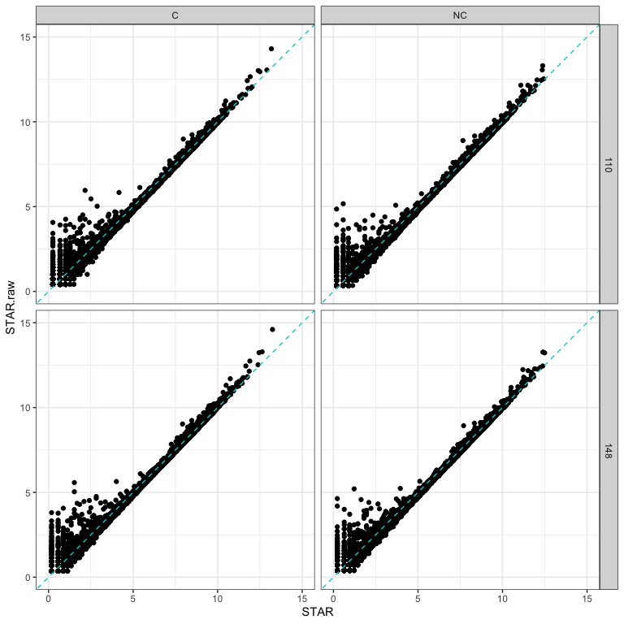
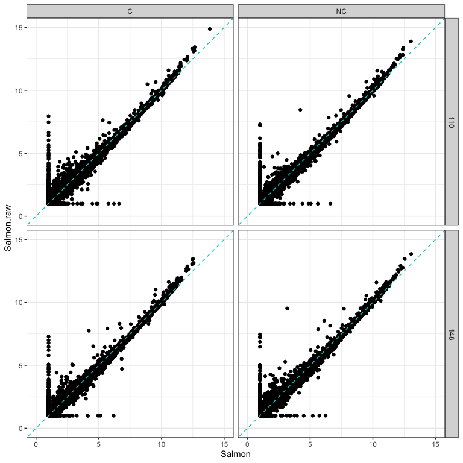
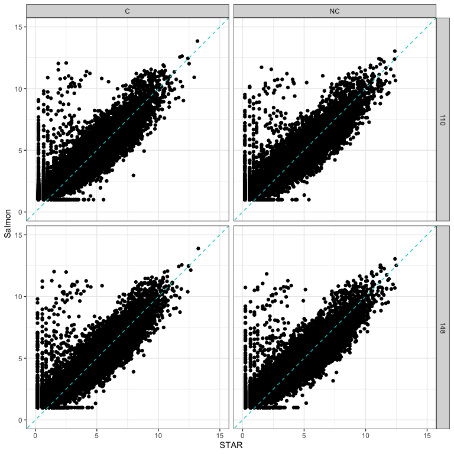
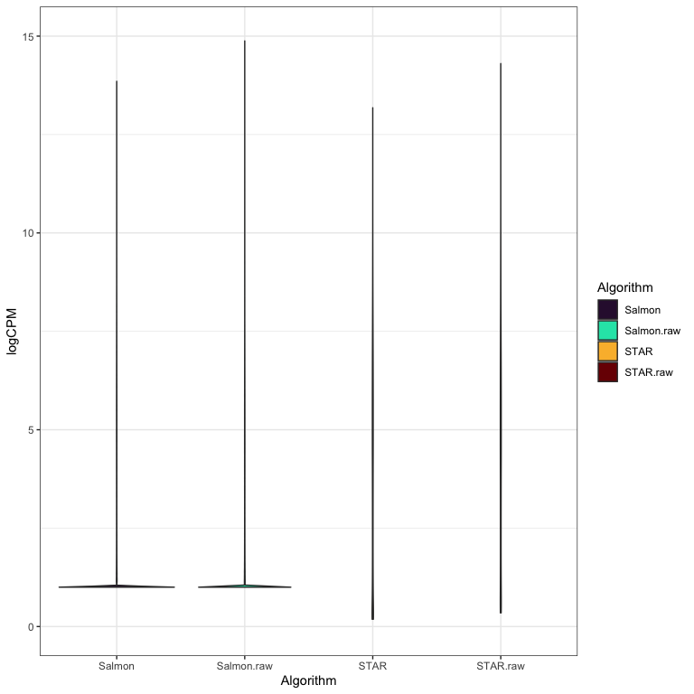
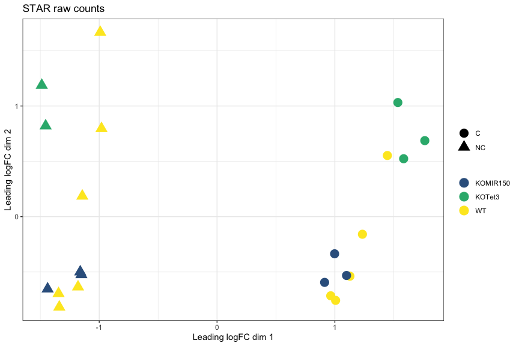
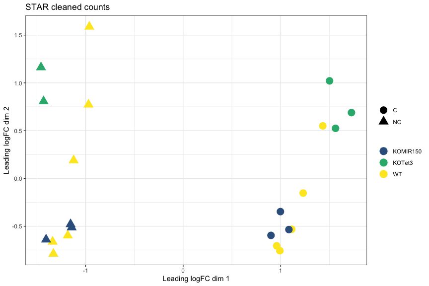
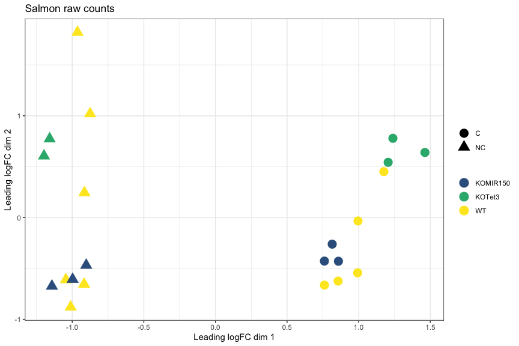
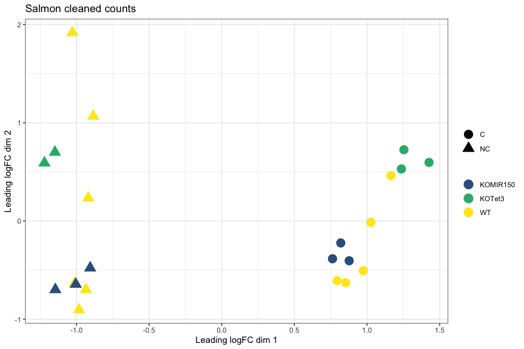
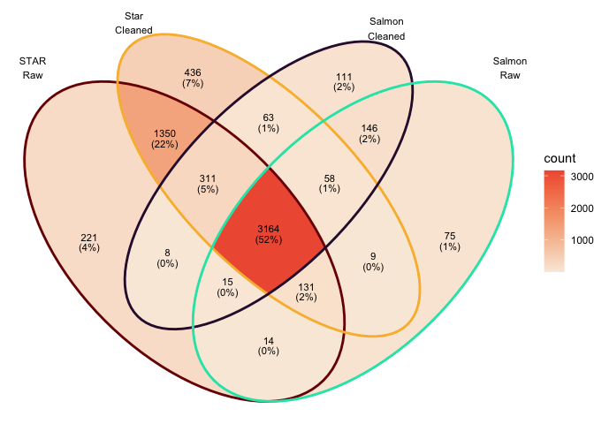
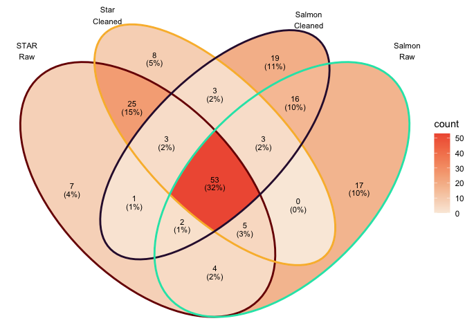

--------

### How had cleaning impacted read counts?

The following plots compare 4 samples that are representative of the rest of the dataset.

<!-- --><!-- -->

--------

### How does quantification method impact read counts?

Salmon CPM values using cleaned reads on y-axis vs STAR CPM values using cleaned reads on x-axis.  


<!-- --><!-- -->


Note the pattern of genes with low expression with STAR and high expression with Salmon.

------

### MDS plot, STAR raw counts:

<!-- -->

### MDS plot, STAR cleaned counts:
<!-- -->

### MDS plot, Salmon raw counts
<!-- -->

### MDS plot, Salmon cleaned counts
<!-- -->


### Top 10 genes with STAR on cleaned reads

```
##                        logFC   AveExpr    adj.P.Val
## ENSMUSG00000020608 -2.486550  7.859085 2.925178e-10
## ENSMUSG00000049103  2.160288  9.879972 4.722386e-09
## ENSMUSG00000052212  4.552087  6.190761 4.722386e-09
## ENSMUSG00000027508 -1.899422  8.112819 5.325170e-09
## ENSMUSG00000051177  3.186456  4.985785 6.008401e-09
## ENSMUSG00000050335  1.111730  8.961147 6.008401e-09
## ENSMUSG00000020437 -1.225453 10.305628 6.008401e-09
## ENSMUSG00000042700 -1.813987  6.083974 6.008401e-09
## ENSMUSG00000038807 -1.561241  9.003435 6.705254e-09
## ENSMUSG00000038147  1.689933  7.138335 6.822748e-09
```

### Top 10 genes with Salmon

```
##                        logFC  AveExpr    adj.P.Val
## ENSMUSG00000052212  4.535892 5.651031 5.877361e-07
## ENSMUSG00000020387 -4.508545 2.893826 5.877361e-07
## ENSMUSG00000049103  2.123480 9.096802 7.642699e-07
## ENSMUSG00000037185 -1.611938 8.791728 7.642699e-07
## ENSMUSG00000020437 -1.334231 9.700940 1.014511e-06
## ENSMUSG00000089929 -3.591508 6.208771 1.157161e-06
## ENSMUSG00000027508 -1.918388 6.041192 1.157161e-06
## ENSMUSG00000038807 -1.589898 7.207312 1.157161e-06
## ENSMUSG00000050335  1.083748 9.689827 1.157161e-06
## ENSMUSG00000097636 -1.485600 5.786712 1.157161e-06
```

### Totals genes DE at adj.P.val < 0.05
STAR + without cleaning : 5214.

STAR + with cleaning : 5522.

Salmon + without cleaning: 3612.

Salmon + with cleaning: 3876.

### Overlap in DEGs at adj.P.val < 0.05  

<!-- -->


### Overlap in top 100 DEGs (sorted by P value)  
<!-- -->

### Conclusions
* STAR and Salmon show differences in quantification of low expressed genes.
* This does not seem to have much impact on the relative distances between samples or differential expression (note that low expressed genes are often filtered out before analysis).
* Pick one approach for a project and go with it.
* Don't run multiple analyses and pick the one that gives you the most DE genes.
