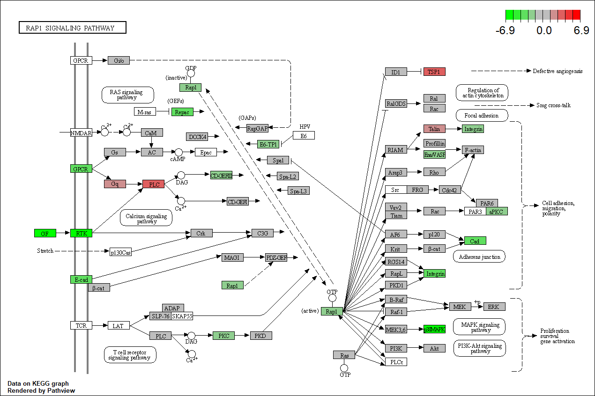

<script>
function buildQuiz(myq, qc){
  // variable to store the HTML output
  const output = [];

  // for each question...
  myq.forEach(
    (currentQuestion, questionNumber) => {

      // variable to store the list of possible answers
      const answers = [];

      // and for each available answer...
      for(letter in currentQuestion.answers){

        // ...add an HTML radio button
        answers.push(
          `<label>
            <input type="radio" name="question${questionNumber}" value="${letter}">
            ${letter} :
            ${currentQuestion.answers[letter]}
          </label><br/>`
        );
      }

      // add this question and its answers to the output
      output.push(
        `<div class="question"> ${currentQuestion.question} </div>
        <div class="answers"> ${answers.join('')} </div><br/>`
      );
    }
  );

  // finally combine our output list into one string of HTML and put it on the page
  qc.innerHTML = output.join('');
}

function showResults(myq, qc, rc){

  // gather answer containers from our quiz
  const answerContainers = qc.querySelectorAll('.answers');

  // keep track of user's answers
  let numCorrect = 0;

  // for each question...
  myq.forEach( (currentQuestion, questionNumber) => {

    // find selected answer
    const answerContainer = answerContainers[questionNumber];
    const selector = `input[name=question${questionNumber}]:checked`;
    const userAnswer = (answerContainer.querySelector(selector) || {}).value;

    // if answer is correct
    if(userAnswer === currentQuestion.correctAnswer){
      // add to the number of correct answers
      numCorrect++;

      // color the answers green
      answerContainers[questionNumber].style.color = 'lightgreen';
    }
    // if answer is wrong or blank
    else{
      // color the answers red
      answerContainers[questionNumber].style.color = 'red';
    }
  });

  // show number of correct answers out of total
  rc.innerHTML = `${numCorrect} out of ${myq.length}`;
}
</script>


# GO AND KEGG Enrichment Analysis

Load libraries
```{r, message = FALSE}
library(topGO)
library(org.Mm.eg.db)
library(clusterProfiler)
library(pathview)
library(enrichplot)
library(ggplot2)
library(dplyr)
```

Files for examples were created in the DE analysis.

## Gene Ontology (GO) Enrichment

[Gene ontology](http://www.geneontology.org/) provides a controlled vocabulary for describing biological processes (BP ontology), molecular functions (MF ontology) and cellular components (CC ontology)

The GO ontologies themselves are organism-independent; terms are associated with genes for a specific organism through direct experimentation or through sequence homology with another organism and its GO annotation.

Terms are related to other terms through parent-child relationships in a directed acylic graph.

Enrichment analysis provides one way of drawing conclusions about a set of differential expression results.

**1\.** topGO Example Using Kolmogorov-Smirnov Testing
Our first example uses Kolmogorov-Smirnov Testing for enrichment testing of our mouse DE results, with GO annotation obtained from the Bioconductor database org.Mm.eg.db.

The first step in each topGO analysis is to create a topGOdata object.  This contains the genes, the score for each gene (here we use the p-value from the DE test), the GO terms associated with each gene, and the ontology to be used (here we use the biological process ontology)
```{r}
infile <- "WT.C_v_WT.NC.txt"
DE <- read.delim(infile)

## Add entrezgene IDs to top table
tmp <- bitr(DE$Gene.stable.ID, fromType = "ENSEMBL", toType = "ENTREZID", OrgDb = org.Mm.eg.db)
id.conv <- subset(tmp, !duplicated(tmp$ENSEMBL))
DE <- left_join(DE, id.conv, by = c("Gene.stable.ID" = "ENSEMBL"))

# Make gene list
DE.nodupENTREZ <- subset(DE, !is.na(ENTREZID) & !duplicated(ENTREZID))
geneList <- DE.nodupENTREZ$P.Value
names(geneList) <- DE.nodupENTREZ$ENTREZID
head(geneList)

# Create topGOData object
GOdata <- new("topGOdata",
	ontology = "BP",
	allGenes = geneList,
	geneSelectionFun = function(x)x,
	annot = annFUN.org , mapping = "org.Mm.eg.db")
```

**2\.** The topGOdata object is then used as input for enrichment testing:
```{r}
# Kolmogorov-Smirnov testing
resultKS <- runTest(GOdata, algorithm = "weight01", statistic = "ks")
tab <- GenTable(GOdata, raw.p.value = resultKS, topNodes = length(resultKS@score), numChar = 120)
```

topGO by default preferentially tests more specific terms, utilizing the topology of the GO graph. The algorithms used are described in detail [here](https://academic.oup.com/bioinformatics/article/22/13/1600/193669).

```{r}
head(tab, 15)
```

* Annotated: number of genes (in our gene list) that are annotated with the term
* Significant: n/a for this example, same as Annotated here
* Expected: n/a for this example, same as Annotated here
* raw.p.value: P-value from Kolomogorov-Smirnov test that DE p-values annotated with the term are smaller (i.e. more significant) than those not annotated with the term.

The Kolmogorov-Smirnov test directly compares two probability distributions based on their maximum distance.  

To illustrate the KS test, we plot probability distributions of p-values that are and that are not annotated with the term GO:0010556 "regulation of macromolecule biosynthetic process" (2344 genes) p-value 1.00.  (This won't exactly match what topGO does due to their elimination algorithm):

```{r}
rna.pp.terms <- genesInTerm(GOdata)[["GO:0010556"]] # get genes associated with term
p.values.in <- geneList[names(geneList) %in% rna.pp.terms]
p.values.out <- geneList[!(names(geneList) %in% rna.pp.terms)]
plot.ecdf(p.values.in, verticals = T, do.points = F, col = "red", lwd = 2, xlim = c(0,1),
          main = "Empirical Distribution of DE P-Values by Annotation with 'regulation of macromolecule biosynthetic process'",
          cex.main = 0.9, xlab = "p", ylab = "Probability(P-Value <= p)")
ecdf.out <- ecdf(p.values.out)
xx <- unique(sort(c(seq(0, 1, length = 201), knots(ecdf.out))))
lines(xx, ecdf.out(xx), col = "black", lwd = 2)
legend("bottomright", legend = c("Genes Annotated with 'regulation of macromolecule biosynthetic process'", "Genes not annotated with 'regulation of macromolecule biosynthetic process'"), lwd = 2, col = 2:1, cex = 0.9)
```

versus the probability distributions of p-values that are and that are not annotated with the term GO:0045071 "negative regulation of viral genome replication" (54 genes) p-value 3.3x10-9.

```{r}
rna.pp.terms <- genesInTerm(GOdata)[["GO:0045071"]] # get genes associated with term
p.values.in <- geneList[names(geneList) %in% rna.pp.terms]
p.values.out <- geneList[!(names(geneList) %in% rna.pp.terms)]
plot.ecdf(p.values.in, verticals = T, do.points = F, col = "red", lwd = 2, xlim = c(0,1),
          main = "Empirical Distribution of DE P-Values by Annotation with 'negative regulation of viral genome replication'",
          cex.main = 0.9, xlab = "p", ylab = "Probability(P-Value <= p)")
ecdf.out <- ecdf(p.values.out)
xx <- unique(sort(c(seq(0, 1, length = 201), knots(ecdf.out))))
lines(xx, ecdf.out(xx), col = "black", lwd = 2)
legend("bottomright", legend = c("Genes Annotated with 'negative regulation of viral genome replication'", "Genes Not Annotated with 'negative regulation of viral genome replication'"), lwd = 2, col = 2:1, cex = 0.9)
```


We can use the function showSigOfNodes to plot the GO graph for the 2 most significant terms and their parents, color coded by enrichment p-value (red is most significant):
```{r, fig.width = 20, fig.height = 20}
par(cex = 0.3)
showSigOfNodes(GOdata, score(resultKS), firstSigNodes = 2, useInfo = "def", .NO.CHAR = 40)
par(cex = 1)
```

**3\.** topGO Example Using Fisher's Exact Test

Next, we use Fisher's exact test to test for GO enrichment among significantly DE genes.

Create topGOdata object:
```{r}
# Create topGOData object
GOdata <- new("topGOdata",
	ontology = "BP",
	allGenes = geneList,
	geneSelectionFun = function(x) (x < 0.05),
	annot = annFUN.org , mapping = "org.Mm.eg.db")
```

Run Fisher's Exact Test:
```{r}
resultFisher <- runTest(GOdata, algorithm = "elim", statistic = "fisher")
tab <- GenTable(GOdata, raw.p.value = resultFisher, topNodes = length(resultFisher@score),
				numChar = 120)
head(tab)
```
* Annotated: number of genes (in our gene list) that are annotated with the term
* Significant: Number of significantly DE genes annotated with that term (i.e. genes where geneList = 1)
* Expected: Under random chance, number of genes that would be expected to be significantly DE and annotated with that term
* raw.p.value: P-value from Fisher's Exact Test, testing for association between significance and pathway membership.

Fisher's Exact Test is applied to the table:

**Significance/Annotation**|**Annotated With GO Term**|**Not Annotated With GO Term**
:-----:|:-----:|:-----:
**Significantly DE**|n1|n3
**Not Significantly DE**|n2|n4

and compares the probability of the observed table, conditional on the row and column sums, to what would be expected under random chance.  

Advantages over KS (or Wilcoxon) Tests:

* Ease of interpretation

* Can be applied when you just have a gene list without associated p-values, etc.

Disadvantages:

* Relies on significant/non-significant dichotomy (an interesting gene could have an adjusted p-value of 0.051 and be counted as non-significant)
* Less powerful
* May be less useful if there are very few (or a large number of) significant genes

## Quiz 1

<div id="quiz1" class="quiz"></div>
<button id="submit1">Submit Quiz</button>
<div id="results1" class="output"></div>
<script>
quizContainer1 = document.getElementById('quiz1');
resultsContainer1 = document.getElementById('results1');
submitButton1 = document.getElementById('submit1');

myQuestions1 = [
  {
    question: "Rerun the KS test analysis using the molecular function (MF) ontology.  What is the top GO term listed?",
    answers: {
      a: "`r GOdata.1 <- new("topGOdata", ontology = "MF", allGenes = geneList, geneSelectionFun = function(x)x, annot = annFUN.org , mapping = "org.Mm.eg.db"); resultKS.1 <- runTest(GOdata.1, algorithm = "weight01", statistic = "ks"); tab.1 <- GenTable(GOdata.1, raw.p.value = resultKS.1, topNodes = length(resultKS.1@score), numChar = 120); tab.1[1, "Term"]`",
      b: "angiogenesis",
      c: "calcium ion binding"
    },
    correctAnswer: "a"
  },
  {
      question: "How many genes from the top table are annotated with the term 'actin filament binding'",
    answers: {
      a: "150",
      b: "5,846",
      c: "`r tab.1[which(tab.1[,'Term'] == 'actin filament binding'),'Annotated']`"
    },
    correctAnswer: "c"
  },
  {
      question: "Based on the graph above generated by showSigOfNodes, what is one parent term of 'negative regulation of viral genome replication'?",
    answers: {
      a: "metabolic process",
      b: "regulation of viral genome replication",
      c: "angiogenesis"
    },
    correctAnswer: "b"
  }
];

buildQuiz(myQuestions1, quizContainer1);
submitButton1.addEventListener('click', function() {showResults(myQuestions1, quizContainer1, resultsContainer1);});
</script>

## KEGG Pathway Enrichment Testing With clusterProfiler

KEGG, the Kyoto Encyclopedia of Genes and Genomes (https://www.genome.jp/kegg/), provides assignment of genes for many organisms into pathways.

We will conduct KEGG enrichment testing using the Bioconductor package [clusterProfiler](https://doi.org/10.1016/j.xinn.2021.100141). clusterProfiler implements the algorithm used by [GSEA](https://www.gsea-msigdb.org/gsea/index.jsp).

Cluster profiler can do much more than KEGG enrichment, check out the [clusterProfiler book](https://yulab-smu.top/biomedical-knowledge-mining-book/index.html).

We will base our KEGG enrichment analysis on the t statistics from differential expression, which allows for directional testing.

```{r}
geneList.KEGG <- DE.nodupENTREZ$t                   
geneList.KEGG <- sort(geneList.KEGG, decreasing = TRUE)
names(geneList.KEGG) <- DE.nodupENTREZ$ENTREZID
head(geneList.KEGG)
```
```{r, warning = FALSE}
KEGG.results <- gseKEGG(gene = geneList.KEGG, organism = "mmu", pvalueCutoff = 1)
KEGG.results <- setReadable(KEGG.results, OrgDb = "org.Mm.eg.db", keyType = "ENTREZID")
outdat <- as.data.frame(KEGG.results)
head(outdat)
```

Gene set enrichment analysis output includes the following columns:

* setSize: Number of genes in pathway

* enrichmentScore: [GSEA enrichment score](https://www.gsea-msigdb.org/gsea/doc/GSEAUserGuideTEXT.htm#_Enrichment_Score_(ES)), a statistic reflecting the degree to which a pathway is overrepresented at the top or bottom of the gene list (the gene list here consists of the t-statistics from the DE test).

* NES: [Normalized enrichment score](https://www.gsea-msigdb.org/gsea/doc/GSEAUserGuideTEXT.htm#_Normalized_Enrichment_Score)

* pvalue: Raw p-value from permutation test of enrichment score

* p.adjust: Benjamini-Hochberg false discovery rate adjusted p-value

* qvalue: Storey false discovery rate adjusted p-value 

* rank: Position in ranked list at which maximum enrichment score occurred

* leading_edge: [Statistics from leading edge analysis](https://www.gsea-msigdb.org/gsea/doc/GSEAUserGuideTEXT.htm#_Detailed_Enrichment_Results)

### Dotplot of enrichment results
Gene.ratio = (count of core enrichment genes)/(count of pathway genes)

Core enrichment genes = subset of genes that contribute most to the enrichment result ("leading edge subset")

```{r, fig.height = 6}
dotplot(KEGG.results)
```

### Pathview plot of log fold changes on KEGG diagram

```{r}
foldChangeList <- DE$logFC
xx <- as.list(org.Mm.egENSEMBL2EG)
names(foldChangeList) <- xx[sapply(strsplit(DE$Gene,split="\\."),"[[", 1L)]
head(foldChangeList)

mmu04015 <- pathview(gene.data  = foldChangeList,
                     pathway.id = "mmu04015",
                     species    = "mmu",
                     limit      = list(gene=max(abs(foldChangeList)), cpd=1))
```



### Barplot of p-values for top pathways
A barplot of -log10(p-value) for the top pathways/terms can be used for any type of enrichment analysis.

```{r}
plotdat <- outdat[1:10,]
plotdat$nice.name <- gsub(" - Mus musculus (house mouse)", "", plotdat$Description, fixed = TRUE)

ggplot(plotdat, aes(x = -log10(p.adjust), y = reorder(nice.name, -log10(p.adjust)), fill = setSize)) + geom_bar(stat = "identity") + labs(x = "-log10(P-Value)", y = NULL, fill = "# Genes") + scale_fill_gradient(low = "red", high = "blue")
```
## Quiz 2

<div id="quiz2" class="quiz"></div>
<button id="submit2">Submit Quiz</button>
<div id="results2" class="output"></div>
<script>
quizContainer2 = document.getElementById('quiz2');
resultsContainer2 = document.getElementById('results2');
submitButton2 = document.getElementById('submit2');

myQuestions2 = [
  {
    question: "How many pathways have an adjusted p-value less than 0.05?",
    answers: {
      a: "`r length(which(outdat$p.adjust < 0.05))`",
      b: "`r nrow(outdat)`",
      c: "`r length(which(outdat$p.adjust < 0.1))`"
    },
    correctAnswer: "a"
  },
  {
      question: "Which pathway has the most genes annotated to it?'",
    answers: {
      a: "`r outdat$Description[1]`",
      b: "`r outdat$Description[which.min(outdat$setSize)]`",
      c: "`r outdat$Description[which.max(outdat$setSize)]`"
    },
    correctAnswer: "c"
  },
  {
      question: "Make a pathview diagram for mmu05171, and locate the file mmu05171.pathview.png on your computer.  What sign does the log fold change for MAPK have?",
    answers: {
      a: "Positive",
      b: "Negative"
    },
    correctAnswer: "b"
  }
];

buildQuiz(myQuestions2, quizContainer2);
submitButton2.addEventListener('click', function() {showResults(myQuestions2, quizContainer2, resultsContainer2);});
</script>

```{r}
sessionInfo()
```
