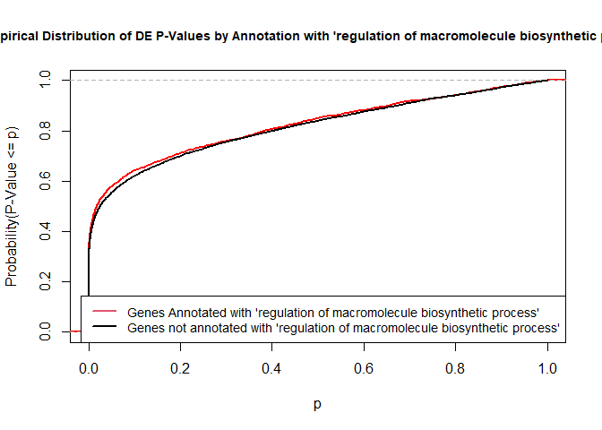
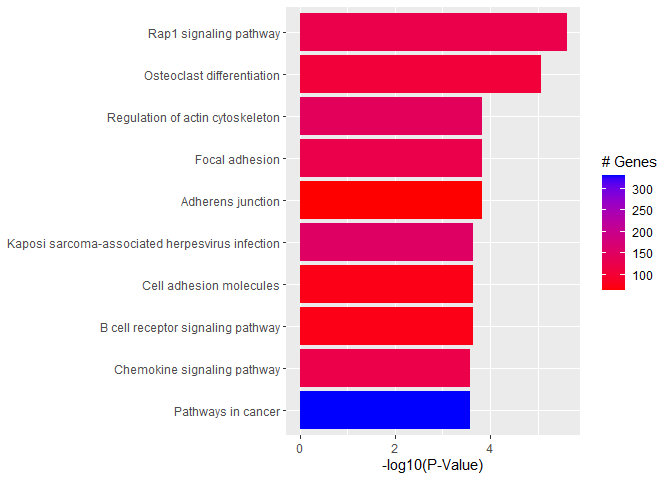

<script>
function buildQuiz(myq, qc){
  // variable to store the HTML output
  const output = [];

  // for each question...
  myq.forEach(
    (currentQuestion, questionNumber) => {

      // variable to store the list of possible answers
      const answers = [];

      // and for each available answer...
      for(letter in currentQuestion.answers){

        // ...add an HTML radio button
        answers.push(
          `<label>
            <input type="radio" name="question${questionNumber}" value="${letter}">
            ${letter} :
            ${currentQuestion.answers[letter]}
          </label><br/>`
        );
      }

      // add this question and its answers to the output
      output.push(
        `<div class="question"> ${currentQuestion.question} </div>
        <div class="answers"> ${answers.join('')} </div><br/>`
      );
    }
  );

  // finally combine our output list into one string of HTML and put it on the page
  qc.innerHTML = output.join('');
}

function showResults(myq, qc, rc){

  // gather answer containers from our quiz
  const answerContainers = qc.querySelectorAll('.answers');

  // keep track of user's answers
  let numCorrect = 0;

  // for each question...
  myq.forEach( (currentQuestion, questionNumber) => {

    // find selected answer
    const answerContainer = answerContainers[questionNumber];
    const selector = `input[name=question${questionNumber}]:checked`;
    const userAnswer = (answerContainer.querySelector(selector) || {}).value;

    // if answer is correct
    if(userAnswer === currentQuestion.correctAnswer){
      // add to the number of correct answers
      numCorrect++;

      // color the answers green
      answerContainers[questionNumber].style.color = 'lightgreen';
    }
    // if answer is wrong or blank
    else{
      // color the answers red
      answerContainers[questionNumber].style.color = 'red';
    }
  });

  // show number of correct answers out of total
  rc.innerHTML = `${numCorrect} out of ${myq.length}`;
}
</script>


# GO AND KEGG Enrichment Analysis

Load libraries

```r
library(topGO)
library(org.Mm.eg.db)
library(clusterProfiler)
library(pathview)
library(enrichplot)
library(ggplot2)
library(dplyr)
```

Files for examples were created in the DE analysis.

## Gene Ontology (GO) Enrichment

[Gene ontology](http://www.geneontology.org/) provides a controlled vocabulary for describing biological processes (BP ontology), molecular functions (MF ontology) and cellular components (CC ontology)

The GO ontologies themselves are organism-independent; terms are associated with genes for a specific organism through direct experimentation or through sequence homology with another organism and its GO annotation.

Terms are related to other terms through parent-child relationships in a directed acylic graph.

Enrichment analysis provides one way of drawing conclusions about a set of differential expression results.

**1\.** topGO Example Using Kolmogorov-Smirnov Testing
Our first example uses Kolmogorov-Smirnov Testing for enrichment testing of our mouse DE results, with GO annotation obtained from the Bioconductor database org.Mm.eg.db.

The first step in each topGO analysis is to create a topGOdata object.  This contains the genes, the score for each gene (here we use the p-value from the DE test), the GO terms associated with each gene, and the ontology to be used (here we use the biological process ontology)

```r
infile <- "WT.C_v_WT.NC.txt"
DE <- read.delim(infile)

## Add entrezgene IDs to top table
tmp <- bitr(DE$Gene.stable.ID, fromType = "ENSEMBL", toType = "ENTREZID", OrgDb = org.Mm.eg.db)
```

<div class='r_output'> 'select()' returned 1:many mapping between keys and columns
</div>
<div class='r_output'> Warning in bitr(DE$Gene.stable.ID, fromType = "ENSEMBL", toType = "ENTREZID", :
 5.55% of input gene IDs are fail to map...
</div>
```r
id.conv <- subset(tmp, !duplicated(tmp$ENSEMBL))
DE <- left_join(DE, id.conv, by = c("Gene.stable.ID" = "ENSEMBL"))

# Make gene list
DE.nodupENTREZ <- subset(DE, !is.na(ENTREZID) & !duplicated(ENTREZID))
geneList <- DE.nodupENTREZ$P.Value
names(geneList) <- DE.nodupENTREZ$ENTREZID
head(geneList)
```

<div class='r_output'>        67241        68891        12772        70686        94212       219140 
 8.218003e-19 3.232959e-18 7.127039e-18 8.029402e-17 1.101664e-16 1.161658e-16
</div>
```r
# Create topGOData object
GOdata <- new("topGOdata",
	ontology = "BP",
	allGenes = geneList,
	geneSelectionFun = function(x)x,
	annot = annFUN.org , mapping = "org.Mm.eg.db")
```

<div class='r_output'> 
 Building most specific GOs .....
</div>
<div class='r_output'> 	( 10663 GO terms found. )
</div>
<div class='r_output'> 
 Build GO DAG topology ..........
</div>
<div class='r_output'> 	( 14106 GO terms and 31755 relations. )
</div>
<div class='r_output'> 
 Annotating nodes ...............
</div>
<div class='r_output'> 	( 10315 genes annotated to the GO terms. )
</div>
**2\.** The topGOdata object is then used as input for enrichment testing:

```r
# Kolmogorov-Smirnov testing
resultKS <- runTest(GOdata, algorithm = "weight01", statistic = "ks")
```

<div class='r_output'> 
 			 -- Weight01 Algorithm -- 
 
 		 the algorithm is scoring 14106 nontrivial nodes
 		 parameters: 
 			 test statistic: ks
 			 score order: increasing
</div>
<div class='r_output'> 
 	 Level 18:	6 nodes to be scored	(0 eliminated genes)
</div>
<div class='r_output'> 
 	 Level 17:	39 nodes to be scored	(0 eliminated genes)
</div>
<div class='r_output'> 
 	 Level 16:	80 nodes to be scored	(8 eliminated genes)
</div>
<div class='r_output'> 
 	 Level 15:	155 nodes to be scored	(97 eliminated genes)
</div>
<div class='r_output'> 
 	 Level 14:	291 nodes to be scored	(305 eliminated genes)
</div>
<div class='r_output'> 
 	 Level 13:	603 nodes to be scored	(651 eliminated genes)
</div>
<div class='r_output'> 
 	 Level 12:	1038 nodes to be scored	(1481 eliminated genes)
</div>
<div class='r_output'> 
 	 Level 11:	1547 nodes to be scored	(3134 eliminated genes)
</div>
<div class='r_output'> 
 	 Level 10:	1936 nodes to be scored	(4452 eliminated genes)
</div>
<div class='r_output'> 
 	 Level 9:	2100 nodes to be scored	(5711 eliminated genes)
</div>
<div class='r_output'> 
 	 Level 8:	2005 nodes to be scored	(6935 eliminated genes)
</div>
<div class='r_output'> 
 	 Level 7:	1806 nodes to be scored	(7934 eliminated genes)
</div>
<div class='r_output'> 
 	 Level 6:	1309 nodes to be scored	(8602 eliminated genes)
</div>
<div class='r_output'> 
 	 Level 5:	709 nodes to be scored	(9063 eliminated genes)
</div>
<div class='r_output'> 
 	 Level 4:	346 nodes to be scored	(9287 eliminated genes)
</div>
<div class='r_output'> 
 	 Level 3:	116 nodes to be scored	(9411 eliminated genes)
</div>
<div class='r_output'> 
 	 Level 2:	19 nodes to be scored	(9459 eliminated genes)
</div>
<div class='r_output'> 
 	 Level 1:	1 nodes to be scored	(9490 eliminated genes)
</div>
```r
tab <- GenTable(GOdata, raw.p.value = resultKS, topNodes = length(resultKS@score), numChar = 120)
```

topGO by default preferentially tests more specific terms, utilizing the topology of the GO graph. The algorithms used are described in detail [here](https://academic.oup.com/bioinformatics/article/22/13/1600/193669).


```r
head(tab, 15)
```

<div class='r_output'>         GO.ID                                                        Term
 1  GO:0045071             negative regulation of viral genome replication
 2  GO:0045944   positive regulation of transcription by RNA polymerase II
 3  GO:0032731        positive regulation of interleukin-1 beta production
 4  GO:0097202          activation of cysteine-type endopeptidase activity
 5  GO:0045766                         positive regulation of angiogenesis
 6  GO:0051607                                   defense response to virus
 7  GO:0032760     positive regulation of tumor necrosis factor production
 8  GO:0045087                                      innate immune response
 9  GO:0070374                positive regulation of ERK1 and ERK2 cascade
 10 GO:0035458                        cellular response to interferon-beta
 11 GO:0001525                                                angiogenesis
 12 GO:0051897           positive regulation of protein kinase B signaling
 13 GO:2000117 negative regulation of cysteine-type endopeptidase activity
 14 GO:0006002                      fructose 6-phosphate metabolic process
 15 GO:0031623                                    receptor internalization
    Annotated Significant Expected raw.p.value
 1         54          54       54     3.3e-09
 2        784         784      784     3.8e-09
 3         55          55       55     1.5e-08
 4         25          25       25     8.4e-08
 5         97          97       97     4.8e-07
 6        242         242      242     6.1e-07
 7         89          89       89     6.5e-07
 8        591         591      591     7.9e-07
 9        109         109      109     1.6e-06
 10        44          44       44     2.0e-06
 11       305         305      305     4.0e-06
 12        61          61       61     5.0e-06
 13        77          77       77     5.4e-06
 14        10          10       10     5.4e-06
 15        89          89       89     6.6e-06
</div>
* Annotated: number of genes (in our gene list) that are annotated with the term
* Significant: n/a for this example, same as Annotated here
* Expected: n/a for this example, same as Annotated here
* raw.p.value: P-value from Kolomogorov-Smirnov test that DE p-values annotated with the term are smaller (i.e. more significant) than those not annotated with the term.

The Kolmogorov-Smirnov test directly compares two probability distributions based on their maximum distance.  

To illustrate the KS test, we plot probability distributions of p-values that are and that are not annotated with the term GO:0010556 "regulation of macromolecule biosynthetic process" (2344 genes) p-value 1.00.  (This won't exactly match what topGO does due to their elimination algorithm):


```r
rna.pp.terms <- genesInTerm(GOdata)[["GO:0010556"]] # get genes associated with term
p.values.in <- geneList[names(geneList) %in% rna.pp.terms]
p.values.out <- geneList[!(names(geneList) %in% rna.pp.terms)]
plot.ecdf(p.values.in, verticals = T, do.points = F, col = "red", lwd = 2, xlim = c(0,1),
          main = "Empirical Distribution of DE P-Values by Annotation with 'regulation of macromolecule biosynthetic process'",
          cex.main = 0.9, xlab = "p", ylab = "Probability(P-Value <= p)")
ecdf.out <- ecdf(p.values.out)
xx <- unique(sort(c(seq(0, 1, length = 201), knots(ecdf.out))))
lines(xx, ecdf.out(xx), col = "black", lwd = 2)
legend("bottomright", legend = c("Genes Annotated with 'regulation of macromolecule biosynthetic process'", "Genes not annotated with 'regulation of macromolecule biosynthetic process'"), lwd = 2, col = 2:1, cex = 0.9)
```

<!-- -->

versus the probability distributions of p-values that are and that are not annotated with the term GO:0045071 "negative regulation of viral genome replication" (54 genes) p-value 3.3x10-9.


```r
rna.pp.terms <- genesInTerm(GOdata)[["GO:0045071"]] # get genes associated with term
p.values.in <- geneList[names(geneList) %in% rna.pp.terms]
p.values.out <- geneList[!(names(geneList) %in% rna.pp.terms)]
plot.ecdf(p.values.in, verticals = T, do.points = F, col = "red", lwd = 2, xlim = c(0,1),
          main = "Empirical Distribution of DE P-Values by Annotation with 'negative regulation of viral genome replication'",
          cex.main = 0.9, xlab = "p", ylab = "Probability(P-Value <= p)")
ecdf.out <- ecdf(p.values.out)
xx <- unique(sort(c(seq(0, 1, length = 201), knots(ecdf.out))))
lines(xx, ecdf.out(xx), col = "black", lwd = 2)
legend("bottomright", legend = c("Genes Annotated with 'negative regulation of viral genome replication'", "Genes Not Annotated with 'negative regulation of viral genome replication'"), lwd = 2, col = 2:1, cex = 0.9)
```

<!-- -->


We can use the function showSigOfNodes to plot the GO graph for the 2 most significant terms and their parents, color coded by enrichment p-value (red is most significant):

```r
par(cex = 0.3)
showSigOfNodes(GOdata, score(resultKS), firstSigNodes = 2, useInfo = "def", .NO.CHAR = 40)
```

<div class='r_output'> Loading required package: Rgraphviz
</div>
<div class='r_output'> Loading required package: grid
</div>
<div class='r_output'> 
 Attaching package: 'grid'
</div>
<div class='r_output'> The following object is masked from 'package:topGO':
 
     depth
</div>
<div class='r_output'> 
 Attaching package: 'Rgraphviz'
</div>
<div class='r_output'> The following objects are masked from 'package:IRanges':
 
     from, to
</div>
<div class='r_output'> The following objects are masked from 'package:S4Vectors':
 
     from, to
</div>
<!-- -->

<div class='r_output'> $dag
 A graphNEL graph with directed edges
 Number of Nodes = 71 
 Number of Edges = 162 
 
 $complete.dag
 [1] "A graph with 71 nodes."
</div>
```r
par(cex = 1)
```

**3\.** topGO Example Using Fisher's Exact Test

Next, we use Fisher's exact test to test for GO enrichment among significantly DE genes.

Create topGOdata object:

```r
# Create topGOData object
GOdata <- new("topGOdata",
	ontology = "BP",
	allGenes = geneList,
	geneSelectionFun = function(x) (x < 0.05),
	annot = annFUN.org , mapping = "org.Mm.eg.db")
```

<div class='r_output'> 
 Building most specific GOs .....
</div>
<div class='r_output'> 	( 10663 GO terms found. )
</div>
<div class='r_output'> 
 Build GO DAG topology ..........
</div>
<div class='r_output'> 	( 14106 GO terms and 31755 relations. )
</div>
<div class='r_output'> 
 Annotating nodes ...............
</div>
<div class='r_output'> 	( 10315 genes annotated to the GO terms. )
</div>
Run Fisher's Exact Test:

```r
resultFisher <- runTest(GOdata, algorithm = "elim", statistic = "fisher")
```

<div class='r_output'> 
 			 -- Elim Algorithm -- 
 
 		 the algorithm is scoring 12807 nontrivial nodes
 		 parameters: 
 			 test statistic: fisher
 			 cutOff: 0.01
</div>
<div class='r_output'> 
 	 Level 18:	6 nodes to be scored	(0 eliminated genes)
</div>
<div class='r_output'> 
 	 Level 17:	32 nodes to be scored	(0 eliminated genes)
</div>
<div class='r_output'> 
 	 Level 16:	69 nodes to be scored	(0 eliminated genes)
</div>
<div class='r_output'> 
 	 Level 15:	133 nodes to be scored	(40 eliminated genes)
</div>
<div class='r_output'> 
 	 Level 14:	248 nodes to be scored	(51 eliminated genes)
</div>
<div class='r_output'> 
 	 Level 13:	515 nodes to be scored	(333 eliminated genes)
</div>
<div class='r_output'> 
 	 Level 12:	898 nodes to be scored	(1679 eliminated genes)
</div>
<div class='r_output'> 
 	 Level 11:	1374 nodes to be scored	(1817 eliminated genes)
</div>
<div class='r_output'> 
 	 Level 10:	1767 nodes to be scored	(2055 eliminated genes)
</div>
<div class='r_output'> 
 	 Level 9:	1923 nodes to be scored	(2707 eliminated genes)
</div>
<div class='r_output'> 
 	 Level 8:	1841 nodes to be scored	(3256 eliminated genes)
</div>
<div class='r_output'> 
 	 Level 7:	1653 nodes to be scored	(4143 eliminated genes)
</div>
<div class='r_output'> 
 	 Level 6:	1214 nodes to be scored	(5524 eliminated genes)
</div>
<div class='r_output'> 
 	 Level 5:	674 nodes to be scored	(5774 eliminated genes)
</div>
<div class='r_output'> 
 	 Level 4:	330 nodes to be scored	(6568 eliminated genes)
</div>
<div class='r_output'> 
 	 Level 3:	110 nodes to be scored	(6734 eliminated genes)
</div>
<div class='r_output'> 
 	 Level 2:	19 nodes to be scored	(6768 eliminated genes)
</div>
<div class='r_output'> 
 	 Level 1:	1 nodes to be scored	(6782 eliminated genes)
</div>
```r
tab <- GenTable(GOdata, raw.p.value = resultFisher, topNodes = length(resultFisher@score),
				numChar = 120)
head(tab)
```

<div class='r_output'>        GO.ID                                                      Term
 1 GO:0051607                                 defense response to virus
 2 GO:0042742                             defense response to bacterium
 3 GO:0045944 positive regulation of transcription by RNA polymerase II
 4 GO:0032731      positive regulation of interleukin-1 beta production
 5 GO:0001525                                              angiogenesis
 6 GO:0098742 cell-cell adhesion via plasma-membrane adhesion molecules
   Annotated Significant Expected raw.p.value
 1       242         172   136.59     1.5e-06
 2       160         119    90.31     1.7e-06
 3       784         504   442.51     2.0e-06
 4        55          47    31.04     4.0e-06
 5       305         227   172.15     4.8e-06
 6        63          52    35.56     1.0e-05
</div>* Annotated: number of genes (in our gene list) that are annotated with the term
* Significant: Number of significantly DE genes annotated with that term (i.e. genes where geneList = 1)
* Expected: Under random chance, number of genes that would be expected to be significantly DE and annotated with that term
* raw.p.value: P-value from Fisher's Exact Test, testing for association between significance and pathway membership.

Fisher's Exact Test is applied to the table:

**Significance/Annotation**|**Annotated With GO Term**|**Not Annotated With GO Term**
:-----:|:-----:|:-----:
**Significantly DE**|n1|n3
**Not Significantly DE**|n2|n4

and compares the probability of the observed table, conditional on the row and column sums, to what would be expected under random chance.  

Advantages over KS (or Wilcoxon) Tests:

* Ease of interpretation

* Can be applied when you just have a gene list without associated p-values, etc.

Disadvantages:

* Relies on significant/non-significant dichotomy (an interesting gene could have an adjusted p-value of 0.051 and be counted as non-significant)
* Less powerful
* May be less useful if there are very few (or a large number of) significant genes

## Quiz 1

<div id="quiz1" class="quiz"></div>
<button id="submit1">Submit Quiz</button>
<div id="results1" class="output"></div>
<script>
quizContainer1 = document.getElementById('quiz1');
resultsContainer1 = document.getElementById('results1');
submitButton1 = document.getElementById('submit1');

myQuestions1 = [
  {
    question: "Rerun the KS test analysis using the molecular function (MF) ontology.  What is the top GO term listed?",
    answers: {
      a: "actin filament binding",
      b: "angiogenesis",
      c: "calcium ion binding"
    },
    correctAnswer: "a"
  },
  {
      question: "How many genes from the top table are annotated with the term 'actin filament binding'",
    answers: {
      a: "150",
      b: "5,846",
      c: "129"
    },
    correctAnswer: "c"
  },
  {
      question: "Based on the graph above generated by showSigOfNodes, what is one parent term of 'negative regulation of viral genome replication'?",
    answers: {
      a: "metabolic process",
      b: "regulation of viral genome replication",
      c: "angiogenesis"
    },
    correctAnswer: "b"
  }
];

buildQuiz(myQuestions1, quizContainer1);
submitButton1.addEventListener('click', function() {showResults(myQuestions1, quizContainer1, resultsContainer1);});
</script>

## KEGG Pathway Enrichment Testing With clusterProfiler

KEGG, the Kyoto Encyclopedia of Genes and Genomes (https://www.genome.jp/kegg/), provides assignment of genes for many organisms into pathways.

We will conduct KEGG enrichment testing using the Bioconductor package [clusterProfiler](https://doi.org/10.1016/j.xinn.2021.100141). clusterProfiler implements the algorithm used by [GSEA](https://www.gsea-msigdb.org/gsea/index.jsp).

Cluster profiler can do much more than KEGG enrichment, check out the [clusterProfiler book](https://yulab-smu.top/biomedical-knowledge-mining-book/index.html).

We will base our KEGG enrichment analysis on the t statistics from differential expression, which allows for directional testing.


```r
geneList.KEGG <- DE.nodupENTREZ$t                   
geneList.KEGG <- sort(geneList.KEGG, decreasing = TRUE)
names(geneList.KEGG) <- DE.nodupENTREZ$ENTREZID
head(geneList.KEGG)
```

<div class='r_output'>    67241    68891    12772    70686    94212   219140 
 40.65736 38.76983 31.10868 31.00222 29.36517 29.32405
</div>
```r
KEGG.results <- gseKEGG(gene = geneList.KEGG, organism = "mmu", pvalueCutoff = 1)
```

<div class='r_output'> Reading KEGG annotation online: "https://rest.kegg.jp/link/mmu/pathway"...
</div>
<div class='r_output'> Reading KEGG annotation online: "https://rest.kegg.jp/list/pathway/mmu"...
</div>
<div class='r_output'> preparing geneSet collections...
</div>
<div class='r_output'> GSEA analysis...
</div>
<div class='r_output'> leading edge analysis...
</div>
<div class='r_output'> done...
</div>
```r
KEGG.results <- setReadable(KEGG.results, OrgDb = "org.Mm.eg.db", keyType = "ENTREZID")
outdat <- as.data.frame(KEGG.results)
head(outdat)
```

<div class='r_output'>                ID
 mmu04015 mmu04015
 mmu04380 mmu04380
 mmu04510 mmu04510
 mmu04520 mmu04520
 mmu04662 mmu04662
 mmu04810 mmu04810
                                                             Description setSize
 mmu04015            Rap1 signaling pathway - Mus musculus (house mouse)     125
 mmu04380        Osteoclast differentiation - Mus musculus (house mouse)     106
 mmu04510                    Focal adhesion - Mus musculus (house mouse)     124
 mmu04520                 Adherens junction - Mus musculus (house mouse)      63
 mmu04662 B cell receptor signaling pathway - Mus musculus (house mouse)      74
 mmu04810  Regulation of actin cytoskeleton - Mus musculus (house mouse)     142
          enrichmentScore      NES       pvalue     p.adjust       qvalue rank
 mmu04015       0.5534343 2.200088 7.929848e-09 2.505832e-06 1.519192e-06 1926
 mmu04380       0.5565518 2.175204 8.455461e-08 1.335963e-05 8.099442e-06 1990
 mmu04510       0.5038579 2.009006 6.763647e-07 7.124375e-05 4.319241e-05 1971
 mmu04520       0.6017661 2.158195 1.241444e-06 9.807408e-05 5.945864e-05 1508
 mmu04662       0.5687424 2.096528 4.230054e-06 2.227828e-04 1.350649e-04 1876
 mmu04810       0.4747548 1.923544 3.573692e-06 2.227828e-04 1.350649e-04 2045
                            leading_edge
 mmu04015 tags=45%, list=18%, signal=37%
 mmu04380 tags=41%, list=18%, signal=33%
 mmu04510 tags=40%, list=18%, signal=33%
 mmu04520 tags=38%, list=14%, signal=33%
 mmu04662 tags=43%, list=17%, signal=36%
 mmu04810 tags=37%, list=19%, signal=31%
                                                                                                                                                                                                                                                                                                                                 core_enrichment
 mmu04015 Plcb1/Sipa1l1/Met/Tiam1/Adcy7/Thbs1/Itgal/Itgb2/Itgb1/Calm1/Afdn/Raf1/Rassf5/Rap1b/Pdgfb/Gnaq/Vasp/Evl/Rasgrp2/Vegfc/Rras/Sipa1l3/Insr/Prkd2/Prkcb/P2ry1/Fpr1/Pfn1/Map2k1/Rapgef5/Actg1/Hgf/Rapgef1/Apbb1ip/Rhoa/Pik3cd/Rap1a/Csf1r/Tln1/Cdh1/Rac1/Kras/Akt1/Adora2a/Lcp2/Fgfr1/Adcy4/Crk/Mapk3/Itgb3/Pdgfrb/Ralb/Akt3/Fyb/Plcb3/Rgs14
 mmu04380                                                                       Pparg/Lilra6/Lilra5/Fyn/Fcgr4/Stat2/Pira11/Tgfbr1/Acp5/Sirpd/Pirb/Tyk2/Ncf1/Map3k14/Tgfbr2/Mitf/Pira2/Nfkb1/Spi1/Map2k1/Fcgr1/Socs3/Sqstm1/Pik3cd/Csf1r/Trem2/Pira1/Ppp3r1/Nfatc1/Pira6/Fos/Rac1/Akt1/Nfkbia/Lcp2/Mapk3/Itgb3/Gab2/Sirpb1a/Akt3/Chuk/Tab2/Ifngr1
 mmu04510                                              Fn1/Met/Fyn/Thbs1/Itga1/Bcl2/Itgb1/Ppp1cb/Ccnd2/Raf1/Rap1b/Pten/Pdgfb/Vasp/Vegfc/Col4a2/Vwf/Capn2/Parvg/Actn4/Flna/Prkcb/Itgav/Itga5/Parvb/Map2k1/Actg1/Hgf/Rapgef1/Rhoa/Pik3cd/Rap1a/Tln1/Rac1/Itgb5/Akt1/Itgb7/Bad/Crk/Mapk3/Itgb3/Pdgfrb/Ccnd1/Ilk/Col4a1/Akt3/Dock1/Itga4/Ppp1ca/Cav2
 mmu04520                                                                                                                                                                                            Met/Fyn/Ccm2/Tcf7l2/Afdn/Ptprj/Heg1/Rap1b/Tgfbr1/Ptpn6/Tgfbr2/Smad3/Insr/Actn4/Actg1/Iqgap1/Rhoa/Rap1a/Cdh1/Nectin4/Rac1/Smurf2/Fgfr1/Mapk3
 mmu04662                                                                                                                                         Lilra6/Lilra5/Pik3ap1/Nfatc3/Raf1/Cd81/Pira11/Pirb/Ptpn6/Cd79a/Pira2/Prkcb/Nfkb1/Cd22/Map2k1/Ifitm1/Pik3cd/Pira1/Cd19/Ppp3r1/Nfatc1/Pira6/Fos/Rac1/Kras/Akt1/Nfkbia/Mapk3/Blk/Nfkbie/Akt3/Chuk
 mmu04810             Spata13/Fn1/Cyfip2/Itgax/Tiam1/Iqgap2/Itgal/Itgb2/Itga1/Itgb1/Ppp1cb/Msn/Arhgef1/Raf1/Gsn/Pdgfb/Cxcr4/Rras/Ssh1/Actn4/Myh9/Itgav/Itga5/Pfn1/Map2k1/Actg1/Ssh2/Arhgef6/Iqgap1/Rhoa/Pik3cd/Pip4k2c/Rac1/Itgb5/Kras/Akt1/Itgb7/Fgfr1/Arpc5l/Crk/Mapk3/Itgb3/Fgd3/Pdgfrb/Pip4k2a/Araf/Akt3/Arpc5/Dock1/Itga4/Ppp1ca/Actr3/Vav3
</div>
Gene set enrichment analysis output includes the following columns:

* setSize: Number of genes in pathway

* enrichmentScore: [GSEA enrichment score](https://www.gsea-msigdb.org/gsea/doc/GSEAUserGuideTEXT.htm#_Enrichment_Score_(ES)), a statistic reflecting the degree to which a pathway is overrepresented at the top or bottom of the gene list (the gene list here consists of the t-statistics from the DE test).

* NES: [Normalized enrichment score](https://www.gsea-msigdb.org/gsea/doc/GSEAUserGuideTEXT.htm#_Normalized_Enrichment_Score)

* pvalue: Raw p-value from permutation test of enrichment score

* p.adjust: Benjamini-Hochberg false discovery rate adjusted p-value

* qvalue: Storey false discovery rate adjusted p-value 

* rank: Position in ranked list at which maximum enrichment score occurred

* leading_edge: [Statistics from leading edge analysis](https://www.gsea-msigdb.org/gsea/doc/GSEAUserGuideTEXT.htm#_Detailed_Enrichment_Results)

### Dotplot of enrichment results
Gene.ratio = (count of core enrichment genes)/(count of pathway genes)

Core enrichment genes = subset of genes that contribute most to the enrichment result ("leading edge subset")


```r
dotplot(KEGG.results)
```

<!-- -->

### Pathview plot of log fold changes on KEGG diagram


```r
foldChangeList <- DE$logFC
xx <- as.list(org.Mm.egENSEMBL2EG)
names(foldChangeList) <- xx[sapply(strsplit(DE$Gene,split="\\."),"[[", 1L)]
head(foldChangeList)
```

<div class='r_output'>     67241     68891     12772     70686     94212    219140 
 -2.493130  4.539354  2.152305 -4.128233 -1.906648 -2.686905
</div>
```r
mmu04015 <- pathview(gene.data  = foldChangeList,
                     pathway.id = "mmu04015",
                     species    = "mmu",
                     limit      = list(gene=max(abs(foldChangeList)), cpd=1))
```

<div class='r_output'> 'select()' returned 1:1 mapping between keys and columns
</div>
<div class='r_output'> Info: Working in directory C:/Users/bpdurbin/OneDrive - University of California, Davis/Desktop/2023-June-RNA-Seq-Analysis/data_analysis
</div>
<div class='r_output'> Info: Writing image file mmu04015.pathview.png
</div>


### Barplot of p-values for top pathways
A barplot of -log10(p-value) for the top pathways/terms can be used for any type of enrichment analysis.


```r
plotdat <- outdat[1:10,]
plotdat$nice.name <- gsub(" - Mus musculus (house mouse)", "", plotdat$Description, fixed = TRUE)

ggplot(plotdat, aes(x = -log10(p.adjust), y = reorder(nice.name, -log10(p.adjust)), fill = setSize)) + geom_bar(stat = "identity") + labs(x = "-log10(P-Value)", y = NULL, fill = "# Genes") + scale_fill_gradient(low = "red", high = "blue")
```

<!-- -->
## Quiz 2

<div id="quiz2" class="quiz"></div>
<button id="submit2">Submit Quiz</button>
<div id="results2" class="output"></div>
<script>
quizContainer2 = document.getElementById('quiz2');
resultsContainer2 = document.getElementById('results2');
submitButton2 = document.getElementById('submit2');

myQuestions2 = [
  {
    question: "How many pathways have an adjusted p-value less than 0.05?",
    answers: {
      a: "96",
      b: "316",
      c: "120"
    },
    correctAnswer: "a"
  },
  {
      question: "Which pathway has the most genes annotated to it?'",
    answers: {
      a: "Rap1 signaling pathway - Mus musculus (house mouse)",
      b: "Arginine biosynthesis - Mus musculus (house mouse)",
      c: "Pathways of neurodegeneration - multiple diseases - Mus musculus (house mouse)"
    },
    correctAnswer: "c"
  },
  {
      question: "Make a pathview diagram for mmu05171, and locate the file mmu05171.pathview.png on your computer.  What sign does the log fold change for MAPK have?",
    answers: {
      a: "Positive",
      b: "Negative"
    },
    correctAnswer: "b"
  }
];

buildQuiz(myQuestions2, quizContainer2);
submitButton2.addEventListener('click', function() {showResults(myQuestions2, quizContainer2, resultsContainer2);});
</script>


```r
sessionInfo()
```

<div class='r_output'> R version 4.3.1 (2023-06-16 ucrt)
 Platform: x86_64-w64-mingw32/x64 (64-bit)
 Running under: Windows 10 x64 (build 19045)
 
 Matrix products: default
 
 
 locale:
 [1] LC_COLLATE=English_United States.utf8 
 [2] LC_CTYPE=English_United States.utf8   
 [3] LC_MONETARY=English_United States.utf8
 [4] LC_NUMERIC=C                          
 [5] LC_TIME=English_United States.utf8    
 
 time zone: America/Los_Angeles
 tzcode source: internal
 
 attached base packages:
 [1] grid      stats4    stats     graphics  grDevices utils     datasets 
 [8] methods   base     
 
 other attached packages:
  [1] Rgraphviz_2.44.0      dplyr_1.1.2           ggplot2_3.4.2        
  [4] enrichplot_1.20.0     pathview_1.40.0       clusterProfiler_4.8.1
  [7] org.Mm.eg.db_3.17.0   topGO_2.52.0          SparseM_1.81         
 [10] GO.db_3.17.0          AnnotationDbi_1.62.1  IRanges_2.34.0       
 [13] S4Vectors_0.38.1      Biobase_2.60.0        graph_1.78.0         
 [16] BiocGenerics_0.46.0  
 
 loaded via a namespace (and not attached):
   [1] RColorBrewer_1.1-3      rstudioapi_0.14         jsonlite_1.8.5         
   [4] magrittr_2.0.3          farver_2.1.1            rmarkdown_2.22         
   [7] zlibbioc_1.46.0         vctrs_0.6.3             memoise_2.0.1          
  [10] RCurl_1.98-1.12         ggtree_3.8.0            htmltools_0.5.5        
  [13] gridGraphics_0.5-1      sass_0.4.6              bslib_0.5.0            
  [16] plyr_1.8.8              cachem_1.0.8            igraph_1.5.0           
  [19] lifecycle_1.0.3         pkgconfig_2.0.3         Matrix_1.5-4.1         
  [22] R6_2.5.1                fastmap_1.1.1           gson_0.1.0             
  [25] GenomeInfoDbData_1.2.10 digest_0.6.31           aplot_0.1.10           
  [28] colorspace_2.1-0        patchwork_1.1.2         RSQLite_2.3.1          
  [31] org.Hs.eg.db_3.17.0     labeling_0.4.2          fansi_1.0.4            
  [34] httr_1.4.6              polyclip_1.10-4         compiler_4.3.1         
  [37] bit64_4.0.5             withr_2.5.0             downloader_0.4         
  [40] BiocParallel_1.34.2     viridis_0.6.3           DBI_1.1.3              
  [43] highr_0.10              ggforce_0.4.1           MASS_7.3-60            
  [46] HDO.db_0.99.1           tools_4.3.1             ape_5.7-1              
  [49] scatterpie_0.2.1        glue_1.6.2              nlme_3.1-162           
  [52] GOSemSim_2.26.0         shadowtext_0.1.2        reshape2_1.4.4         
  [55] snow_0.4-4              fgsea_1.26.0            generics_0.1.3         
  [58] gtable_0.3.3            tidyr_1.3.0             data.table_1.14.8      
  [61] tidygraph_1.2.3         utf8_1.2.3              XVector_0.40.0         
  [64] ggrepel_0.9.3           pillar_1.9.0            stringr_1.5.0          
  [67] yulab.utils_0.0.6       splines_4.3.1           tweenr_2.0.2           
  [70] treeio_1.24.1           lattice_0.21-8          bit_4.0.5              
  [73] tidyselect_1.2.0        Biostrings_2.68.1       knitr_1.43             
  [76] gridExtra_2.3           xfun_0.39               graphlayouts_1.0.0     
  [79] matrixStats_1.0.0       KEGGgraph_1.60.0        stringi_1.7.12         
  [82] lazyeval_0.2.2          ggfun_0.1.1             yaml_2.3.7             
  [85] evaluate_0.21           codetools_0.2-19        ggraph_2.1.0           
  [88] tibble_3.2.1            qvalue_2.32.0           ggplotify_0.1.0        
  [91] cli_3.6.1               munsell_0.5.0           jquerylib_0.1.4        
  [94] Rcpp_1.0.10             GenomeInfoDb_1.36.0     png_0.1-8              
  [97] XML_3.99-0.14           parallel_4.3.1          blob_1.2.4             
 [100] DOSE_3.26.1             bitops_1.0-7            viridisLite_0.4.2      
 [103] tidytree_0.4.2          scales_1.2.1            purrr_1.0.1            
 [106] crayon_1.5.2            rlang_1.1.1             cowplot_1.1.1          
 [109] fastmatch_1.1-3         KEGGREST_1.40.0
</div>