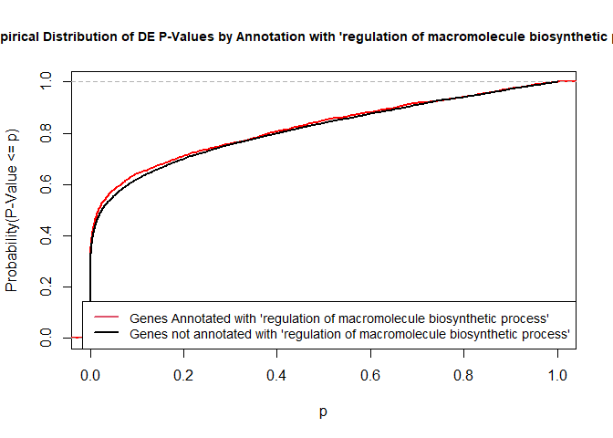
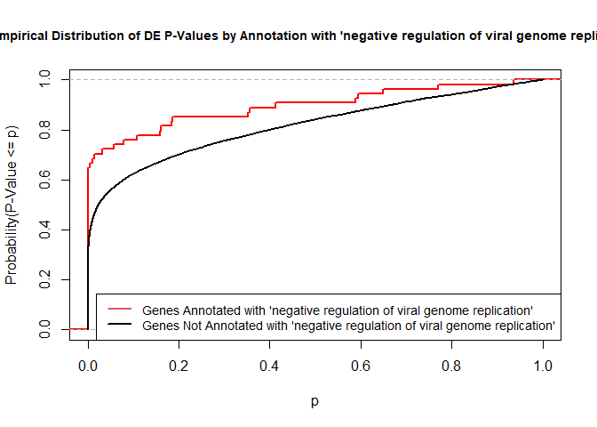
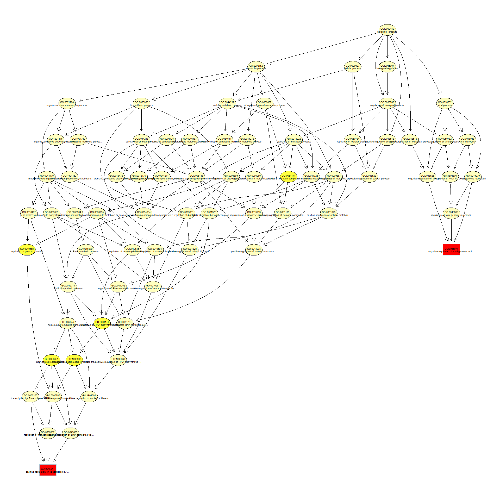
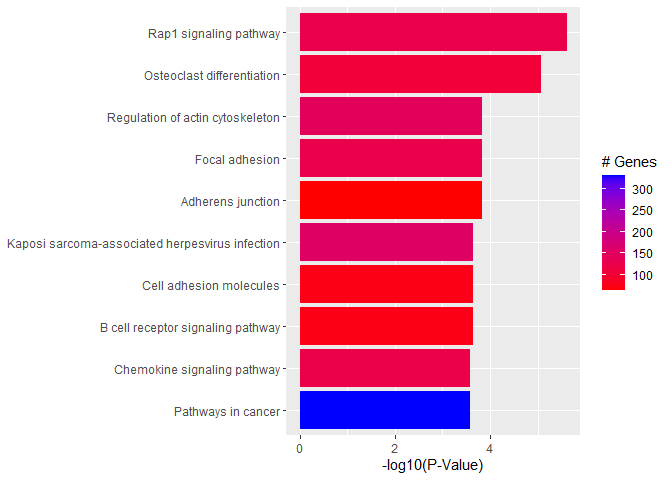

<script>
function buildQuiz(myq, qc){
  // variable to store the HTML output
  const output = [];

  // for each question...
  myq.forEach(
    (currentQuestion, questionNumber) => {

      // variable to store the list of possible answers
      const answers = [];

      // and for each available answer...
      for(letter in currentQuestion.answers){

        // ...add an HTML radio button
        answers.push(
          `<label>
            <input type="radio" name="question${questionNumber}" value="${letter}">
            ${letter} :
            ${currentQuestion.answers[letter]}
          </label><br/>`
        );
      }

      // add this question and its answers to the output
      output.push(
        `<div class="question"> ${currentQuestion.question} </div>
        <div class="answers"> ${answers.join('')} </div><br/>`
      );
    }
  );

  // finally combine our output list into one string of HTML and put it on the page
  qc.innerHTML = output.join('');
}

function showResults(myq, qc, rc){

  // gather answer containers from our quiz
  const answerContainers = qc.querySelectorAll('.answers');

  // keep track of user's answers
  let numCorrect = 0;

  // for each question...
  myq.forEach( (currentQuestion, questionNumber) => {

    // find selected answer
    const answerContainer = answerContainers[questionNumber];
    const selector = `input[name=question${questionNumber}]:checked`;
    const userAnswer = (answerContainer.querySelector(selector) || {}).value;

    // if answer is correct
    if(userAnswer === currentQuestion.correctAnswer){
      // add to the number of correct answers
      numCorrect++;

      // color the answers green
      answerContainers[questionNumber].style.color = 'lightgreen';
    }
    // if answer is wrong or blank
    else{
      // color the answers red
      answerContainers[questionNumber].style.color = 'red';
    }
  });

  // show number of correct answers out of total
  rc.innerHTML = `${numCorrect} out of ${myq.length}`;
}
</script>


# GO AND KEGG Enrichment Analysis

Load libraries

```r
library(topGO)
```

<div class='r_output'> Loading required package: BiocGenerics
</div>
<div class='r_output'> 
 Attaching package: 'BiocGenerics'
</div>
<div class='r_output'> The following objects are masked from 'package:stats':
 
     IQR, mad, sd, var, xtabs
</div>
<div class='r_output'> The following objects are masked from 'package:base':
 
     anyDuplicated, append, as.data.frame, basename, cbind, colnames,
     dirname, do.call, duplicated, eval, evalq, Filter, Find, get, grep,
     grepl, intersect, is.unsorted, lapply, Map, mapply, match, mget,
     order, paste, pmax, pmax.int, pmin, pmin.int, Position, rank,
     rbind, Reduce, rownames, sapply, setdiff, sort, table, tapply,
     union, unique, unsplit, which.max, which.min
</div>
<div class='r_output'> Loading required package: graph
</div>
<div class='r_output'> Loading required package: Biobase
</div>
<div class='r_output'> Welcome to Bioconductor
 
     Vignettes contain introductory material; view with
     'browseVignettes()'. To cite Bioconductor, see
     'citation("Biobase")', and for packages 'citation("pkgname")'.
</div>
<div class='r_output'> Loading required package: GO.db
</div>
<div class='r_output'> Loading required package: AnnotationDbi
</div>
<div class='r_output'> Loading required package: stats4
</div>
<div class='r_output'> Loading required package: IRanges
</div>
<div class='r_output'> Loading required package: S4Vectors
</div>
<div class='r_output'> 
 Attaching package: 'S4Vectors'
</div>
<div class='r_output'> The following objects are masked from 'package:base':
 
     expand.grid, I, unname
</div>
<div class='r_output'> 
 Attaching package: 'IRanges'
</div>
<div class='r_output'> The following object is masked from 'package:grDevices':
 
     windows
</div>
<div class='r_output'> 
</div>
<div class='r_output'> Loading required package: SparseM
</div>
<div class='r_output'> 
 Attaching package: 'SparseM'
</div>
<div class='r_output'> The following object is masked from 'package:base':
 
     backsolve
</div>
<div class='r_output'> 
 groupGOTerms: 	GOBPTerm, GOMFTerm, GOCCTerm environments built.
</div>
<div class='r_output'> 
 Attaching package: 'topGO'
</div>
<div class='r_output'> The following object is masked from 'package:IRanges':
 
     members
</div>
```r
library(KEGGREST)
library(org.Mm.eg.db)
```

<div class='r_output'> 
</div>
```r
library(pathview)
```

<div class='r_output'> 
</div>
<div class='r_output'> 
 Pathview is an open source software package distributed under GNU General
 Public License version 3 (GPLv3). Details of GPLv3 is available at
 http://www.gnu.org/licenses/gpl-3.0.html. Particullary, users are required to
 formally cite the original Pathview paper (not just mention it) in publications
 or products. For details, do citation("pathview") within R.
 
 The pathview downloads and uses KEGG data. Non-academic uses may require a KEGG
 license agreement (details at http://www.kegg.jp/kegg/legal.html).
 
</div>
```r
library(ggplot2)
```

Files for examples were created in the DE analysis.

## Gene Ontology (GO) Enrichment

[Gene ontology](http://www.geneontology.org/) provides a controlled vocabulary for describing biological processes (BP ontology), molecular functions (MF ontology) and cellular components (CC ontology)

The GO ontologies themselves are organism-independent; terms are associated with genes for a specific organism through direct experimentation or through sequence homology with another organism and its GO annotation.

Terms are related to other terms through parent-child relationships in a directed acylic graph.

Enrichment analysis provides one way of drawing conclusions about a set of differential expression results.

**1\.** topGO Example Using Kolmogorov-Smirnov Testing
Our first example uses Kolmogorov-Smirnov Testing for enrichment testing of our mouse DE results, with GO annotation obtained from the Bioconductor database org.Mm.eg.db.

The first step in each topGO analysis is to create a topGOdata object.  This contains the genes, the score for each gene (here we use the p-value from the DE test), the GO terms associated with each gene, and the ontology to be used (here we use the biological process ontology)

```r
infile <- "WT.C_v_WT.NC.txt"
tmp <- read.delim(infile)

geneList <- tmp$P.Value
xx <- as.list(org.Mm.egENSEMBL2EG)
names(geneList) <- xx[sapply(strsplit(tmp$Gene,split="\\."),"[[", 1L)]
head(geneList)
```

<div class='r_output'>        67241        68891        12772        70686        94212       219140 
 4.383027e-19 3.423886e-18 3.945562e-18 5.384455e-17 7.758438e-17 8.489480e-17
</div>
```r
# Create topGOData object
GOdata <- new("topGOdata",
	ontology = "BP",
	allGenes = geneList,
	geneSelectionFun = function(x)x,
	annot = annFUN.org , mapping = "org.Mm.eg.db")
```

<div class='r_output'> 
 Building most specific GOs .....
</div>
<div class='r_output'> 	( 10461 GO terms found. )
</div>
<div class='r_output'> 
 Build GO DAG topology ..........
</div>
<div class='r_output'> 	( 14058 GO terms and 31916 relations. )
</div>
<div class='r_output'> 
 Annotating nodes ...............
</div>
<div class='r_output'> 	( 10378 genes annotated to the GO terms. )
</div>
**2\.** The topGOdata object is then used as input for enrichment testing:

```r
# Kolmogorov-Smirnov testing
resultKS <- runTest(GOdata, algorithm = "weight01", statistic = "ks")
```

<div class='r_output'> 
 			 -- Weight01 Algorithm -- 
 
 		 the algorithm is scoring 14058 nontrivial nodes
 		 parameters: 
 			 test statistic: ks
 			 score order: increasing
</div>
<div class='r_output'> 
 	 Level 20:	1 nodes to be scored	(0 eliminated genes)
</div>
<div class='r_output'> 
 	 Level 19:	8 nodes to be scored	(0 eliminated genes)
</div>
<div class='r_output'> 
 	 Level 18:	17 nodes to be scored	(1 eliminated genes)
</div>
<div class='r_output'> 
 	 Level 17:	38 nodes to be scored	(29 eliminated genes)
</div>
<div class='r_output'> 
 	 Level 16:	82 nodes to be scored	(64 eliminated genes)
</div>
<div class='r_output'> 
 	 Level 15:	178 nodes to be scored	(135 eliminated genes)
</div>
<div class='r_output'> 
 	 Level 14:	350 nodes to be scored	(333 eliminated genes)
</div>
<div class='r_output'> 
 	 Level 13:	622 nodes to be scored	(747 eliminated genes)
</div>
<div class='r_output'> 
 	 Level 12:	1083 nodes to be scored	(1633 eliminated genes)
</div>
<div class='r_output'> 
 	 Level 11:	1558 nodes to be scored	(3210 eliminated genes)
</div>
<div class='r_output'> 
 	 Level 10:	1946 nodes to be scored	(4707 eliminated genes)
</div>
<div class='r_output'> 
 	 Level 9:	2077 nodes to be scored	(5893 eliminated genes)
</div>
<div class='r_output'> 
 	 Level 8:	1955 nodes to be scored	(7085 eliminated genes)
</div>
<div class='r_output'> 
 	 Level 7:	1725 nodes to be scored	(7939 eliminated genes)
</div>
<div class='r_output'> 
 	 Level 6:	1255 nodes to be scored	(8647 eliminated genes)
</div>
<div class='r_output'> 
 	 Level 5:	690 nodes to be scored	(9067 eliminated genes)
</div>
<div class='r_output'> 
 	 Level 4:	324 nodes to be scored	(9314 eliminated genes)
</div>
<div class='r_output'> 
 	 Level 3:	126 nodes to be scored	(9428 eliminated genes)
</div>
<div class='r_output'> 
 	 Level 2:	22 nodes to be scored	(9477 eliminated genes)
</div>
<div class='r_output'> 
 	 Level 1:	1 nodes to be scored	(9506 eliminated genes)
</div>
```r
tab <- GenTable(GOdata, raw.p.value = resultKS, topNodes = length(resultKS@score), numChar = 120)
```

topGO by default preferentially tests more specific terms, utilizing the topology of the GO graph. The algorithms used are described in detail [here](https://academic.oup.com/bioinformatics/article/22/13/1600/193669).


```r
head(tab, 15)
```

<div class='r_output'>         GO.ID                                                      Term
 1  GO:0045087                                    innate immune response
 2  GO:0045944 positive regulation of transcription by RNA polymerase II
 3  GO:0045766                       positive regulation of angiogenesis
 4  GO:0045071           negative regulation of viral genome replication
 5  GO:0032731      positive regulation of interleukin-1 beta production
 6  GO:0051897         positive regulation of protein kinase B signaling
 7  GO:0031623                                  receptor internalization
 8  GO:0008360                                  regulation of cell shape
 9  GO:0032760   positive regulation of tumor necrosis factor production
 10 GO:0051607                                 defense response to virus
 11 GO:0008150                                        biological_process
 12 GO:0006002                    fructose 6-phosphate metabolic process
 13 GO:0007229                       integrin-mediated signaling pathway
 14 GO:0070374              positive regulation of ERK1 and ERK2 cascade
 15 GO:0001525                                              angiogenesis
    Annotated Significant Expected raw.p.value
 1        530         530      530     4.0e-10
 2        768         768      768     3.7e-08
 3         97          97       97     2.8e-07
 4         49          49       49     4.8e-07
 5         51          51       51     1.2e-06
 6         61          61       61     1.3e-06
 7         79          79       79     1.6e-06
 8        105         105      105     1.6e-06
 9         85          85       85     1.9e-06
 10       228         228      228     2.0e-06
 11     10378       10378    10378     2.6e-06
 12        10          10       10     3.2e-06
 13        63          63       63     6.4e-06
 14       108         108      108     6.6e-06
 15       300         300      300     7.3e-06
</div>
* Annotated: number of genes (in our gene list) that are annotated with the term
* Significant: n/a for this example, same as Annotated here
* Expected: n/a for this example, same as Annotated here
* raw.p.value: P-value from Kolomogorov-Smirnov test that DE p-values annotated with the term are smaller (i.e. more significant) than those not annotated with the term.

The Kolmogorov-Smirnov test directly compares two probability distributions based on their maximum distance.  

To illustrate the KS test, we plot probability distributions of p-values that are and that are not annotated with the term GO:0046661 "male sex differentiation" (66 genes) p-value 0.8721.  (This won't exactly match what topGO does due to their elimination algorithm):


```r
rna.pp.terms <- genesInTerm(GOdata)[["GO:0046661"]] # get genes associated with term
p.values.in <- geneList[names(geneList) %in% rna.pp.terms]
p.values.out <- geneList[!(names(geneList) %in% rna.pp.terms)]
plot.ecdf(p.values.in, verticals = T, do.points = F, col = "red", lwd = 2, xlim = c(0,1),
          main = "Empirical Distribution of DE P-Values by Annotation with 'male sex differentiation'",
          cex.main = 0.9, xlab = "p", ylab = "Probabilty(P-Value < p)")
ecdf.out <- ecdf(p.values.out)
xx <- unique(sort(c(seq(0, 1, length = 201), knots(ecdf.out))))
lines(xx, ecdf.out(xx), col = "black", lwd = 2)
legend("bottomright", legend = c("Genes Annotated with 'male sex differentiation'", "Genes not annotated with male sex differentiation'"), lwd = 2, col = 2:1, cex = 0.9)
```

<!-- -->

versus the probability distributions of p-values that are and that are not annotated with the term GO:0007229 "integrin-mediated signaling pathway" (66 genes) p-value 9.8x10-5.


```r
rna.pp.terms <- genesInTerm(GOdata)[["GO:0007229"]] # get genes associated with term
p.values.in <- geneList[names(geneList) %in% rna.pp.terms]
p.values.out <- geneList[!(names(geneList) %in% rna.pp.terms)]
plot.ecdf(p.values.in, verticals = T, do.points = F, col = "red", lwd = 2, xlim = c(0,1),
          main = "Empirical Distribution of DE P-Values by Annotation with 'integrin-mediated signaling pathway'",
          cex.main = 0.9, xlab = "p", ylab = "Probabilty(P-Value < p)")
ecdf.out <- ecdf(p.values.out)
xx <- unique(sort(c(seq(0, 1, length = 201), knots(ecdf.out))))
lines(xx, ecdf.out(xx), col = "black", lwd = 2)
legend("bottomright", legend = c("Genes Annotated with 'integrin-mediated signaling pathway'", "Genes Not Annotated with 'integrin-mediated signaling pathway'"), lwd = 2, col = 2:1, cex = 0.9)
```

<!-- -->


We can use the function showSigOfNodes to plot the GO graph for the 3 most significant terms and their parents, color coded by enrichment p-value (red is most significant):

```r
par(cex = 0.3)
showSigOfNodes(GOdata, score(resultKS), firstSigNodes = 2, useInfo = "def")
```

<div class='r_output'> Loading required package: Rgraphviz
</div>
<div class='r_output'> Loading required package: grid
</div>
<div class='r_output'> 
 Attaching package: 'grid'
</div>
<div class='r_output'> The following object is masked from 'package:topGO':
 
     depth
</div>
<div class='r_output'> 
 Attaching package: 'Rgraphviz'
</div>
<div class='r_output'> The following objects are masked from 'package:IRanges':
 
     from, to
</div>
<div class='r_output'> The following objects are masked from 'package:S4Vectors':
 
     from, to
</div>
<!-- -->

<div class='r_output'> $dag
 A graphNEL graph with directed edges
 Number of Nodes = 74 
 Number of Edges = 161 
 
 $complete.dag
 [1] "A graph with 74 nodes."
</div>
```r
par(cex = 1)
```

**3\.** topGO Example Using Fisher's Exact Test

Next, we use Fisher's exact test to test for GO enrichment among significantly DE genes.

Create topGOdata object:

```r
# Create topGOData object
GOdata <- new("topGOdata",
	ontology = "BP",
	allGenes = geneList,
	geneSelectionFun = function(x) (x < 0.05),
	annot = annFUN.org , mapping = "org.Mm.eg.db")
```

<div class='r_output'> 
 Building most specific GOs .....
</div>
<div class='r_output'> 	( 10461 GO terms found. )
</div>
<div class='r_output'> 
 Build GO DAG topology ..........
</div>
<div class='r_output'> 	( 14058 GO terms and 31916 relations. )
</div>
<div class='r_output'> 
 Annotating nodes ...............
</div>
<div class='r_output'> 	( 10378 genes annotated to the GO terms. )
</div>
Run Fisher's Exact Test:

```r
resultFisher <- runTest(GOdata, algorithm = "elim", statistic = "fisher")
```

<div class='r_output'> 
 			 -- Elim Algorithm -- 
 
 		 the algorithm is scoring 12736 nontrivial nodes
 		 parameters: 
 			 test statistic: fisher
 			 cutOff: 0.01
</div>
<div class='r_output'> 
 	 Level 20:	1 nodes to be scored	(0 eliminated genes)
</div>
<div class='r_output'> 
 	 Level 19:	8 nodes to be scored	(0 eliminated genes)
</div>
<div class='r_output'> 
 	 Level 18:	17 nodes to be scored	(0 eliminated genes)
</div>
<div class='r_output'> 
 	 Level 17:	35 nodes to be scored	(0 eliminated genes)
</div>
<div class='r_output'> 
 	 Level 16:	73 nodes to be scored	(19 eliminated genes)
</div>
<div class='r_output'> 
 	 Level 15:	158 nodes to be scored	(94 eliminated genes)
</div>
<div class='r_output'> 
 	 Level 14:	304 nodes to be scored	(94 eliminated genes)
</div>
<div class='r_output'> 
 	 Level 13:	521 nodes to be scored	(304 eliminated genes)
</div>
<div class='r_output'> 
 	 Level 12:	935 nodes to be scored	(1549 eliminated genes)
</div>
<div class='r_output'> 
 	 Level 11:	1378 nodes to be scored	(1842 eliminated genes)
</div>
<div class='r_output'> 
 	 Level 10:	1761 nodes to be scored	(2046 eliminated genes)
</div>
<div class='r_output'> 
 	 Level 9:	1901 nodes to be scored	(2563 eliminated genes)
</div>
<div class='r_output'> 
 	 Level 8:	1790 nodes to be scored	(3184 eliminated genes)
</div>
<div class='r_output'> 
 	 Level 7:	1586 nodes to be scored	(3935 eliminated genes)
</div>
<div class='r_output'> 
 	 Level 6:	1159 nodes to be scored	(4759 eliminated genes)
</div>
<div class='r_output'> 
 	 Level 5:	657 nodes to be scored	(5360 eliminated genes)
</div>
<div class='r_output'> 
 	 Level 4:	308 nodes to be scored	(5995 eliminated genes)
</div>
<div class='r_output'> 
 	 Level 3:	121 nodes to be scored	(6573 eliminated genes)
</div>
<div class='r_output'> 
 	 Level 2:	22 nodes to be scored	(6729 eliminated genes)
</div>
<div class='r_output'> 
 	 Level 1:	1 nodes to be scored	(6729 eliminated genes)
</div>
```r
tab <- GenTable(GOdata, raw.p.value = resultFisher, topNodes = length(resultFisher@score),
				numChar = 120)
head(tab)
```

<div class='r_output'>        GO.ID                                                      Term
 1 GO:0045087                                    innate immune response
 2 GO:0042742                             defense response to bacterium
 3 GO:0045944 positive regulation of transcription by RNA polymerase II
 4 GO:0001525                                              angiogenesis
 5 GO:0032760   positive regulation of tumor necrosis factor production
 6 GO:0032731      positive regulation of interleukin-1 beta production
   Annotated Significant Expected raw.p.value
 1       530         364   298.90     2.0e-08
 2       165         126    93.05     5.8e-08
 3       768         497   433.13     6.5e-07
 4       300         223   169.19     6.9e-06
 5        85          67    47.94     1.2e-05
 6        51          43    28.76     2.1e-05
</div>* Annotated: number of genes (in our gene list) that are annotated with the term
* Significant: Number of significantly DE genes annotated with that term (i.e. genes where geneList = 1)
* Expected: Under random chance, number of genes that would be expected to be significantly DE and annotated with that term
* raw.p.value: P-value from Fisher's Exact Test, testing for association between significance and pathway membership.

Fisher's Exact Test is applied to the table:

**Significance/Annotation**|**Annotated With GO Term**|**Not Annotated With GO Term**
:-----:|:-----:|:-----:
**Significantly DE**|n1|n3
**Not Significantly DE**|n2|n4

and compares the probability of the observed table, conditional on the row and column sums, to what would be expected under random chance.  

Advantages over KS (or Wilcoxon) Tests:

* Ease of interpretation

* Easier directional testing

Disadvantages:

* Relies on significant/non-significant dichotomy (an interesting gene could have an adjusted p-value of 0.051 and be counted as non-significant)
* Less powerful
* May be less useful if there are very few (or a large number of) significant genes

## Quiz 1

<div id="quiz1" class="quiz"></div>
<button id="submit1">Submit Quiz</button>
<div id="results1" class="output"></div>
<script>
quizContainer1 = document.getElementById('quiz1');
resultsContainer1 = document.getElementById('results1');
submitButton1 = document.getElementById('submit1');

myQuestions1 = [
  {
    question: "Rerun the KS test analysis using the molecular function (MF) ontology.  What is the top GO term listed?",
    answers: {
      a: "transmembrane signaling receptor activity",
      b: "angiogenesis",
      c: "calcium ion binding"
    },
    correctAnswer: "a"
  },
  {
      question: "How many genes from the top table are annotated with the term 'actin filament binding'",
    answers: {
      a: "150",
      b: "5,846",
      c: "129"
    },
    correctAnswer: "c"
  },
  {
      question: "Based on the graph above generated by showSigOfNodes, what is one parent term of 'innate immune response'?",
    answers: {
      a: "metabolic process",
      b: "defense response to other",
      c: "angiogenesis"
    },
    correctAnswer: "b"
  }
];

buildQuiz(myQuestions1, quizContainer1);
submitButton1.addEventListener('click', function() {showResults(myQuestions1, quizContainer1, resultsContainer1);});
</script>


## KEGG Pathway Enrichment Testing With KEGGREST
KEGG, the Kyoto Encyclopedia of Genes and Genomes (https://www.genome.jp/kegg/), provides assignment of genes for many organisms into pathways.

We will access KEGG pathway assignments for mouse through the KEGGREST Bioconductor package, and then use some homebrew code for enrichment testing.

**1\.** Get all mouse pathways and their genes:

```r
# Pull all pathways for mmu
pathways.list <- keggList("pathway", "mmu")
head(pathways.list)
```

<div class='r_output'>                                                           path:mmu00010 
             "Glycolysis / Gluconeogenesis - Mus musculus (house mouse)" 
                                                           path:mmu00020 
                "Citrate cycle (TCA cycle) - Mus musculus (house mouse)" 
                                                           path:mmu00030 
                "Pentose phosphate pathway - Mus musculus (house mouse)" 
                                                           path:mmu00040 
 "Pentose and glucuronate interconversions - Mus musculus (house mouse)" 
                                                           path:mmu00051 
          "Fructose and mannose metabolism - Mus musculus (house mouse)" 
                                                           path:mmu00052 
                     "Galactose metabolism - Mus musculus (house mouse)"
</div>
```r
# Pull all genes for each pathway
pathway.codes <- sub("path:", "", names(pathways.list))
genes.by.pathway <- sapply(pathway.codes,
	function(pwid){
		pw <- keggGet(pwid)
		if (is.null(pw[[1]]$GENE)) return(NA)
		pw2 <- pw[[1]]$GENE[c(TRUE,FALSE)] # may need to modify this to c(FALSE, TRUE) for other organisms
		pw2 <- unlist(lapply(strsplit(pw2, split = ";", fixed = T), function(x)x[1]))
		return(pw2)
	}
)
head(genes.by.pathway)
```

<div class='r_output'> $mmu00010
  [1] "15277"     "212032"    "15275"     "216019"    "103988"    "14751"    
  [7] "18641"     "18642"     "56421"     "14121"     "14120"     "11674"    
 [13] "230163"    "11676"     "353204"    "79459"     "21991"     "14433"    
 [19] "115487111" "14447"     "18655"     "18663"     "18648"     "56012"    
 [25] "13806"     "13807"     "13808"     "433182"    "226265"    "18746"    
 [31] "18770"     "18597"     "18598"     "68263"     "235339"    "13382"    
 [37] "16828"     "16832"     "16833"     "106557"    "11522"     "11529"    
 [43] "26876"     "11532"     "58810"     "11669"     "11671"     "72535"    
 [49] "110695"    "56752"     "11670"     "67689"     "621603"    "73458"    
 [55] "68738"     "60525"     "319625"    "72157"     "66681"     "14377"    
 [61] "14378"     "68401"     "72141"     "12183"     "17330"     "18534"    
 [67] "74551"    
 
 $mmu00020
  [1] "12974"  "71832"  "104112" "11429"  "11428"  "15926"  "269951" "15929" 
  [9] "67834"  "170718" "243996" "18293"  "239017" "78920"  "13382"  "56451" 
 [17] "20917"  "20916"  "66945"  "67680"  "66052"  "66925"  "14194"  "17449" 
 [25] "17448"  "18563"  "18534"  "74551"  "18597"  "18598"  "68263"  "235339"
 
 $mmu00030
  [1] "14751"  "14380"  "14381"  "66171"  "100198" "110208" "66646"  "21881" 
  [9] "83553"  "74419"  "21351"  "19895"  "232449" "71336"  "72157"  "66681" 
 [17] "19139"  "110639" "328099" "75456"  "19733"  "75731"  "235582" "11674" 
 [25] "230163" "11676"  "353204" "79459"  "14121"  "14120"  "18641"  "18642" 
 [33] "56421" 
 
 $mmu00040
  [1] "110006" "16591"  "22238"  "22236"  "94284"  "94215"  "394434" "394430"
  [9] "394432" "394433" "72094"  "552899" "71773"  "394435" "394436" "100727"
 [17] "231396" "100559" "112417" "243085" "613123" "22235"  "216558" "58810" 
 [25] "68631"  "66646"  "102448" "11997"  "14187"  "11677"  "67861"  "67880" 
 [33] "20322"  "71755"  "75578"  "75847" 
 
 $mmu00051
  [1] "110119" "54128"  "29858"  "331026" "69080"  "218138" "22122"  "75540" 
  [9] "234730" "15277"  "212032" "15275"  "216019" "18641"  "18642"  "56421" 
 [17] "14121"  "14120"  "18639"  "18640"  "170768" "270198" "319801" "16548" 
 [25] "20322"  "11997"  "14187"  "11677"  "67861"  "11674"  "230163" "11676" 
 [33] "353204" "79459"  "21991"  "225913"
 
 $mmu00052
  [1] "319625" "14635"  "14430"  "74246"  "216558" "72157"  "66681"  "15277" 
  [9] "212032" "15275"  "216019" "103988" "14377"  "14378"  "68401"  "12091" 
 [17] "226413" "16770"  "14595"  "53418"  "11605"  "11997"  "14187"  "11677" 
 [25] "67861"  "18641"  "18642"  "56421"  "232714" "14387"  "76051"  "69983"
</div>
Read in DE file to be used in enrichment testing:

```r
head(geneList)
```

<div class='r_output'>        67241        68891        12772        70686        94212       219140 
 4.383027e-19 3.423886e-18 3.945562e-18 5.384455e-17 7.758438e-17 8.489480e-17
</div>
**2\.** Apply Wilcoxon rank-sum test to each pathway, testing if "in" p-values are smaller than "out" p-values:

```r
# Wilcoxon test for each pathway
pVals.by.pathway <- t(sapply(names(genes.by.pathway),
	function(pathway) {
		pathway.genes <- genes.by.pathway[[pathway]]
		list.genes.in.pathway <- intersect(names(geneList), pathway.genes)
		list.genes.not.in.pathway <- setdiff(names(geneList), list.genes.in.pathway)
		scores.in.pathway <- geneList[list.genes.in.pathway]
		scores.not.in.pathway <- geneList[list.genes.not.in.pathway]
		if (length(scores.in.pathway) > 0){
			p.value <- wilcox.test(scores.in.pathway, scores.not.in.pathway, alternative = "less")$p.value
		} else{
			p.value <- NA
		}
		return(c(p.value = p.value, Annotated = length(list.genes.in.pathway)))
	}
))

# Assemble output table
outdat <- data.frame(pathway.code = rownames(pVals.by.pathway))
outdat$pathway.name <- pathways.list[paste0("path:",outdat$pathway.code)]
outdat$p.value <- pVals.by.pathway[,"p.value"]
outdat$Annotated <- pVals.by.pathway[,"Annotated"]
outdat <- outdat[order(outdat$p.value),]
head(outdat)
```

<div class='r_output'>     pathway.code                                                   pathway.name
 300     mmu05171    Coronavirus disease - COVID-19 - Mus musculus (house mouse)
 169     mmu04380        Osteoclast differentiation - Mus musculus (house mouse)
 121     mmu04015            Rap1 signaling pathway - Mus musculus (house mouse)
 293     mmu05164                       Influenza A - Mus musculus (house mouse)
 289     mmu05160                       Hepatitis C - Mus musculus (house mouse)
 196     mmu04662 B cell receptor signaling pathway - Mus musculus (house mouse)
          p.value Annotated
 300 1.176677e-10       172
 169 5.084974e-10       105
 121 2.585792e-09       125
 293 6.055844e-09       121
 289 1.844962e-08       116
 196 4.710489e-08        71
</div>* p.value: P-value for Wilcoxon rank-sum testing, testing that p-values from DE analysis for genes in the pathway are smaller than those not in the pathway
* Annotated: Number of genes in the pathway (regardless of DE p-value)

The Wilcoxon rank-sum test is the nonparametric analogue of the two-sample t-test.  It compares the ranks of observations in two groups.  It is more powerful than the Kolmogorov-Smirnov test.

**3\.** Plotting Pathways

```r
foldChangeList <- tmp$logFC
xx <- as.list(org.Mm.egENSEMBL2EG)
names(foldChangeList) <- xx[sapply(strsplit(tmp$Gene,split="\\."),"[[", 1L)]
head(foldChangeList)
```

<div class='r_output'>     67241     68891     12772     70686     94212    219140 
 -2.487719  4.552564  2.164336 -4.121437 -1.899178 -2.676304
</div>
```r
mmu04380 <- pathview(gene.data  = foldChangeList,
                     pathway.id = "mmu04380",
                     species    = "mmu",
                     limit      = list(gene=max(abs(foldChangeList)), cpd=1))
```

<div class='r_output'> 'select()' returned 1:1 mapping between keys and columns
</div>
<div class='r_output'> Info: Working in directory C:/Users/bpdurbin/Desktop/RNASeq_Aug_2022
</div>
<div class='r_output'> Info: Writing image file mmu04380.pathview.png
</div>


### Barplot of p-values for top pathways
A barplot of -log10(p-value) for the top pathways can be used for any type of enrichment analysis.


```r
plotdat <- outdat[1:10,]
plotdat$nice.name <- gsub(" - Mus musculus (house mouse)", "", plotdat$pathway.name, fixed = TRUE)

ggplot(plotdat, aes(x = -log10(p.value), y = reorder(nice.name, -log10(p.value)), fill = Annotated)) + geom_bar(stat = "identity") + labs(x = "-log10(P-Value)", y = NULL, fill = "# Genes") + scale_fill_gradient(low = "red", high = "blue")
```

<!-- -->

## Quiz 2

<div id="quiz2" class="quiz"></div>
<button id="submit2">Submit Quiz</button>
<div id="results2" class="output"></div>
<script>
quizContainer2 = document.getElementById('quiz2');
resultsContainer2 = document.getElementById('results2');
submitButton2 = document.getElementById('submit2');

myQuestions2 = [
  {
    question: "How many pathways have a p-value less than 0.05?",
    answers: {
      a: "193",
      b: "343",
      c: "208"
    },
    correctAnswer: "a"
  },
  {
      question: "Which pathway has the most genes annotated to it (excluding genes not in the top table)?'",
    answers: {
      a: "Coronavirus disease - COVID-19 - Mus musculus (house mouse)",
      b: "Metabolic pathways - Mus musculus (house mouse)",
      c: "Pathways of neurodegeneration - multiple diseases - Mus musculus (house mouse)"
    },
    correctAnswer: "c"
  },
  {
      question: "Make a pathview diagram for mmu05171, and locate the file mmu05171.pathview.png on your computer.  What sign does the log fold change for MAPK have?",
    answers: {
      a: "Positive",
      b: "Negative"
    },
    correctAnswer: "b"
  },
{
      question: "This study predates the discovery of COVID-19 in humans by at least a year, yet 'Coronavirus disease - COVID-19' is the most significantly enriched pathway.  What is the most likely explanation?",
    answers: {
      a: "COVID-19 originated in these mice",
      b: "Genes associated with COVID-19 infection also happen to be associated with nonclassical monocytes"
    },
    correctAnswer: "b"
  }
];

buildQuiz(myQuestions2, quizContainer2);
submitButton2.addEventListener('click', function() {showResults(myQuestions2, quizContainer2, resultsContainer2);});
</script>


```r
sessionInfo()
```

<div class='r_output'> R version 4.2.1 (2022-06-23 ucrt)
 Platform: x86_64-w64-mingw32/x64 (64-bit)
 Running under: Windows 10 x64 (build 19044)
 
 Matrix products: default
 
 locale:
 [1] LC_COLLATE=English_United States.utf8 
 [2] LC_CTYPE=English_United States.utf8   
 [3] LC_MONETARY=English_United States.utf8
 [4] LC_NUMERIC=C                          
 [5] LC_TIME=English_United States.utf8    
 
 attached base packages:
 [1] grid      stats4    stats     graphics  grDevices datasets  utils    
 [8] methods   base     
 
 other attached packages:
  [1] Rgraphviz_2.40.0     ggplot2_3.3.6        pathview_1.31.3     
  [4] org.Mm.eg.db_3.15.0  KEGGREST_1.36.3      topGO_2.48.0        
  [7] SparseM_1.81         GO.db_3.15.0         AnnotationDbi_1.58.0
 [10] IRanges_2.30.0       S4Vectors_0.34.0     Biobase_2.56.0      
 [13] graph_1.74.0         BiocGenerics_0.42.0 
 
 loaded via a namespace (and not attached):
  [1] KEGGgraph_1.56.0       Rcpp_1.0.9             lattice_0.20-45       
  [4] png_0.1-7              Biostrings_2.64.0      utf8_1.2.2            
  [7] digest_0.6.29          R6_2.5.1               GenomeInfoDb_1.32.2   
 [10] RSQLite_2.2.15         evaluate_0.15          highr_0.9             
 [13] pillar_1.8.0           httr_1.4.3             zlibbioc_1.42.0       
 [16] rlang_1.0.4            curl_4.3.2             rstudioapi_0.13       
 [19] jquerylib_0.1.4        blob_1.2.3             rmarkdown_2.14        
 [22] labeling_0.4.2         stringr_1.4.0          RCurl_1.98-1.8        
 [25] bit_4.0.4              munsell_0.5.0          compiler_4.2.1        
 [28] xfun_0.31              pkgconfig_2.0.3        htmltools_0.5.3       
 [31] tibble_3.1.8           GenomeInfoDbData_1.2.8 matrixStats_0.62.0    
 [34] XML_3.99-0.10          fansi_1.0.3            withr_2.5.0           
 [37] crayon_1.5.1           bitops_1.0-7           jsonlite_1.8.0        
 [40] gtable_0.3.0           lifecycle_1.0.1        DBI_1.1.3             
 [43] magrittr_2.0.3         scales_1.2.0           cli_3.3.0             
 [46] stringi_1.7.8          cachem_1.0.6           farver_2.1.1          
 [49] XVector_0.36.0         renv_0.15.5            bslib_0.4.0           
 [52] vctrs_0.4.1            org.Hs.eg.db_3.15.0    tools_4.2.1           
 [55] bit64_4.0.5            glue_1.6.2             fastmap_1.1.0         
 [58] yaml_2.3.5             colorspace_2.0-3       memoise_2.0.1         
 [61] knitr_1.39             sass_0.4.2
</div>